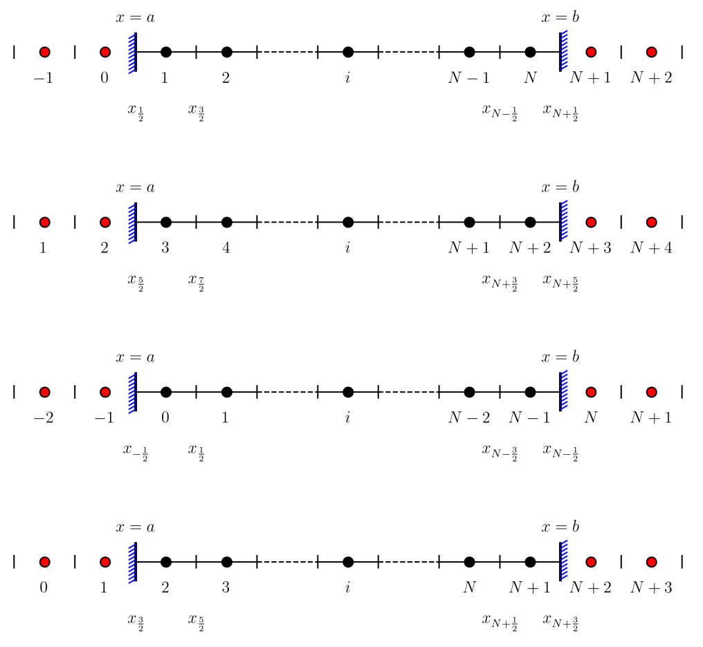
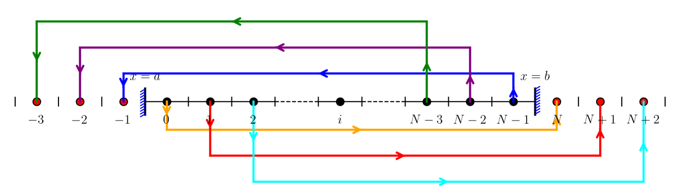

# Figure

## Link

- [OneFLOW-WENO schemes](https://eric2003.github.io/OneFLOW/cfd/scheme/weno.html).

## matplotlib

### default coordinate range

```python
import matplotlib.pyplot as plt
import numpy as np

# Why not centered? Check default coordinate range
plt.figure(figsize=(6, 4))
plt.plot([5, 10], [5, 10])  # Line from (5,5) to (10,10)
plt.title('Is the line centered in the canvas?')

# Get current axis limits
ax = plt.gca()
xlim = ax.get_xlim()
ylim = ax.get_ylim()
print(f"Auto-set x-axis range: {xlim}")
print(f"Auto-set y-axis range: {ylim}")

plt.grid(True)
plt.show()
```

```powershell
Auto-set x-axis range: (np.float64(4.75), np.float64(10.25))
Auto-set y-axis range: (np.float64(4.75), np.float64(10.25))
```

### How to truly center a line

```python
import matplotlib.pyplot as plt
import numpy as np

# How to truly center a line
plt.figure(figsize=(6, 6))

# Method 1: Manually set symmetric coordinate ranges
plt.plot([-1, 1], [0, 0], 'r-', linewidth=3, label='Horizontal line y=0')
plt.plot([0, 0], [-1, 1], 'b-', linewidth=3, label='Vertical line x=0')

# Key: Set symmetric axis limits
plt.xlim(-2, 2)
plt.ylim(-2, 2)

plt.axhline(y=0, color='gray', linestyle='--', alpha=0.5)  # x-axis
plt.axvline(x=0, color='gray', linestyle='--', alpha=0.5)  # y-axis
plt.grid(True)
plt.title('Centered by setting symmetric ranges')
plt.legend()
plt.gca().set_aspect('equal')  # Equal aspect ratio
plt.show()
```

### Center in canvas coordinates

```python
import matplotlib.pyplot as plt
import numpy as np

# Example 5: Canvas coordinates vs data coordinates
fig = plt.figure(figsize=(8, 6))

# Center in canvas coordinates (not data coordinates!)
ax = fig.add_axes([0.1, 0.1, 0.8, 0.8])  # Graphics area centered in canvas

# Now draw lines in the graphics area
x_center = 5
y_center = 5
length = 2

# Horizontal line
plt.plot([x_center - length/2, x_center + length/2], 
         [y_center, y_center], 'r-', linewidth=3, label='Horizontal line')

# Vertical line
plt.plot([x_center, x_center], 
         [y_center - length/2, y_center + length/2], 'b-', linewidth=3, label='Vertical line')

# Set symmetric ranges to center line in graphics area
plt.xlim(x_center - length, x_center + length)
plt.ylim(y_center - length, y_center + length)

plt.grid(True)
plt.axhline(y=y_center, color='gray', linestyle='--', alpha=0.5)
plt.axvline(x=x_center, color='gray', linestyle='--', alpha=0.5)
plt.title('Line centered in graphics area')
plt.legend()
plt.show()
```

plot_cfd_figure
```python
import matplotlib.pyplot as plt
import numpy as np

def plot_vertical_boundary(border_x, y_start, y_end, lr):
    """
    Plot a vertical boundary with diagonal lines on one side.
    
    Parameters:
    -----------
    border_x : float
        The x-coordinate of the vertical boundary line
    y_start : float
        The starting y-coordinate of the vertical boundary
    y_end : float
        The ending y-coordinate of the vertical boundary
    lr : str
        Direction indicator: 'L' for left side, 'R' for right side
        Determines the orientation of diagonal lines
    """
    # Batch plot diagonal lines
    num_lines = 10  # Number of diagonal lines
    
    # Calculate the total height
    dy = y_end - y_start
    
    # Generate evenly spaced y positions for diagonal lines
    # Add small margins to avoid lines at the very edges
    y_positions = np.linspace(y_start + 0.02 * dy, y_end - 0.02 * dy, num_lines)
    
    # Length of each diagonal line (as percentage of total height)
    line_length = 0.2 * dy
    
    # Determine angle based on direction
    if lr == "L":
        angle = 180 + 30  # 210 degrees for left side
    else:
        angle = 30  # 30 degrees for right side
    
    # Convert angle to radians for trigonometric calculations
    angle_rad = np.deg2rad(angle)
    
    # Calculate dx and dy components for the diagonal lines
    dx = line_length * np.cos(angle_rad)
    dy_component = line_length * np.sin(angle_rad)
    
    # Plot the main vertical boundary line
    plt.plot([border_x, border_x], [y_start, y_end], 'k-', linewidth=2)
    
    # Plot each diagonal line
    for y in y_positions:
        # Start point: on the vertical line
        x1 = border_x
        y1 = y
        
        # End point: offset by dx and dy
        x2 = x1 + dx
        y2 = y1 + dy_component
        
        # Plot the diagonal line
        plt.plot([x1, x2], [y1, y2], color='blue', linewidth=1)

class BaseMesh:
    """Base class for mesh (main mesh/ghost mesh) with common grid logic"""
    def __init__(self, ncells, xstart, dx, lr=None):
        self.ncells = ncells
        self.nnodes = self.ncells + 1
        self.xstart = xstart  # Starting coordinate of the mesh
        self.dx = dx          # Grid spacing (negative value for left ghost mesh)
        self.lr = lr          # Identifier for ghost mesh: "L" (left) / "R" (right), None for main mesh
        
        # Initialize empty arrays for node coordinates and cell-center coordinates
        self.x = np.zeros(self.nnodes, dtype=np.float64)
        self.y = np.zeros(self.nnodes, dtype=np.float64)
        self.xcc = np.zeros(self.ncells, dtype=np.float64)
        self.ycc = np.zeros(self.ncells, dtype=np.float64)

    def generate_mesh(self):
        """Calculate node coordinates and cell-center coordinates for the mesh"""
        # Compute node coordinates along x-axis (y=0 for 1D mesh)
        for i in range(self.nnodes):
            self.x[i] = self.xstart + i * self.dx
            self.y[i] = 0.0
        
        # Compute cell-center coordinates as midpoint of adjacent nodes
        for i in range(self.ncells):
            self.xcc[i] = 0.5 * (self.x[i] + self.x[i+1])
            self.ycc[i] = 0.0

    def printinfo(self, prefix="Mesh"):
        """Print detailed mesh parameters and coordinates"""
        print(f"{prefix} ncells = {self.ncells}")
        print(f"{prefix} nnodes = {self.nnodes}")
        print(f"{prefix} xstart = {self.xstart:.6f}")
        if self.lr is not None:
            print(f"{prefix} lr = {self.lr}")
        print(f"{prefix} dx = {self.dx:.6f}")
        print(f"{prefix} x coordinates = {self.x}")
        print(f"{prefix} cell-center x coordinates = {self.xcc}")
        
    def plot_boundary_vertical_interface_lines(self):
        """Plot vertical lines at all mesh node positions (cell boundaries)"""
        dy = 0.1 * abs(self.dx)  # Absolute value ensures positive vertical line length
        ipoints = [0,self.nnodes-1]
        for i in ipoints:
            xm = self.x[i]
            ym = self.y[i]
            #plt.plot([xm, xm], [ym - 3*dy, ym + 3*dy], 'k-', linewidth=1)
            lr = "L" if i == 0 else "R"
            plot_vertical_boundary(xm,ym - 3*dy,ym + 3*dy, lr)

    def plot_vertical_interface_lines(self, indices=None):
        """Plot vertical lines at all mesh node positions (cell boundaries)"""
        dy = 0.1 * abs(self.dx)  # Absolute value ensures positive vertical line length
        if indices is None:
            indices = [i for i in range(0, self.nnodes)]
        for i in indices:
            xm = self.x[i]
            ym = self.y[i]
            plt.plot([xm, xm], [ym - dy, ym + dy], 'k-', linewidth=1)

class Ghost(BaseMesh):
    """Ghost mesh class with cell labeling and visualization"""
    def __init__(self, xstart, dx, ncells, lr):
        # Inherit initialization logic from BaseMesh class
        super().__init__(ncells=ncells, xstart=xstart, dx=dx, lr=lr)
        
    def plot_cell_label(self):
        ytext_shift = 0.5*abs(self.dx)  # Y-position for labels (avoid overlap with main mesh)
        for i in range(self.ncells):
            # Define cell labels based on left/right ghost mesh type
            if self.lr == "L":
                cell_label = f"${- i}$"  # Label format for left ghost cells
            else:
                cell_label = f"$N+{i+1}$"    # Label format for right ghost cells
            # Add text label at cell center
            plt.text(self.xcc[i], self.ycc[i]-ytext_shift, cell_label, fontsize=12, ha='center')
            
    def plot(self):
        """Visualize ghost mesh: cell-center points and cell index labels"""
        self.plot_cell_label()

        # Plot cell-center points (red fill with black edge)
        plt.scatter(self.xcc, self.ycc, s=50, facecolor='red', edgecolor='black', linewidth=1)
        
        indices = [i for i in range(1, self.nnodes)]
        self.plot_vertical_interface_lines(indices)


class Mesh(BaseMesh):
    """Main mesh class with ghost mesh generation and management"""
    def __init__(self):
        # Define main mesh physical boundaries and grid resolution
        self.xmin = 0.0      # Left physical boundary of main mesh
        self.xmax = 1.0      # Right physical boundary of main mesh
        self.ncells = 9      # Number of cells in main mesh
        self.dx = (self.xmax - self.xmin) / self.ncells  # Grid spacing of main mesh
        self.nnodes = self.ncells + 1  # Number of nodes in main mesh
        
        # Initialize main mesh using BaseMesh constructor
        super().__init__(ncells=self.ncells, xstart=self.xmin, dx=self.dx, lr=None)
        self.nghosts = 2     # Number of ghost cell layers on each side

        # Create left ghost mesh (mirror extension to the left of main mesh)
        self.ghost_mesh_left = Ghost(
            xstart=self.xmin,
            dx=-self.dx,
            ncells=self.nghosts,
            lr="L"
        )
        
        # Create right ghost mesh (mirror extension to the right of main mesh)
        self.ghost_mesh_right = Ghost(
            xstart=self.xmax,
            dx=self.dx,
            ncells=self.nghosts,
            lr="R"
        )
        
    def generate_total_mesh(self):
        self.generate_mesh()
        self.ghost_mesh_left.generate_mesh()
        self.ghost_mesh_right.generate_mesh()

    def printinfo(self):
        """Print main mesh and ghost mesh information"""
        super().printinfo(prefix="Main Mesh")
        self.ghost_mesh_left.printinfo(prefix="Left Ghost Mesh")
        self.ghost_mesh_right.printinfo(prefix="Right Ghost Mesh")
        
    def plot_cell_label(self):
        ytext_shift = 0.5*abs(self.dx)  # Y-position for labels (avoid overlap with main mesh
        nlabels = 2
        for i in range(self.ncells):
            if i < nlabels:
                  cell_label = f"${i+1}$"
            elif i > self.ncells - 1 - nlabels:
                inew = i - (self.ncells - 1)
                if inew == 0:
                    cell_label = f"$N$"
                else:
                    cell_label = f"$N{inew}$"
            else:
                cell_label=""
            # Add text label at cell center
            plt.text(self.xcc[i], self.ycc[i]-ytext_shift, cell_label, fontsize=12, ha='center')        

    def plot(self):
        """Complete visualization of main mesh and ghost meshes"""
        # Plot main mesh cell-center points (black fill with black edge)
        plt.scatter(self.xcc, self.ycc, s=50, facecolor='black', edgecolor='black', linewidth=1)
        # Plot horizontal line connecting main mesh nodes
        plt.plot(self.x, self.y, 'k-', linewidth=1)
        # Plot vertical interface lines for main mesh
        indices = [i for i in range(1, self.nnodes-1)]
        self.plot_vertical_interface_lines(indices)
        self.plot_boundary_vertical_interface_lines()
        
        self.plot_cell_label()

        # Add boundary labels for main mesh
        dy = 0.1 * self.dx
        plt.text(self.x[0], self.y[0]+3.5*dy, r'$x=a$', fontsize=12, ha='center')
        plt.text(self.x[-1], self.y[0]+3.5*dy, r'$x=b$', fontsize=12, ha='center')
        
        # Plot ghost mesh components (points and labels)
        self.ghost_mesh_left.plot()
        self.ghost_mesh_right.plot()

def plot_cfd_figure():
    """Generate and save CFD mesh visualization figure"""
    # Configure LaTeX for text rendering and font settings
    plt.rc('text', usetex=True)
    plt.rc('font', family='serif', serif=['Times New Roman'])
    
    # Create figure with fixed dimensions
    plt.figure(figsize=(12, 4))

    # Initialize main mesh and generate grid coordinates
    mesh = Mesh()
    mesh.generate_total_mesh()
    
    # Print mesh information for verification
    mesh.printinfo()
    # Render all mesh components
    mesh.plot()

    # Set axis limits for symmetric display
    plt.xlim(-1.5, 1.5)
    plt.ylim(-1, 1)
    
    # Set equal axis scale and hide axis lines
    plt.axis('equal')
    plt.axis('off')
    
    # Save figure with high resolution and tight bounding box
    plt.savefig('cfd.png', bbox_inches='tight', dpi=300)
    # Display the figure
    plt.show()

if __name__ == '__main__':
    plot_cfd_figure()
```





\[
\begin{array}{l}
[ist,ied)\\
ist=3\\
ied=N+3\\
\text{for i in range(ist,ied)}\\
x[i-ist]\\
x[0],\dots,x[N-1]\\
\end{array}
\]

```python
	[ist,ied)
	N(ncells)
	nghost = 3
	ist = nghost
	ied = N + ist
	#left ghost cells
	for ig in range(nghost):
		u[ig] = u[N+ig]
		
	#right ghost cells
	for ig in range(nghost):
		u[ied+ig] = u[ist+ig]
```



```python
	[ist,ied)
	N(ncells)
	nghost = 3
	ist = nghost
	ied = N + ist
	#left ghost cells
	for ig in range(nghost):
		u[ist-1-ig] = u[ied-1-ig]
		
	#right ghost cells
	for ig in range(nghost):
		u[ied+ig] = u[ist+ig]
```

```python
class Cfd:
    def __init__(self, solver, mesh, iorder):
        self.solver = solver
        self.mesh = mesh
        self.nx = mesh.nx
        self.iorder = iorder
        self.ighost = iorder
        self.ishift = self.ighost + 1
        self.ist = 0 + self.ishift
        self.ied = self.nx - 1 + self.ishift
        self.ntcells = self.nx + 2 * self.ishift
        self.isize = iorder * (iorder + 1)

        self.il = np.zeros(self.nx + 1, dtype=int)
        self.ir = np.zeros(self.nx + 1, dtype=int)
        self.coef = np.zeros((iorder + 1, iorder))
        self.dd = np.zeros((iorder, self.ntcells))
        self.up1_2m = np.zeros(self.nx + 1)
        self.up1_2p = np.zeros(self.nx + 1)
        self.flux = np.zeros(self.nx + 1)
        self.res = np.zeros(self.nx)

        # Field module variables
        self.u = np.zeros(self.ntcells)
        self.un = np.zeros(self.ntcells)
```

```
"可复制粘贴的Markdown格式" (Copy-pastable Markdown)

"独立Markdown文档" (Standalone Markdown document)

"自包含Markdown代码块" (Self-contained Markdown code block)

"完整回答的Markdown导出" (Markdown export of complete answer)
```


## 第三部分：CFD周期性边界条件代码解析

### 原代码
```python
def boundary(u, cfd):
    # 处理左边界
    for i in range(-cfd.ighost, 1):
        u[cfd.ist - 1 + i] = u[cfd.ied - 1 + i]
    
    # 处理右边界
    for i in range(1, cfd.ighost + 2):
        u[cfd.ied - 1 + i] = u[cfd.ist - 1 + i]
```

### 代码功能
这段代码实现的是**周期性边界条件**，常见于CFD（计算流体动力学）模拟中。

### 变量含义
- `cfd.ist`：内部计算区域的**起始索引**（第一个内部单元格）
- `cfd.ied`：内部计算区域的**结束索引**（最后一个内部单元格）
- `cfd.ighost`：**边界层（ghost cell）的数量**
- `u`：要更新的物理量数组（如速度、密度等）

### 内存布局示意图
```
┌─────────左边界层────────┐┌─────────内部区域─────────┐┌─────────右边界层────────┐
[ghost2][ghost1][ghost0]   [cell0][cell1]...[cellN]   [ghost0][ghost1][ghost2]
                              ↑                           ↑
                            ist=0                       ied=N-1
```

### 具体操作详解

#### 1. 处理左边界（左边的ghost cells）
```python
for i in range(-cfd.ighost, 1):
    u[cfd.ist - 1 + i] = u[cfd.ied - 1 + i]
```
- `i` 的范围：从 `-cfd.ighost` 到 `0`
- **将右边内部单元格的值赋给左边ghost cells**
- 相当于：左ghost cells = 右内部cells

**示例**（假设 `ighost=2`, `ist=0`, `ied=99`）：
```
i = -2: u[-3] = u[96]   # ghost2 = 右数第3个内部cell
i = -1: u[-2] = u[97]   # ghost1 = 右数第2个内部cell  
i = 0:  u[-1] = u[98]   # ghost0 = 右数第1个内部cell
```

#### 2. 处理右边界（右边的ghost cells）
```python
for i in range(1, cfd.ighost + 2):
    u[cfd.ied - 1 + i] = u[cfd.ist - 1 + i]
```
- `i` 的范围：从 `1` 到 `cfd.ighost+1`
- **将左边内部单元格的值赋给右边ghost cells**
- 相当于：右ghost cells = 左内部cells

**示例**（假设 `ighost=2`, `ist=0`, `ied=99`）：
```
i = 1: u[99] = u[0]     # 右ghost0 = 左数第1个内部cell
i = 2: u[100] = u[1]    # 右ghost1 = 左数第2个内部cell
i = 3: u[101] = u[2]    # 右ghost2 = 左数第3个内部cell
```

### 物理意义
这种边界条件使得计算域**首尾相连**，形成一个**环形**或**周期性**的域。常见于：
1. **周期性流动模拟**（如管道流动、周期性湍流）
2. **避免边界反射**的边界处理
3. 模拟**无限长**或**循环**的系统

### 等价写法（更清晰）
```python
def boundary(u, cfd):
    # 左ghost cells = 右内部cells
    for g in range(cfd.ighost):
        left_ghost_idx = cfd.ist - 1 - g  # 从-1向左
        right_inner_idx = cfd.ied - 1 - g  # 从最右向左
        u[left_ghost_idx] = u[right_inner_idx]
    
    # 右ghost cells = 左内部cells  
    for g in range(cfd.ighost):
        right_ghost_idx = cfd.ied + g  # 从ied向右
        left_inner_idx = cfd.ist + g  # 从ist向右
        u[right_ghost_idx] = u[left_inner_idx]
```

### 注意事项
1. **索引偏移**：Python索引从0开始，但CFD代码中常用`ist`、`ied`表示逻辑位置
2. **边界层数量**：`ighost`决定了边界处理的精度（如2阶格式需要1层ghost，4阶需要2层等）
3. **周期性**：这种边界条件使得流场在左右边界处连续

### 完整示例
假设有10个内部单元格，2层ghost cells：
```
内部区域索引：   0   1   2   3   4   5   6   7   8   9
实际内存布局： [-2][-1][0][1][2][3][4][5][6][7][8][9][10][11]
                ↑左ghost     ↑内部区域          ↑右ghost
```
执行后：
- u[-2] = u[7], u[-1] = u[8]  （左ghost取右内部值）
- u[10] = u[0], u[11] = u[1]  （右ghost取左内部值）

这样就实现了周期性的边界条件。

---

## 总结

本文涵盖了：
1. Python数组切片的基本概念和规则
2. CFD中数组赋值的多种写法及其区别
3. CFD周期性边界条件的详细解析和实现

这些内容对于理解CFD代码中的数组操作和边界处理非常有帮助。