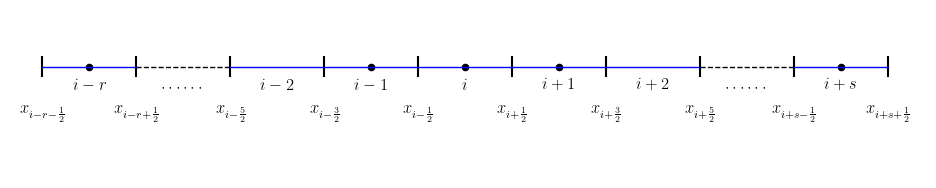

# Upwind5

## WENO Link

- [OneFLOW-WENO schemes](https://eric2003.github.io/OneFLOW/cfd/scheme/weno.html).
- [Efficient Finite Difference WENO Scheme for Hyperbolic Systems with Non-Conservative Products and Stiff Source Terms](https://www.youtube.com/watch?v=D87ctxheEr0).
- [Prof. Chi-Wang Shu: Mathematics in Scientific Computing](https://www.youtube.com/watch?v=0FdOVvCJJEk).
- [High-Order CFD Solvers on Three-Dimensional Unstructured Meshes: Parallel Implementation of RKDG Method with WENO Limiter and Momentum Sources](https://www.mdpi.com/2226-4310/9/7/372).
- [CFD_Julia](https://github.com/surajp92/CFD_Julia).
- [WENO格式自动推导](https://blog.csdn.net/weixin_43325228/article/details/128057804).
- [An Improved WENO-Z Scheme for Hyperbolic Conservation Laws with New Global Smoothness Indicator](https://www.mdpi.com/2227-7390/11/21/4449).
- [www.pyfr.org](https://www.pyfr.org/).


## ENO 与 WENO 中的光滑性选择
 
- [A Robust Seventh-order WENO Scheme and Its Applications](https://acfdlab.miami.edu/publications/AIAA-2008-0757.pdf).


---

### 背景回顾：ENO 与 WENO 中的光滑性选择

在 ENO（Essentially Non-Oscillatory，本质无振荡）重构方法中，为了在间断附近避免产生数值振荡，算法会从多个候选模板（stencil）$S_r(i)$ 中选择一个“最光滑”的模板进行多项式插值。判断“光滑”的依据，通常是通过比较模板上函数值的**差分**（divided/undivided differences）：差分越小，表明函数在该模板上越光滑。

然而，差分仅是一种启发式度量。为了更系统、更鲁棒地衡量光滑性，Jiang 和 Shu 在文献 [43] 中提出了一种**基于重构多项式导数的光滑性指示器** $\beta_r$，这一构造被证明在**三阶和五阶**WENO 方法中非常有效。

---

### 光滑性指示器 $\beta_r$ 的定义（公式 2.61）

对于每个候选模板 $S_r(i)$，我们可以构造一个 **$(k-1)$ 次**的重构多项式 $p_r(x)$，使得它在单元平均值 $\bar{v}_j$ 上满足插值条件（即：$p_r(x)$ 在每个单元 $I_j$ 上的平均值等于 $\bar{v}_j$）。这个多项式用于逼近界面 $x_{i+1/2}$ 处的真实值 $v(x_{i+1/2})$。

为了衡量 $p_r(x)$ 在单元 $I_i = [x_{i-1/2}, x_{i+1/2}]$ 上的**光滑程度**，定义如下光滑性指示器：

\[
\beta_r = \sum_{l=1}^{k-1} \int_{x_{i-1/2}}^{x_{i+1/2}} \Delta x^{2l - 1} \left( \frac{d^l p_r(x)}{dx^l} \right)^2 dx
\]

#### 各部分含义：

- **求和范围 $l = 1$ 到 $k-1$**：因为我们使用的是 $(k-1)$ 阶多项式，其最高非零导数为 $(k-1)$ 阶，因此考虑所有阶导数（从一阶到 $k-1$ 阶）。
- **被积函数 $\left( \frac{d^l p_r}{dx^l} \right)^2$**：这是第 $l$ 阶导数的**平方**，即 $L^2$ 范数的平方。导数越大，说明函数变化越剧烈，越不光滑。
- **权重因子 $\Delta x^{2l - 1}$**：该因子起到**无量纲化**作用。因为导数 $\frac{d^l}{dx^l}$ 本身具有量纲 $\Delta x^{-l}$，平方后是 $\Delta x^{-2l}$，再乘以积分区间长度 $\Delta x$，整体量纲为 $\Delta x^{1 - 2l}$。引入 $\Delta x^{2l - 1}$ 后，整个积分项变为**无量纲量**，从而保证在网格细化（$\Delta x \to 0$）时，$\beta_r$ 的值不会因为网格尺度变化而失真。这对于保持**双曲型 PDE 数值格式的自相似性**（self-similarity）非常重要（见第 2.3 节）。
- **物理意义**：$\beta_r$ 本质上是多项式 $p_r(x)$ 在单元 $I_i$ 内所有阶导数的**加权 $L^2$ 范数平方和**。值越小，说明该多项式越“平坦”、越光滑。

> ✅ 与传统的**总变差**（Total Variation, TV，基于 $L^1$ 范数）相比，这种基于 $L^2$ 范数的度量更光滑、更易于解析处理，且在低阶（如 $k=2,3$）情况下能给出更准确的 WENO 权重。

---

### 具体例子：$k=2$（三阶 WENO）

当 $k=2$，即使用**线性多项式**（1 次）重构（整体格式为三阶精度），每个模板只包含两个单元。

- 模板 $S_0(i) = \{i, i+1\}$ → $\beta_0 = (\bar{v}_{i+1} - \bar{v}_i)^2$
- 模板 $S_1(i) = \{i-1, i\}$ → $\beta_1 = (\bar{v}_i - \bar{v}_{i-1})^2$

这恰好是一阶差分的平方！说明：在一阶导数主导的情况下，光滑性就由函数值的变化幅度决定。

---

### 具体例子：$k=3$（五阶 WENO）

当 $k=3$，使用**二次多项式**（2 次）重构（整体五阶精度），每个模板包含三个单元。此时 $\beta_r$ 包含一阶和二阶导数的贡献，展开后得到：

\[
\begin{aligned}
\beta_0 &= \frac{13}{12}(\bar{v}_i - 2\bar{v}_{i+1} + \bar{v}_{i+2})^2 + \frac{1}{4}(3\bar{v}_i - 4\bar{v}_{i+1} + \bar{v}_{i+2})^2, \\
\beta_1 &= \frac{13}{12}(\bar{v}_{i-1} - 2\bar{v}_i + \bar{v}_{i+1})^2 + \frac{1}{4}(\bar{v}_{i-1} - \bar{v}_{i+1})^2, \\
\beta_2 &= \frac{13}{12}(\bar{v}_{i-2} - 2\bar{v}_{i-1} + \bar{v}_i)^2 + \frac{1}{4}(\bar{v}_{i-2} - 4\bar{v}_{i-1} + 3\bar{v}_i)^2.
\end{aligned}
\]

#### 逐项解释：

- **第一项（系数 13/12）**：对应**二阶差分**（$\Delta^2 \bar{v}$），反映函数的**曲率**（二阶导数）。如果函数接近线性，这项应接近零。
- **第二项（系数 1/4）**：对应**一阶差分的某种组合**，反映**斜率**（一阶导数）。
- 两个项加权平方和，就是该模板上重构多项式“不光滑程度”的综合度量。

> 注意：不同模板的表达式结构不同，是因为它们相对于界面 $x_{i+1/2}$ 的位置不同（右偏、居中、左偏），因此插值多项式的形式不同，导数也不同。

---

### 为什么这个 $\beta_r$ 更好？

1. **物理一致性**：基于导数的 $L^2$ 范数比基于差分的启发式判断更符合光滑性的数学定义。
2. **精度更高**：尤其在 $k=2,3$ 时，使用此 $\beta_r$ 的 WENO 格式比早期用差分作为光滑指示器的版本更准确。
3. **鲁棒性强**：经过大量数值实验验证，在激波、接触间断等复杂情形下表现稳定。
4. **便于理论分析**：积分形式便于进行误差分析和稳定性研究。

---

### 总结

公式 定义的 $\beta_r$ 是 WENO 方法中用于衡量候选模板光滑性的核心工具。它通过量化重构多项式在目标单元内的各阶导数大小（加权 $L^2$ 范数），提供了一个**无量纲、光滑、鲁棒**的光滑性指标。对于常用的三阶（$k=2$）和五阶（$k=3$）WENO，其具体表达式可直接用于编程实现，是现代高精度激波捕捉格式的标准组成部分。


当然可以！我们一步一步、从最简单的情况开始，耐心地推导 **从光滑性指示器定义（2.61）如何得到具体的差分表达式（2.62）和（2.63）**。  
我们会先处理 **$k = 2$（三阶 WENO，线性重构）**，然后再进阶到 **$k =3$（五阶 WENO，二次重构）**。  
目标是：**从积分形式 → 写出多项式 → 求导 → 积分 → 用网格平均值 $\bar{v}_j$ 表示 → 得到差分形式**。

我们假设：

- 网格是均匀的，单元中心为 $ x_j $，单元界面为 $ x_{j\pm1/2} = x_j \pm \frac{\Delta x}{2} $；
- 每个单元 $I_j = [x_{j-1/2}, x_{j+1/2}]$ 上给定的是**单元平均值** $\bar{v}_j$，即：

\[
  \bar{v}_j = \frac{1}{\Delta x} \int_{x_{j-1/2}}^{x_{j+1/2}} v(x) \, dx.
\]

- 重构多项式 $p_r(x)$ 是在模板 $S_r(i)$ 上构造的，满足：它在每个单元 $I_j \in S_r(i)$ 上的平均值等于 $\bar{v}_j$。

> ⚠️ 注意：这里不是插值点值，而是**平均值约束**。这是有限体积法（FVM）中 WENO 重构的关键！但我们可以通过**多项式在单元上的平均值等于给定值**这一条件，反解出多项式系数。

---

## 第一部分：$k = 2$（线性重构，三阶 WENO）

此时每个模板包含 **2 个单元**，构造 **1 次多项式**（直线）。

我们以模板 $S_0(i) = \{i, i+1\}$ 为例，目标是计算 $\beta_0$。

### 步骤 1：写出一般形式的线性多项式

设在模板 $S_0(i)$ 上，重构多项式为：

\[
p_0(x) = a + b(x - x_i),
\]

这里我们以 $x_i$ 为参考点（便于对称），$a, b$ 是待定系数。

### 步骤 2：施加平均值约束

多项式必须满足：

\[
\frac{1}{\Delta x} \int_{x_{i-1/2}}^{x_{i+1/2}} p_0(x)\,dx = \bar{v}_i, \quad
\frac{1}{\Delta x} \int_{x_{i+1/2}}^{x_{i+3/2}} p_0(x)\,dx = \bar{v}_{i+1}.
\]

> 注意：虽然 $p_0(x)$ 是在整个实数轴定义的，但我们只关心它在 $I_i$ 和 $I_{i+1}$ 上的平均值。

先计算第一个积分：

\[
\int_{x_{i-1/2}}^{x_{i+1/2}} p_0(x)\,dx = \int_{-\Delta x/2}^{\Delta x/2} [a + b \xi] \, d\xi \quad (\text{令 } \xi = x - x_i)
= a \Delta x + b \cdot 0 = a \Delta x.
\]

所以

\[
\frac{1}{\Delta x} \cdot a \Delta x = a = \bar{v}_i \quad \Rightarrow \quad a = \bar{v}_i.
\]

再算第二个单元 $I_{i+1} = [x_{i+1/2}, x_{i+3/2}]$：
令 $\xi = x - x_i$，则 $x \in [ \Delta x/2, 3\Delta x/2 ]$，所以：

\[
\int_{x_{i+1/2}}^{x_{i+3/2}} p_0(x)\,dx = \int_{\Delta x/2}^{3\Delta x/2} (a + b \xi) \, d\xi
= a \Delta x + b \int_{\Delta x/2}^{3\Delta x/2} \xi \, d\xi
= a \Delta x + b \cdot \Delta x^2.
\]

> 计算细节：

> \[
> \int_{\Delta x/2}^{3\Delta x/2} \xi \, d\xi = \frac{1}{2} \left( \left(\frac{3\Delta x}{2}\right)^2 - \left(\frac{\Delta x}{2}\right)^2 \right)
> = \frac{1}{2} \left( \frac{9\Delta x^2}{4} - \frac{\Delta x^2}{4} \right) = \frac{1}{2} \cdot 2\Delta x^2 = \Delta x^2.
> \]

所以平均值为：

\[
\frac{1}{\Delta x} \left( a \Delta x + b \Delta x^2 \right) = a + b \Delta x = \bar{v}_{i+1}.
\]

因为我们已知 $a = \bar{v}_i$，代入得：

\[
\bar{v}_i + b \Delta x = \bar{v}_{i+1} \quad \Rightarrow \quad b = \frac{\bar{v}_{i+1} - \bar{v}_i}{\Delta x}.
\]

### 步骤 3：写出完整多项式

\[
p_0(x) = \bar{v}_i + \frac{\bar{v}_{i+1} - \bar{v}_i}{\Delta x} (x - x_i).
\]

### 步骤 4：计算光滑性指标 $\beta_0$

根据 (2.61)，当 $k = 2$，求和从 $l = 1$ 到 $k-1 = 1$，只有一项：

\[
\beta_0 = \int_{x_{i-1/2}}^{x_{i+1/2}} \Delta x^{2\cdot1 - 1} \left( \frac{d p_0}{dx} \right)^2 dx
= \int_{x_{i-1/2}}^{x_{i+1/2}} \Delta x^{1} \cdot b^2 \, dx.
\]

因为 $\frac{dp_0}{dx} = b = \text{常数}$，所以：

\[
\beta_0 = \Delta x \cdot b^2 \cdot \int_{x_{i-1/2}}^{x_{i+1/2}} dx = \Delta x \cdot b^2 \cdot \Delta x = \Delta x^2 \cdot b^2.
\]

代入 $b = \frac{\bar{v}_{i+1} - \bar{v}_i}{\Delta x}$：

\[
\beta_0 = \Delta x^2 \cdot \left( \frac{\bar{v}_{i+1} - \bar{v}_i}{\Delta x} \right)^2 = (\bar{v}_{i+1} - \bar{v}_i)^2.
\]

✅ 完美得到 (2.62) 中的 $\beta_0$！

同理，对模板 $S_1(i) = \{i-1, i\}$，可得：

\[
\beta_1 = (\bar{v}_i - \bar{v}_{i-1})^2.
\]

> 🎯 关键点：**一阶导数是常数，积分就是乘以区间长度，再乘上 $\Delta x$ 权重，刚好抵消分母，得到差分的平方**。

---

## 第二部分：$k = 3$（二次重构，五阶 WENO）

现在每个模板有 **3 个单元**，构造 **2 次多项式**（抛物线）。

我们以**中间模板** $S_1(i) = \{i-1, i, i+1\}$ 为例（对应 $\beta_1$），因为它最对称，最容易理解。

### 步骤 1：写出二次多项式（以 $x_i$ 为中心）

设：

\[
p_1(x) = a + b(x - x_i) + c(x - x_i)^2.
\]

### 步骤 2：施加三个平均值约束

需要满足：

- $\displaystyle \frac{1}{\Delta x} \int_{I_{i-1}} p_1(x) dx = \bar{v}_{i-1}$
- $\displaystyle \frac{1}{\Delta x} \int_{I_i} p_1(x) dx = \bar{v}_i$
- $\displaystyle \frac{1}{\Delta x} \int_{I_{i+1}} p_1(x) dx = \bar{v}_{i+1}$

令 $\xi = x - x_i$，则：

- $I_{i-1}: \xi \in [-3\Delta x/2, -\Delta x/2]$
- $I_i: \xi \in [-\Delta x/2, \Delta x/2]$
- $I_{i+1}: \xi \in [\Delta x/2, 3\Delta x/2]$

计算每个积分：

#### 1. 单元 $I_i$（对称区间）

\[
\int_{-\Delta x/2}^{\Delta x/2} [a + b\xi + c\xi^2] d\xi = a\Delta x + 0 + c \cdot \frac{\Delta x^3}{12}.
\]

所以：

\[
\frac{1}{\Delta x} \int_{I_i} p_1 dx = a + c \cdot \frac{\Delta x^2}{12} = \bar{v}_i. \quad (1)
\]

#### 2. 单元 $I_{i+1}$：$\xi \in [\Delta x/2, 3\Delta x/2]$

\[
\int_{\Delta x/2}^{3\Delta x/2} (a + b\xi + c\xi^2) d\xi
= a \Delta x + b \Delta x^2 + c \cdot \frac{13}{12} \Delta x^3,
\]

平均值：

\[
a + b \Delta x + c \cdot \frac{13}{12} \Delta x^2 = \bar{v}_{i+1}. \quad (2)
\]

#### 3. 单元 $I_{i-1}$：$\xi \in [-3\Delta x/2, -\Delta x/2]$

利用对称性（或直接计算）：

\[
a - b \Delta x + c \cdot \frac{13}{12} \Delta x^2 = \bar{v}_{i-1}. \quad (3)
\]

### 步骤 3：解方程组求导数

我们不需要完全解出 $a, b, c$，因为 **$\beta_1$ 只依赖导数！**

计算导数：

- $p_1'(x) = b + 2c(x - x_i)$
- $p_1''(x) = 2c$

根据 (2.61)，当 $k=3$，有：

\[
\beta_1 = \int_{x_{i-1/2}}^{x_{i+1/2}} \left[ \Delta x^{1} (p_1')^2 + \Delta x^{3} (p_1'')^2 \right] dx.
\]

> 因为：$l=1 \Rightarrow \Delta x^{2\cdot1 -1} = \Delta x^1$，$l=2 \Rightarrow \Delta x^{3}$

现在分别计算两项。

---

### 第一项：一阶导数项

\[
I_1 = \Delta x \int_{-\Delta x/2}^{\Delta x/2} [b + 2c \xi]^2 d\xi
= \Delta x \left[ b^2 \Delta x + 4c^2 \cdot \frac{\Delta x^3}{12} \right]
= \Delta x^2 b^2 + \frac{1}{3} \Delta x^4 c^2.
\]

### 第二项：二阶导数项

\[
I_2 = \Delta x^3 \int_{-\Delta x/2}^{\Delta x/2} (2c)^2 dx = \Delta x^3 \cdot 4c^2 \cdot \Delta x = 4 \Delta x^4 c^2.
\]

### 总和：

\[
\beta_1 = I_1 + I_2 = \Delta x^2 b^2 + \left( \frac{1}{3} + 4 \right) \Delta x^4 c^2 = \Delta x^2 b^2 + \frac{13}{3} \Delta x^4 c^2.
\]

现在需要用 $\bar{v}_{i-1}, \bar{v}_i, \bar{v}_{i+1}$ 表示 $b$  和 $c$。

从方程 (2) 和 (3) 相减：

\[
(2) - (3): \quad 2b \Delta x = \bar{v}_{i+1} - \bar{v}_{i-1} \quad \Rightarrow \quad b = \frac{\bar{v}_{i+1} - \bar{v}_{i-1}}{2\Delta x}.
\]

(2) + (3)：

\[
2a + 2c \cdot \frac{13}{12} \Delta x^2 = \bar{v}_{i+1} + \bar{v}_{i-1}.
\]

再用 (1)：$a = \bar{v}_i - \frac{c \Delta x^2}{12}$，代入上式：

\[
2\bar{v}_i + 2c \Delta x^2 = \bar{v}_{i+1} + \bar{v}_{i-1}
\quad \Rightarrow \quad
c = \frac{ \bar{v}_{i-1} - 2\bar{v}_i + \bar{v}_{i+1} }{2 \Delta x^2 }.
\]

> 这正是二阶中心差分！

### 代入 $\beta_1$

先算 $\Delta x^2 b^2$：

\[
\Delta x^2 \cdot \left( \frac{\bar{v}_{i+1} - \bar{v}_{i-1}}{2\Delta x} \right)^2 = \frac{1}{4} (\bar{v}_{i+1} - \bar{v}_{i-1})^2.
\]

再算 $\frac{13}{3} \Delta x^4 c^2$：

\[
\frac{13}{3} \Delta x^4 \cdot \left( \frac{ \bar{v}_{i-1} - 2\bar{v}_i + \bar{v}_{i+1} }{2 \Delta x^2 } \right)^2
= \frac{13}{12} ( \bar{v}_{i-1} - 2\bar{v}_i + \bar{v}_{i+1} )^2.
\]

因此：

\[
\beta_1 = \frac{13}{12}(\bar{v}_{i-1} - 2\bar{v}_i + \bar{v}_{i+1})^2 + \frac{1}{4}(\bar{v}_{i-1} - \bar{v}_{i+1})^2.
\]

✅ 完全匹配 (2.63) 中的 $\beta_1$！

---

### 补充说明：非对称模板（如 $\beta_0$）

对于 $S_0(i) = \{i, i+1, i+2\}$，多项式仍为二次，但中心不在 $x_i$，计算过程类似，只是积分区间和平均值约束不同，最终会得到：

- 二阶差分项：$\bar{v}_i - 2\bar{v}_{i+1} + \bar{v}_{i+2}$
- 一阶差分组合：$3\bar{v}_i - 4\bar{v}_{i+1} + \bar{v}_{i+2}$（这其实是非对称的一阶导数近似）

推导过程完全平行，只是代数更繁琐，核心思想一致。

---

## 总结：从 (2.61) 到差分表达式的通用步骤

1. **根据模板大小**（k）；
2. **写出多项式**（以某点为参考）；
3. **利用单元平均值条件建立方程**；
4. **求出各阶导数**（或直接保留系数）；
5. **代入 (2.61) 的积分式**，计算每一项；
6. **将系数用 $ \bar{v}_j $ 表示**（通过解线性方程组）；
7. **化简得到差分平方和形式**。

这个过程虽然代数繁琐，但**完全机械**，因此文献 [43] 直接给出了结果。而理解其来源，有助于我们在非均匀网格、高维或非标准模板时自行推导。


非常好的问题！  
将变量 **归一化**（即令  

\[
\xi = \frac{x - x_i}{\Delta x}
\]  

）不仅能让推导更简洁、消除对 \(\Delta x\) 的依赖，更能**揭示 WENO 光滑性指示器的尺度不变性**（scale invariance）这一本质特性——这正是公式 (2.61) 中引入 \(\Delta x^{2l-1}\) 权重的根本原因。

下面我们**用归一化变量 \(\xi\) 重新推导**，并对比之前的结果，说明“为什么这样做更深刻”。

---

## 一、归一化的意义与设置

令：

\[
x = x_i + \Delta x \cdot \xi \quad \Longleftrightarrow \quad \xi = \frac{x - x_i}{\Delta x}.
\]

那么：

- 单元 \(I_i = [x_{i-1/2}, x_{i+1/2}]\) 对应 \(\xi \in [-1/2, 1/2]\)；
- 单元 \(I_{i+1}\) 对应 \(\xi \in [1/2, 3/2]\)；
- 单元 \(I_{i-1}\) 对应 \(\xi \in [-3/2, -1/2]\)，等等；
- 微分变换：\(dx = \Delta x \, d\xi\)；
- 导数变换：

\[
\frac{d}{dx} = \frac{1}{\Delta x} \frac{d}{d\xi}, \quad
\frac{d^l}{dx^l} = \frac{1}{\Delta x^l} \frac{d^l}{d\xi^l}.
\]

> ✅ **关键洞察**：物理空间中的导数会随网格尺度变化，但归一化空间中的导数 \(\frac{d^l p}{d\xi^l}\) 是**纯数值量**，与 \(\Delta x\) 无关。

---

## 二、重写光滑性指示器 (2.61) 的归一化形式

原式：

\[
\beta_r = \sum_{l=1}^{k-1} \int_{x_{i-1/2}}^{x_{i+1/2}} \Delta x^{2l - 1} \left( \frac{d^l p_r(x)}{dx^l} \right)^2 dx.
\]

代入变换：

- \(\frac{d^l p_r}{dx^l} = \frac{1}{\Delta x^l} \frac{d^l p_r}{d\xi^l}\)，
- \(dx = \Delta x \, d\xi\)，
- 积分限变为 \(\xi \in [-1/2, 1/2]\)。

于是：

\[
\begin{aligned}
\beta_r 
&= \sum_{l=1}^{k-1} \int_{-1/2}^{1/2} \Delta x^{2l - 1} \left( \frac{1}{\Delta x^l} \frac{d^l p_r}{d\xi^l} \right)^2 (\Delta x \, d\xi) \\
&= \sum_{l=1}^{k-1} \int_{-1/2}^{1/2} \Delta x^{2l - 1} \cdot \frac{1}{\Delta x^{2l}} \cdot \left( \frac{d^l p_r}{d\xi^l} \right)^2 \cdot \Delta x \, d\xi \\
&= \sum_{l=1}^{k-1} \int_{-1/2}^{1/2} \left( \frac{d^l p_r}{d\xi^l} \right)^2 d\xi.
\end{aligned}
\]

> 🌟 **惊人结果**：**所有 \(\Delta x\) 都消掉了！**
> 
> \[
> \boxed{
> \beta_r = \sum_{l=1}^{k-1} \int_{-1/2}^{1/2} \left( \frac{d^l p_r(\xi)}{d\xi^l} \right)^2 d\xi
> }
> \]

这意味着：**\(\beta_r\) 本质上是归一化多项式在单位参考单元上的导数能量，完全与网格尺度无关**。这正是“自相似性”（self-similarity）的数学体现——无论网格多密，光滑性度量的方式不变。

> 🔍 **这就是为什么 (2.61) 中要引入 \(\Delta x^{2l-1}\) —— 它的作用就是抵消导数和积分中的 \(\Delta x\) 依赖，使得 \(\beta_r\) 是一个“纯形状”度量，只反映多项式在局部的振荡程度，而不受网格粗细影响。**

---

## 三、用归一化变量重新推导 \(k=2\) 的情况（更简洁！）

模板 \(S_0(i) = \{i, i+1\}\)，构造线性多项式：

\[
p_0(\xi) = a + b \xi.
\]

> 注意：现在 \(p_0\) 是 \(\xi\) 的函数，系数 \(a, b\) 是无量纲常数。

### 施加平均值约束（在 \(\xi\) 空间）

- 单元 \(I_i\)：\(\xi \in [-1/2, 1/2]\)，

\[
\frac{1}{\Delta x} \int_{I_i} p_0(x) dx = \int_{-1/2}^{1/2} p_0(\xi) d\xi = a = \bar{v}_i.
\]

- 单元 \(I_{i+1}\)：\(\xi \in [1/2, 3/2]\)，

\[
\int_{1/2}^{3/2} (a + b \xi) d\xi = a + b = \bar{v}_{i+1} \quad \text{（因为积分长度为1）}.
\]

> 为什么？因为：

> \[
> \int_{1/2}^{3/2} d\xi = 1, \quad \int_{1/2}^{3/2} \xi d\xi = 1.
> \]

所以：

\[
a = \bar{v}_i, \quad a + b = \bar{v}_{i+1} \Rightarrow b = \bar{v}_{i+1} - \bar{v}_i.
\]

### 计算 \(\beta_0\)

\[
\beta_0 = \int_{-1/2}^{1/2} \left( \frac{d p_0}{d\xi} \right)^2 d\xi = \int_{-1/2}^{1/2} b^2 d\xi = b^2 = (\bar{v}_{i+1} - \bar{v}_i)^2.
\]

✅ 一步到位！无需处理 \(\Delta x\)。

---

## 四、用归一化变量推导 \(k=3\) 的中间模板（\(\beta_1\)）

设：

\[
p_1(\xi) = a + b \xi + c \xi^2.
\]

### 平均值约束（在 \(\xi\) 空间）

- \(I_{i-1}\)：\(\xi \in [-3/2, -1/2]\)，

\[
\int_{-3/2}^{-1/2} p_1(\xi) d\xi = a - b + \frac{13}{12} c = \bar{v}_{i-1}.
\]

- \(I_i\)：\(\xi \in [-1/2, 1/2]\)，

\[
\int_{-1/2}^{1/2} p_1(\xi) d\xi = a + \frac{1}{12} c = \bar{v}_i.
\]

- \(I_{i+1}\)：\(\xi \in [1/2, 3/2]\)，

\[
\int_{1/2}^{3/2} p_1(\xi) d\xi = a + b + \frac{13}{12} c = \bar{v}_{i+1}.
\]

> 这些积分结果可通过直接计算得到，且**所有结果都是纯数**，不含 \(\Delta x\)。

### 解出导数相关量

由对称性可得：

\[
b = \frac{\bar{v}_{i+1} - \bar{v}_{i-1}}{2}, \quad
c = \frac{\bar{v}_{i-1} - 2\bar{v}_i + \bar{v}_{i+1}}{2}.
\]

### 计算 \(\beta_1\)

\[
\beta_1 = \int_{-1/2}^{1/2} \left( \frac{dp_1}{d\xi} \right)^2 d\xi + \int_{-1/2}^{1/2} \left( \frac{d^2 p_1}{d\xi^2} \right)^2 d\xi.
\]

- \(\frac{dp_1}{d\xi} = b + 2c\xi\)，
- \(\frac{d^2 p_1}{d\xi^2} = 2c\).

计算：

\[
\begin{aligned}
\int_{-1/2}^{1/2} (b + 2c\xi)^2 d\xi &= b^2 + \frac{1}{3} c^2, \\
\int_{-1/2}^{1/2} (2c)^2 d\xi &= 4c^2.
\end{aligned}
\]

所以：

\[
\beta_1 = b^2 + \left( \frac{1}{3} + 4 \right) c^2 = b^2 + \frac{13}{3} c^2.
\]

代入 \(b, c\) 表达式：

\[
\beta_1 = \frac{1}{4}(\bar{v}_{i+1} - \bar{v}_{i-1})^2 + \frac{13}{12}(\bar{v}_{i-1} - 2\bar{v}_i + \bar{v}_{i+1})^2.
\]

✅ 与之前完全一致，但**推导更干净、无 \(\Delta x\) 干扰**。

---

## 五、深刻本质：为什么归一化揭示了问题核心？

1. **消除尺度依赖**：  
   物理问题可能在不同尺度下重复出现（如激波结构在细/粗网格上相似），WENO 希望**光滑性判断不随网格变化**。归一化后，\(\beta_r\) 仅由“形状”决定，完美实现这一点。

2. **通用性**：  
   一旦在参考单元 \([-1/2, 1/2]\) 上推导出 \(\beta_r\) 的差分形式，**对任意 \(\Delta x\) 都成立**，无需重新计算。

3. **与有限元/谱方法思想一致**：  
   归一化参考单元是现代数值方法（如 finite element, DG）的标准做法，便于局部计算和组装。

4. **解释 \(\Delta x^{2l-1}\) 的由来**：  
   它不是人为凑出来的，而是**为了使 \(\beta_r\) 在变量替换下不变**（即满足尺度不变性）而**唯一确定**的权重。

---

## 六、总结

| 方法 | 是否含 \(\Delta x\) | 推导复杂度 | 揭示本质 |
|------|-------------------|-----------|--------|
| 物理空间推导 | 是 | 较高（需跟踪量纲） | 表面 |
| **归一化空间推导** | **否** | **低（纯代数）** | **深刻（尺度不变性）** |

> ✅ **最终结论**：  
> 光滑性指示器 \(\beta_r\) 的本质是——**在参考单元上，重构多项式各阶导数的 \(L^2\) 能量之和**。  
> 它是一个**纯几何/代数量**，衡量多项式“有多弯”，与网格粗细、物理单位完全无关。  
> 这正是 WENO 方法鲁棒性和高精度的基石之一。

如果您希望，我也可以用归一化方式完整推导非对称模板（如 \(\beta_0\)）的表达式，过程同样简洁优美。


## 再次推导

\[
\beta_r = \sum_{l=1}^{k-1} \int_{-1/2}^{1/2} \left( \frac{d^l p_r(\xi)}{d\xi^l} \right)^2 d\xi
\]

\(k=3\)设：

\[
p_{r}(\xi) = a_{0} + a_{1} \xi + a_{2} \xi^2.
\]

### 计算 \(\beta_{r}\)


\[
\begin{array}{l}
\beta_r = \displaystyle \sum_{l=1}^{k-1} \int_{-1/2}^{1/2} \left( \frac{d^l p_r(\xi)}{d\xi^l} \right)^2 d\xi\\
\beta_r = \displaystyle \sum_{l=1}^{2} \int_{-1/2}^{1/2} \left( \frac{d^l p_r(\xi)}{d\xi^l} \right)^2 d\xi\\
= \displaystyle\int_{-1/2}^{1/2} \left( \frac{d^1 p_r(\xi)}{d\xi^1} \right)^2 d\xi
+\displaystyle\int_{-1/2}^{1/2} \left( \frac{d^2 p_r(\xi)}{d\xi^2} \right)^2 d\xi
\end{array}
\]

\[
p_{r}(\xi) = a_{0} + a_{1} \xi + a_{2} \xi^2.
\]

\[
\begin{array}{l}
\displaystyle \frac{d^1 p_r(\xi)}{d\xi^1}=\frac{d^1(a_{0} + a_{1} \xi + a_{2} \xi^2)}{d\xi^1}=0+a_{1}+2a_{2} \xi\\
\displaystyle \frac{d^2 p_r(\xi)}{d\xi^2}=\frac{d^2(a_{0} + a_{1} \xi + a_{2} \xi^2)}{d\xi^2}=0+0+2a_{2}
\end{array}
\]

一般情况

\[
p_{r}(\xi) = a_{0} + a_{1} \xi + a_{2} \xi^2 + \cdots + a_{k-1} \xi^{k-1}.
\]


\[
\begin{array}{l}
\displaystyle \frac{d^1 p_r(\xi)}{d\xi^1}&=\displaystyle\frac{d^1(a_{0} + a_{1} \xi + a_{2} \xi^2 + \cdots + a_{k-1} \xi^{k-1})}{d\xi^1}\\
&=0+a_{1}+2a_{2}\xi+\cdots+(k-1)a_{k-1}\xi^{k-2}\\
\displaystyle \frac{d^2 p_r(\xi)}{d\xi^2}&=\displaystyle\frac{d^2(a_{0} + a_{1} \xi + a_{2} \xi^2 + \cdots + a_{k-1} \xi^{k-1})}{d\xi^2}\\
&=0+0+2a_{2}+\cdots+(k-2)(k-1)a_{k-1}\xi^{k-3}\\
\cdots\cdots \\
\displaystyle \frac{d^{k-2} p_r(\xi)}{d\xi^{k-2}}&=\displaystyle\frac{d^{k-2}(a_{0} + a_{1} \xi + a_{2} \xi^2 + \cdots + a_{k-1} \xi^{k-1})}{d\xi^{k-2}}\\
&=0+0+0+\cdots+2*3*\cdots*(k-1)a_{k-1}\xi\\
\displaystyle \frac{d^{k-1} p_r(\xi)}{d\xi^{k-1}}&=\displaystyle\frac{d^{k-1}(a_{0} + a_{1} \xi + a_{2} \xi^2 + \cdots + a_{k-1} \xi^{k-1})}{d\xi^{k-1}}\\
&=0+0+0+\cdots+0+(k-1)!a_{k-1}\\
\end{array}
\]

\[
\begin{array}{l}
\beta_r = \displaystyle \sum_{l=1}^{k-1} \int_{-1/2}^{1/2} \left( \frac{d^l p_r(\xi)}{d\xi^l} \right)^2 d\xi\\
=\displaystyle\int_{-1/2}^{1/2} \left( \frac{d^1 p_r(\xi)}{d\xi^1} \right)^2 d\xi
+\displaystyle\int_{-1/2}^{1/2} \left( \frac{d^2 p_r(\xi)}{d\xi^2} \right)^2 d\xi
+\cdots
+\displaystyle\int_{-1/2}^{1/2} \left( \frac{d^{k-1} p_r(\xi)}{d\xi^{k-1}} \right)^2 d\xi
\end{array}
\]

在有一般性公式的情况下，继续考虑\(k=3\)的特例

\[
p_{r}(\xi) = a_{0} + a_{1} \xi + a_{2} \xi^2.
\]

\[
\begin{array}{l}
\displaystyle \frac{d^1 p_r(\xi)}{d\xi^1}=\frac{d^1(a_{0} + a_{1} \xi + a_{2} \xi^2)}{d\xi^1}=0+a_{1}+2a_{2} \xi\\
\displaystyle \frac{d^2 p_r(\xi)}{d\xi^2}=\frac{d^2(a_{0} + a_{1} \xi + a_{2} \xi^2)}{d\xi^2}=0+0+2a_{2}
\end{array}
\]

\[
\begin{array}{l}
\beta_r = \displaystyle \sum_{l=1}^{2} \int_{-1/2}^{1/2} \left( \frac{d^l p_r(\xi)}{d\xi^l} \right)^2 d\xi\\
= \displaystyle\int_{-1/2}^{1/2} \left( \frac{d^1 p_r(\xi)}{d\xi^1} \right)^2 d\xi
+\displaystyle\int_{-1/2}^{1/2} \left( \frac{d^2 p_r(\xi)}{d\xi^2} \right)^2 d\xi
\end{array}
\]

\[
\begin{array}{l}
\beta_r &= \displaystyle\int_{-1/2}^{1/2} \left( \frac{d^1 p_r(\xi)}{d\xi^1} \right)^2 d\xi
+\displaystyle\int_{-1/2}^{1/2} \left( \frac{d^2 p_r(\xi)}{d\xi^2} \right)^2 d\xi\\
&= \displaystyle\int_{-1/2}^{1/2} \left(0+a_{1}+2a_{2} \xi \right)^2 d\xi
+\displaystyle\int_{-1/2}^{1/2} \left( 0+0+2a_{2} \right)^2 d\xi\\
\end{array}
\]


\[
\begin{array}{l}
\displaystyle \frac{d^{m} p_r(\xi)}{d\xi^{m}}=\frac{d^{m}(a_{0} + a_{1} \xi + \cdots +a_{k-1} \xi^{k-1})}{d\xi^{m}}\\
=a_{0}\displaystyle\frac{d^{m}(\xi^{0})}{d\xi^{m}}+
a_{1}\displaystyle\frac{d^{m}(\xi^{1})}{d\xi^{m}}+\cdots+
a_{k-1}\displaystyle\frac{d^{m}(\xi^{k-1})}{d\xi^{m}}\\
\end{array}
\]




在有一般性公式的情况下，继续考虑\(k=4\)的特例

\[
p_{r}(\xi)=a_{0}+a_{1}\xi+a_{2}\xi^2+a_{3}\xi^3.\\
\]

\[
\begin{array}{l}
\displaystyle \frac{d^1 p_r(\xi)}{d\xi^1}=\frac{d^1(a_{0}+a_{1}\xi+a_{2}\xi^2+a_{3}\xi^3)}{d\xi^1}=0+a_{1}+2a_{2}\xi+3a_{3}\xi^2\\
\displaystyle \frac{d^2 p_r(\xi)}{d\xi^2}=\frac{d^2(a_{0}+a_{1}\xi+a_{2}\xi^2+a_{3}\xi^3)}{d\xi^2}=0+0+2a_{2}+6a_{3}\xi\\
\displaystyle \frac{d^3 p_r(\xi)}{d\xi^2}=\frac{d^2(a_{0}+a_{1}\xi+a_{2}\xi^2+a_{3}\xi^3)}{d\xi^2}=0+0+0+6a_{3}
\end{array}
\]

\[
\begin{array}{l}
\beta_r = \displaystyle \sum_{l=1}^{3} \int_{-1/2}^{1/2} \left( \frac{d^l p_r(\xi)}{d\xi^l} \right)^2 d\xi\\
=\displaystyle \int_{-1/2}^{1/2} \left( \frac{d^1 p_r(\xi)}{d\xi^1} \right)^2 d\xi
+\displaystyle \int_{-1/2}^{1/2} \left( \frac{d^2 p_r(\xi)}{d\xi^2} \right)^2 d\xi
+\displaystyle \int_{-1/2}^{1/2} \left( \frac{d^3 p_r(\xi)}{d\xi^3} \right)^2 d\xi\\
=\displaystyle \int_{-1/2}^{1/2} \left(0+a_{1}+2a_{2}\xi+3a_{3}\xi^2 \right)^2 d\xi\\
+\displaystyle \int_{-1/2}^{1/2} \left(0+0+2a_{2}+6a_{3}\xi \right)^2 d\xi\\
+\displaystyle \int_{-1/2}^{1/2} \left(0+0+0+6a_{3} \right)^2 d\xi\\
\end{array}
\]

\[
\begin{array}{l}
(0+a_{1}+2a_{2}\xi+3a_{3}\xi^2)^2=
a_{1}^{2} + 4 a_{1} a_{2} \xi + (6 a_{1} a_{3}+4 a_{2}^{2} )\xi^{2} + 12 a_{2} a_{3} \xi^{3} + 9 a_{3}^{2} \xi^{4}\\
(0+0+2a_{2}+6a_{3}\xi)^2=4 a_{2}^{2} + 24 a_{2} a_{3} \xi + 36 a_{3}^{2} \xi^{2}\\
(0+0+0+6a_{3})^2=36 a_{3}^{2}\\
\end{array}
\]

\[
\begin{array}{l}
\displaystyle \int_{-1/2}^{1/2} \left(0+a_{1}+2a_{2}\xi+3a_{3}\xi^2 \right)^2 d\xi&=a_{1}^{2} + \cfrac{a_{1} a_{3}}{2} + \cfrac{a_{2}^{2}}{3} + \cfrac{9 a_{3}^{2}}{80}\\
\displaystyle \int_{-1/2}^{1/2} \left(0+0+2a_{2}+6a_{3}\xi \right)^2 d\xi&=4 a_{2}^{2} + 3 a_{3}^{2}\\
\displaystyle \int_{-1/2}^{1/2} \left(0+0+0+6a_{3} \right)^2 d\xi&=36 a_{3}^{2}\\
\end{array}
\]

\[
\begin{array}{l}
\beta_r = \displaystyle \sum_{l=1}^{3} \int_{-1/2}^{1/2} \left( \frac{d^l p_r(\xi)}{d\xi^l} \right)^2 d\xi\\
= \displaystyle a_{1}^{2} + \cfrac{a_{1} a_{3}}{2} + \cfrac{13 a_{2}^{2}}{3} + \cfrac{3129 a_{3}^{2}}{80}
\end{array}
\]

\[
\begin{array}{l}
\displaystyle \frac{d^{m} p_r(\xi)}{d\xi^{m}}=\frac{d^{m}(a_{0} + a_{1} \xi + \cdots +a_{k-1} \xi^{k-1})}{d\xi^{m}}\\
=a_{0}\displaystyle\frac{d^{m}(\xi^{0})}{d\xi^{m}}+
a_{1}\displaystyle\frac{d^{m}(\xi^{1})}{d\xi^{m}}+\cdots+
a_{k-1}\displaystyle\frac{d^{m}(\xi^{k-1})}{d\xi^{m}}\\
\end{array}
\]


一般情况

\[
p_{r}(\xi) = a_{0} + a_{1} \xi + a_{2} \xi^2 + \cdots + a_{k-1} \xi^{k-1}.
\]

\[
\begin{array}{l}
\displaystyle\int_{\xi(x_{i-r+j-1/2})}^{\xi(x_{i-r+j+1/2})} p(\xi) d\xi=\overline{u}_{i-r+j}\\
\displaystyle\int_{\xi_{i-r+j-1/2}}^{\xi_{i-r+j+1/2}} p(\xi) d\xi=\overline{u}_{i-r+j}\\
\end{array}
\]

\[
\begin{array}{l}
\xi_{i+m}=m\\
\xi_{i-r+j-1/2}=-r+j-1/2,\quad j=0,1,\cdots,k-1\\
\xi_{i-r+j+1/2}=-r+j+1/2,\quad j=0,1,\cdots,k-1\\
\end{array}
\]

\[
\int_{-r+j-1/2}^{-r+j+1/2} p(\xi) d\xi=\overline{u}_{i-r+j}\\
\]

\[
\int_{-r+j-1/2}^{-r+j+1/2} (a_{0} + a_{1} \xi + a_{2} \xi^2 + \cdots + a_{k-1} \xi^{k-1}) d\xi=\overline{u}_{i-r+j}\\
\]

\[
a_{0}\int_{\alpha}^{\beta}d\xi+ a_{1}\int_{\alpha}^{\beta}{\xi}d\xi+
a_{2}\int_{\alpha}^{\beta}{\xi}^{2}d{\xi}+\cdots
+a_{k-1}\int_{\alpha}^{\beta}{\xi}^{k-1}d{\xi}
=\overline{u}_{i-r+j}\\
\]

\[
\begin{array}{l}
\displaystyle a_{0}\int_{\alpha_{0}}^{\beta_{0}}d\xi+a_{1}\int_{\alpha_{0}}^{\beta_{0}}{\xi}d\xi+
a_{2}\int_{\alpha_{0}}^{\beta_{0}}{\xi}^{2}d{\xi}+\cdots
+a_{k-1}\int_{\alpha_{0}}^{\beta_{0}}{\xi}^{k-1}d{\xi}=\overline{u}_{i-r+0}\\
\displaystyle a_{0}\int_{\alpha_{1}}^{\beta_{1}}d\xi+a_{1}\int_{\alpha_{1}}^{\beta_{1}}{\xi}d\xi+
a_{2}\int_{\alpha_{1}}^{\beta_{1}}{\xi}^{2}d{\xi}+\cdots
+a_{k-1}\int_{\alpha_{1}}^{\beta_{1}}{\xi}^{k-1}d{\xi}=\overline{u}_{i-r+1}\\
\cdots\cdots\\
\displaystyle a_{0}\int_{\alpha_{k-1}}^{\beta_{k-1}}d\xi+a_{1}\int_{\alpha_{k-1}}^{\beta_{k-1}}{\xi}d\xi+
a_{2}\int_{\alpha_{k-1}}^{\beta_{k-1}}{\xi}^{2}d{\xi}+\cdots
+a_{k-1}\int_{\alpha_{k-1}}^{\beta_{k-1}}{\xi}^{k-1}d{\xi}=\overline{u}_{i-r+k-1}\\
\end{array}
\]

\[
\begin{array}{l}
a =\begin{bmatrix}
 a_{0}\\a_{1}\\\vdots\\a_{k-1}
\end{bmatrix},\quad a^{T}=\begin{bmatrix}
  a_{0}&a_{1}  &\cdots &a_{k-1}
\end{bmatrix}
\end{array}
\]

\[
u =\begin{bmatrix}
 \overline{u}_{i-r+0}\\\overline{u}_{i-r+1}\\\vdots\\\overline{u}_{i-r+k-1}
\end{bmatrix}
\]

\[
M\cdot a=u
\]

\[
M=\left[
\begin{array}{l}
  \int_{\alpha_{0}}^{\beta_{0}}d\xi &
  \int_{\alpha_{0}}^{\beta_{0}}{\xi}^{1}d\xi &
  \cdots &
  \int_{\alpha_{0}}^{\beta_{0}}{\xi}^{k-1}d\xi\\
  \int_{\alpha_{1}}^{\beta_{1}}d\xi &
  \int_{\alpha_{1}}^{\beta_{1}}{\xi}^{1}d\xi &
  \cdots &
  \int_{\alpha_{1}}^{\beta_{1}}{\xi}^{k-1}d\xi\\
  \cdots & \cdots & \cdots & \cdots \\
  \int_{\alpha_{k-1}}^{\beta_{k-1}}d\xi &
  \int_{\alpha_{k-1}}^{\beta_{k-1}}{\xi}^{1}d\xi &
  \cdots &
  \int_{\alpha_{k-1}}^{\beta_{k-1}}{\xi}^{k-1}d\xi\\
\end{array}
\right]
\]

\[
\begin{array}{c}
\alpha_{j}=-r+j-1/2=-r-1/2+j\\
\beta_{j}=-r+j+1/2=-r+1/2+j
\end{array}
\]

\[
\begin{array}{l}
\begin{bmatrix}
 a_{0}\\a_{1}\\\vdots\\a_{k-1}\\
\end{bmatrix}
=M^{-1}
\begin{bmatrix}
\overline{u}_{i-r+0}\\\overline{u}_{i-r+1}\\\vdots\\\overline{u}_{i-r+k-1}\\
\end{bmatrix}
\end{array}
\]


实际上\(M,a,v\)都是\(k,r\)的函数，对于给定的\(k\)，这些量都隐含着和\(r\)有关

\[
M=M(k\times k,r),a=a(k,r),v=v(k,r)
\]

there are constants $c_{rj}$ such that the reconstructed value at the cell boundary ${x}_{i+\frac{1}{2}}$

$$
{v}_{i+\frac{1}{2}}=\sum_{j=0}^{k-1}c_{rj}\bar{v}_{i-r+j}
$$


We summarize this as follows: given the $k$ cell averages

$$
\bar{v}_{i-r},\bar{v}_{i-r+1}\dots,\bar{v}_{i-r+k-1}
$$

there are constants $c_{rj}$ such that the reconstructed value at the cell boundary $x_{i+1/2}$

$$
v_{i+1/2}=c_{r0}\bar{v}_{i-r+0}+c_{r1}\bar{v}_{i-r+1}+\dots+c_{r,k-1}\bar{v}_{i-r+k-1}\\
$$

\[
p_{r}(\xi) = a_{0} + a_{1} \xi + a_{2} \xi^2 + \cdots + a_{k-1} \xi^{k-1}.
\]

$$
{v}_{i+\frac{1}{2},r}=p_{r}(\xi=1/2)=(a_{0,r}+a_{1,r}\xi+a_{2,r}\xi^2+\cdots+a_{k-1,r}\xi^{k-1})\big|_{\xi=1/2}
$$

\[
\vec{\xi} =\begin{bmatrix}
 1\\\xi^{1}\\\vdots\\\xi^{k-1}\\
\end{bmatrix},\quad
\vec{\xi}(\xi=1/2) =\begin{bmatrix}
 1\\\xi^{1}\\\vdots\\\xi^{k-1}\\
\end{bmatrix}_{\xi=1/2}\\
\]

\[
\begin{array}{l}
\mathbf{a}=[a_{0},a_{1},\dots,a_{k-1}]^T,\mathbf{q}(\xi) = [\xi^0, \xi^1, \dots, \xi^{k-1}]^{T}\\
\mathbf{v}=[\overline{v}_{i-r+0},\overline{v}_{i-r+1},\dots,\overline{v}_{i-r+k-1}]^T\\
\mathbf{a}=M^{-1}\mathbf{v}\\
\begin{bmatrix}
 a_{0}\\a_{1}\\\vdots\\a_{k-1}\\
\end{bmatrix}
=M^{-1}
\begin{bmatrix}
\overline{v}_{i-r+0}\\\overline{v}_{i-r+1}\\\vdots\\\overline{v}_{i-r+k-1}\\
\end{bmatrix}\\
{v}_{i+\frac{1}{2},r}=p_{r}(\xi=1/2)=(a_{0,r}+a_{1,r}\xi+a_{2,r}\xi^2+\cdots+a_{k-1,r}\xi^{k-1})\big|_{\xi=1/2}\\
{v}_{i+\frac{1}{2},r}=p_{r}(\xi=1/2)=\mathbf{a}^{T}\mathbf{q}(1/2)=\mathbf{q}^{T}(1/2)\mathbf{a}\\
{v}_{i+\frac{1}{2},r}=\mathbf{q}^{T}(1/2)\mathbf{a}=\mathbf{q}^{T}(1/2)M^{-1}\mathbf{v}\\
\end{array}
\]

\[
\begin{array}{l}
\mathbf{a}^T=[a_{0},a_{1},\dots,a_{k-1}],\mathbf{q}^T(\xi) = [\xi^0, \xi^1, \dots, \xi^{k-1}]\\
\mathbf{v}^T=[\overline{v}_{i-r+0},\overline{v}_{i-r+1},\dots,\overline{v}_{i-r+k-1}]\\
\mathbf{c}^T=[c_{0},c_{1},\dots,c_{k-1}]\\
\mathbf{c}^{T}=\mathbf{q}^{T}M^{-1}\\
\mathbf{c}=(\mathbf{q}^{T}M^{-1})^{T}=(M^{-1})^{T}\mathbf{q}\\
\end{array}
\]

Convert to fraction
```python
# Convert to fraction
frac = Fraction(coeff).limit_denominator(1000)
if frac.denominator == 1:
	coeff_str = str(frac.numerator)
else:
	coeff_str = f"{frac.numerator}/{frac.denominator}"
```

python .\polynomial_operations.py
```powershell
PS D:\github\OneFLOW\example\figure\1d\interplate\polynomial_operations\03c> python .\polynomial_operations.py

Initial Polynomial Expressions (before integration):
  Polynomial Term 1: P1(x) = (1*a1*a1)*x^0 + (4*a1*a2)*x^1 + (4*a2*a2)*x^2
  Polynomial Term 2: P2(x) = (4*a2*a2)*x^0

Step-by-step Integration and Summation (integration domain: x∈[-1/2, 1/2]):
  Integration Result for Term1: 1*a1^2 + 1/3*a2^2
  Integration Result for Term2: 4*a2^2

Final Aggregated Result (sum of all integrated terms):
Σ ∫ P_i(x) dx = 1*a1^2 + 13/3*a2^2
======================================================================
Polynomial Reconstruction: p(ξ) = a₀ + a₁ξ + a₂ξ² + ... + aₖ₋₁ξ^{k-1}
Configuration Parameters: k = 3 (Polynomial Degree = 2)
======================================================================
β0 = 13/12( v[i+0] - 2v[i+1] + v[i+2] )^2 + 1/4( 3v[i+0] - 4v[i+1] + v[i+2] )^2
β1 = 13/12( v[i-1] - 2v[i+0] + v[i+1] )^2 + 1/4( v[i-1]  - v[i+1] )^2
β2 = 13/12( v[i-2] - 2v[i-1] + v[i+0] )^2 + 1/4( v[i-2] - 4v[i-1] + 3v[i+0] )^2
```


```powershell
Polynomial Reconstruction: p(ξ) = a₀ + a₁ξ + a₂ξ² + ... + aₖ₋₁ξ^{k-1}
Configuration Parameters: k = 3 (Polynomial Degree = 2)
======================================================================

[r = 0] (Stencil Center Offset, Covering Cells [i,i+2])
------------------------------------------------------------
a0 =   23/24·v[i] + 1/12·v[i+1] - 1/24·v[i+2]
a1 =  - 3/2·v[i] + 2·v[i+1] - 1/2·v[i+2]
a2 =   1/2·v[i] - v[i+1] + 1/2·v[i+2]

[r = 1] (Stencil Center Offset, Covering Cells [i-1,i+1])
------------------------------------------------------------
a0 =  - 1/24·v[i-1] + 13/12·v[i] - 1/24·v[i+1]
a1 =  - 1/2·v[i-1] + 1/2·v[i+1]
a2 =   1/2·v[i-1] - v[i] + 1/2·v[i+1]

[r = 2] (Stencil Center Offset, Covering Cells [i-2, i])
------------------------------------------------------------
a0 =  - 1/24·v[i-2] + 1/12·v[i-1] + 23/24·v[i]
a1 =   1/2·v[i-2] - 2·v[i-1] + 3/2·v[i]
a2 =   1/2·v[i-2] - v[i-1] + 1/2·v[i]
```


```
beta0_expanded=10*v(i)**2/3 - 31*v(i)*v(i + 1)/3 + 11*v(i)*v(i + 2)/3 + 25*v(i + 1)**2/3 - 19*v(i + 1)*v(i + 2)/3 + 4*v(i + 2)**2/3
beta1_expanded=13*v(i)**2/3 - 13*v(i)*v(i - 1)/3 - 13*v(i)*v(i + 1)/3 + 4*v(i - 1)**2/3 + 5*v(i - 1)*v(i + 1)/3 + 4*v(i + 1)**2/3
beta2_expanded=10*v(i)**2/3 + 11*v(i)*v(i - 2)/3 - 31*v(i)*v(i - 1)/3 + 4*v(i - 2)**2/3 - 19*v(i - 2)*v(i - 1)/3 + 25*v(i - 1)**2/3
```

# SOS 分解：找到所有 3 项 + 2 项平方和，以及 3 项 + 3 项平方和

## 是否可能？
是的，可以找到。鉴于 \(\beta_0\) 是 3 变量的正半定二次型（PSD，秩 2），其 SOS 分解的最小形式是 **2 个线性形式平方的加权和**（每个线性形式有 3 个整数系数，gcd=1，无公约数）。  
**3 个平方的 SOS** 也是可能的，但由于秩 2，通常第三个 \(\lambda_k = 0\) 或线性形式线性相关；如果要求所有 \(\lambda_k > 0\)，则需要依赖形式，可能系数较大（非最小）。

## 一般方法
1. **表示形式**：  
   \[
   \beta_0 = \lambda_1 (a_1 v_0 + b_1 v_1 + c_1 v_2)^2 + \lambda_2 (a_2 v_0 + b_2 v_1 + c_2 v_2)^2
   \]  
   其中 \((a_i, b_i, c_i)\) 是整数向量，gcd=1，\(\lambda_i > 0\) 有理数。

2. **枚举策略**：  
   - 穷举小整数系数（|coeff| ≤ `max_c`，e.g., 4-6）。  
   - 对每个向量对标准化（gcd=1，第一非零系数正），避免重复（排序向量对）。

3. **验证**：  
   - 使用对角元（v0², v1² 系数）解 2×2 系统得到 \(\lambda_1, \lambda_2\)（Cramer 法则，手动计算避免矩阵求解问题）。  
   - 检查所有系数匹配 \(\beta_0\) 的矩阵（包括 v2² 和跨项）。

4. **对于 3 平方**：  
   - 类似，使用 3×3 系统解 \(\lambda\)，检查 off-diagonal。  
   - 计算量大（O(max_c^9)），秩 2 下通常无严格正 \(\lambda\) 的小系数表示（退化为 2 平方）。

5. **唯一性**：  
   - SOS 非唯一，但限制小系数可找到所有“最小”形式（如目标形式）。  
   - 运行代码可发现目标形式，且可能有其他等价表示（通过基变换）。

## 注意事项
- **代码实现**：使用 Python + SymPy 处理有理数。2 平方搜索快速（max_c=6 约几秒到分钟）。  
- **3 平方**：需 max_c=2（否则超时）；可能找到退化形式（一 \(\lambda \approx 0\)）。  
- **优势**：符号精确，找到最小整数系数形式。  
- **局限**：无限多形式（大系数），但小 max_c 覆盖实际“所有最小”表示。