# WENO3

## WENO3 Link

- [WENO schemes](https://eric2003.github.io/OneFLOW/cfd/scheme/weno.html).
- [Efficient Finite Difference WENO Scheme for Hyperbolic Systems with Non-Conservative Products and Stiff Source Terms](https://www.youtube.com/watch?v=D87ctxheEr0).
- [Prof. Chi-Wang Shu: Mathematics in Scientific Computing](https://www.youtube.com/watch?v=0FdOVvCJJEk).


## 机构

- [The State Key Laboratory of Scientific and Engineering Computing (LSEC)](https://lsec.cc.ac.cn/).
- [lsec.cc.ac.cn](https://lsec.cc.ac.cn/lcfd/).

## code

- [WENO (Weighted Essentially Non-Oscillatory) schemes](https://github.com/wme7/WENO).
- [WenOOF](https://github.com/Fortran-FOSS-Programmers/WenOOF).

## PyWENO

PyWENO contains two modules to help authors generate WENO codes

- [PyWENO](https://pyweno.readthedocs.io/en/latest/index.html).

WENO（Weighted Essentially Non-Oscillatory）格式是一种高阶精度的数值格式，广泛应用于计算流体动力学（CFD）中，特别是在求解含有激波或高梯度区域的偏微分方程时。WENO 格式通过自适应地选择光滑的子模板来构造高阶精度的数值通量，从而避免非物理振荡。

---

WENO 格式简介
WENO 格式的核心思想是通过加权多个低阶模板的数值通量来构造高阶精度的通量。对于三阶 WENO 格式（WENO3），通常使用两个二阶模板来构造三阶精度的数值通量。

---

WENO3 公式
假设我们求解一维守恒律方程：

$$
\cfrac{\partial u}{\partial t}+\cfrac{\partial f}{\partial x}=0
$$

其中$f(u)$是通量函数。

### 通量分裂

首先对通量进行分裂（如 Lax-Friedrichs 分裂）：

$$
f(u)=f^{+}(u)+f^{-}(u)
$$

其中：

$$
f^{+}(u)=\cfrac{1}{2}(f(u)+\alpha{u}), \quad f^{-}(u)=\cfrac{1}{2}(f(u)-\alpha{u})
$$

$\alpha$是通量的最大特征值。

### 模板选择

对于 WENO3，使用两个二阶模板：

* 模板 1：$\{u_{i-1},u_{i}\}$
* 模板 2：$\{u_{i},u_{i+1}\}$

### 数值通量计算

对于正通量$f^{+}$，使用左侧模板；对于负通量$f^{-}$，使用右侧模板。

### 正通量$f^{+}$:

$$
f^{+}_{i+1/2}=\omega_{1}f^{1}_{i+1/2}+\omega_{2}f^{2}_{i+1/2}
$$

其中：

  - \( f_{i+1/2}^{(1)} = -\frac{1}{2} f_{i-1} + \frac{3}{2} f_i \)
  - \( f_{i+1/2}^{(2)} = \frac{1}{2} f_i + \frac{1}{2} f_{i+1} \)
  - 权重 \( w_1 \) 和 \( w_2 \) 通过光滑度指标计算。
  
### 负通量 \( f^- \)：

$$
f_{i+1/2}^- = w_1 f_{i+1/2}^{(1)} + w_2 f_{i+1/2}^{(2)}
$$

其中：

- \( f_{i+1/2}^{(1)} = \frac{1}{2} f_i + \frac{1}{2} f_{i+1} \)
- \( f_{i+1/2}^{(2)} = \frac{3}{2} f_{i+1} - \frac{1}{2} f_{i+2} \)

### 4. 光滑度指标

光滑度指标用于计算权重 \( w_1 \) 和 \( w_2 \)：

$$
\beta_1 = (u_i - u_{i-1})^2, \quad \beta_2 = (u_{i+1} - u_i)^2
$$

权重计算：

$$
w_k = \frac{\alpha_k}{\alpha_1 + \alpha_2}, \quad \alpha_k = \frac{C_k}{(\beta_k + \epsilon)^2}
$$

其中 $C_1=\frac{2}{3}$, $C_2=\frac{1}{3}$ 是模板的系数，\( \epsilon \) 是一个小常数（通常取 \( 10^{-6} \)）。


## one-dimensional scalar conservation laws

ESSENTIALLY NON-OSCILLATORY AND WEIGHTED ESSENTIALLY NON-OSCILLATORY SCHEMES FOR HYPERBOLIC CONSERVATION LAWS

CHI-WANG SHU

One Space Dimension.

Reconstruction and Approximation in 1D. In this section we concentrate on the problems
of interpolation and approximation in one space dimension.

Given a grid
```
  [   1  |  ...    N-1    |    N    ]
  1/2   3/2             N-1/2      N+1/2
  a                                  b
```

$$
a=x_{\frac{1}{2}}<x_{\frac{3}{2}}<\cdots<x_{N-\frac{1}{2}}<x_{N+\frac{1}{2}}=b
$$

We define cells, cell centers, and cell sizes by

$$
\begin{array}{l}
I_{i}\equiv [x_{i-\frac{1}{2}},
x_{i+\frac{1}{2}}],\quad x_{i}\equiv\cfrac{1}{2}(x_{i-\frac{1}{2}}+x_{i+\frac{1}{2}})\\
\Delta \equiv x_{i+\frac{1}{2}}-x_{i-\frac{1}{2}},i=1,2,\cdots,N\\
\end{array}
$$

We denote the maximum cell size by
$$
\Delta x \equiv \underset{1\le i\le N}{\text{max}}\Delta x_{i}
$$

## Reconstruction from cell averages

One dimensional reconstruction

Given the cell averages of a function v(x):

$$
\bar{v}_{i}\equiv \cfrac{1}{\Delta x_{i}}\int_{x_{i-\frac{1}{2}}}^{x_{i+\frac{1}{2}}}v(\xi)d\xi,
 i=1,2,...,N\\
$$

find a polynomial $pi(x)$, of degree at most k − 1, for each cell $I_{i}$, such that it is a k-th order accurate
approximation to the function $v(x)$ inside $I_{i}$:

$$
p_{i}(x)=v(x)+O(\Delta x^{k}),\quad x \in I_{i},\quad i=1,\cdots,N.
$$

In particular, this gives approximations to the function v(x) at the cell boundaries

$$
{v}^{-}_{i+\frac{1}{2}}=p_{i}(x_{i+\frac{1}{2}}),\quad {v}^{+}_{i-\frac{1}{2}}=p_{i}(x_{i-\frac{1}{2}})
,\quad i=1,\cdots,N.
$$

which are k-th order accurate:

$$
{v}^{-}_{i+\frac{1}{2}}=v(x_{i+\frac{1}{2}})+O(\Delta x^{k}),\quad 
{v}^{+}_{i-\frac{1}{2}}=v(x_{i-\frac{1}{2}})+O(\Delta x^{k})
,\quad i=1,\cdots,N.
$$

Given the location $I_{i}$ and the order of accuracy $k$, we first choose a “stencil”, based on $r$ cells to the
left, $s$ cells to the right, and $I_{i}$ itself if $r, s ≥ 0$, with $r + s +1= k$:

$$
S(i)\equiv \{I_{i-r},\cdots,I_{i+s}\}
$$

There is a unique polynomial of degree at most $k−1 = r+s$, denoted by $p(x)$ (we will drop the subscript
i when it does not cause confusion), whose cell average in each of the cells in $S(i)$ agrees with that of $v(x)$:

$$
\cfrac{1}{\Delta x_{j}}\int_{x_{j-\frac{1}{2}}}^{x_{j+\frac{1}{2}}}p(\xi)d\xi=\bar{v}_{j},\quad 
j=i-r,\cdots,i+s
$$

$$
{v}^{-}_{i+\frac{1}{2}}=\sum_{j=0}^{k-1}c_{rj}{v}^{-}_{i-r+j},\quad
{v}^{+}_{i-\frac{1}{2}}=\sum_{j=0}^{k-1}\tilde c_{rj}{v}^{-}_{i-r+j}
$$

$$
\tilde{c}_{rj}=c_{r-1,j}
$$

We summarize this as follows: given the $k$ cell averages

$$
\bar{v}_{i-r},\cdots,\bar{v}_{i-r+k-1}
$$

there are constants $c_{rj}$ such that the reconstructed value at the cell boundary ${x}_{i+\frac{1}{2}}$

$$
{v}_{i+\frac{1}{2}}=\sum_{j=0}^{k-1}c_{rj}\bar{v}_{i-r+j}
$$

is $k-th$ order accurate:

$$
{v}_{i+\frac{1}{2}}=v(x_{i+\frac{1}{2}})+O(\Delta x^{k})
$$

use the Lagrange form of the interpolation polynomial:

$$
{P}(x)=\sum_{m=0}^{k}V(x_{i-r+m-\frac{1}{2}})\prod_{l=0,l\ne m}^{k}
\cfrac{x-x_{i-r+l-\frac{1}{2}}}{x_{i-r+m-\frac{1}{2}}-x_{i-r+l-\frac{1}{2}}} \\
$$

$$
c_{rj}=\sum^{k}_{m=j+1}\cfrac{\sum^{k}_{l=0,l\ne m}\prod^{k}_{q=0,q\ne m,l}(r-q+1)}{\prod^{k}_{l=0,l\ne m}(m-l)}
$$

From Table 2.1, we would know, for example, that

$$
v_{i+\frac{1}{2}}=-\cfrac{1}{6}\bar{v}_{i-1}+\cfrac{5}{6}\bar{v}_{i}+\cfrac{1}{3}\bar{v}_{i+1}+O(\Delta x^{3}).\\
$$

calc crj
```python
import math
from fractions import Fraction  

def calculate_crj(r, j, k):
    result = Fraction(0, 1)

    # 外层求和：m 从 j+1 到 k
    for m in range(j + 1, k + 1):
        numerator = 0

        # 内层求和：l 从 0 到 k，且 l ≠ m
        for l in range(0, k + 1):
            if l == m:
                continue  # 跳过 l = m 的情况

            product = 1

            # 内层连乘：q 从 0 到 k，且 q ≠ m, l
            for q in range(0, k + 1):
                if q == m or q == l:
                    continue  # 跳过 q = m 或 q = l 的情况
                product *= (r - q + 1)

            numerator += product

        denominator = 1

        # 分母连乘：l 从 0 到 k，且 l ≠ m
        for l in range(0, k + 1):
            if l == m:
                continue  # 跳过 l = m 的情况
            denominator *= (m - l)

        result += Fraction(numerator, denominator)
    return result
    

for k in range(1,8):
    print(f"=== k = {k} ===")
    # 计算矩阵并存储到列表中
    mat = []
    for r in range(k):
        row = []
        for j in range(k):
            c_rj = calculate_crj(r, j, k)
            row.append(c_rj)
        mat.append(row)
    # 计算每个分数的最大宽度
    max_width = max(len(str(item)) for row in mat for item in row)        
    for row in mat:
        for item in row:
            print(f"{str(item):^{max_width}}", end=' ')
        print()
    print()
```

results
```
=== k = 1 ===
1

=== k = 2 ===
1/2  1/2
-1/2 3/2

=== k = 3 ===
1/3  5/6  -1/6
-1/6 5/6  1/3
1/3  -7/6 11/6

=== k = 4 ===
 1/4   13/12  -5/12   1/12
-1/12   7/12   7/12  -1/12
 1/12  -5/12  13/12   1/4
 -1/4  13/12  -23/12 25/12

=== k = 5 ===
  1/5    77/60  -43/60   17/60   -1/20
 -1/20   9/20    47/60  -13/60   1/30
 1/30   -13/60   47/60   9/20    -1/20
 -1/20   17/60  -43/60   77/60    1/5
  1/5   -21/20  137/60  -163/60 137/60

=== k = 6 ===
  1/6    29/20  -21/20   37/60  -13/60   1/30
 -1/30   11/30   19/20  -23/60   7/60    -1/60
 1/60    -2/15   37/60   37/60   -2/15   1/60
 -1/60   7/60   -23/60   19/20   11/30   -1/30
 1/30   -13/60   37/60  -21/20   29/20    1/6
 -1/6    31/30  -163/60  79/20  -71/20   49/20

=== k = 7 ===
   1/7     223/140  -197/140   153/140  -241/420   37/210     -1/42
  -1/42     13/42    153/140  -241/420   109/420   -31/420    1/105
  1/105    -19/210   107/210   319/420  -101/420    5/84     -1/140
 -1/140     5/84    -101/420   319/420   107/210   -19/210    1/105
  1/105    -31/420   109/420  -241/420   153/140    13/42     -1/42
  -1/42    37/210   -241/420   153/140  -197/140   223/140     1/7
   1/7     -43/42    667/210  -2341/420  853/140  -617/140   363/140
```

For a nonuniform grid, one would want to pre-compute the constants {crj} as in (2.20),

for $0 ≤ i ≤ N,−1 ≤ r ≤ k − 1$, and $0 ≤ j ≤ k − 1$, and store them before solving the PDE.

```python
import math
from fractions import Fraction  

def calculate_crj(r, j, k):
    result = Fraction(0, 1)

    # 外层求和：m 从 j+1 到 k
    for m in range(j + 1, k + 1):
        numerator = 0

        # 内层求和：l 从 0 到 k，且 l ≠ m
        for l in range(0, k + 1):
            if l == m:
                continue  # 跳过 l = m 的情况

            product = 1

            # 内层连乘：q 从 0 到 k，且 q ≠ m, l
            for q in range(0, k + 1):
                if q == m or q == l:
                    continue  # 跳过 q = m 或 q = l 的情况
                product *= (r - q + 1)

            numerator += product

        denominator = 1

        # 分母连乘：l 从 0 到 k，且 l ≠ m
        for l in range(0, k + 1):
            if l == m:
                continue  # 跳过 l = m 的情况
            denominator *= (m - l)

        result += Fraction(numerator, denominator)
    return result
    

for k in range(1,8):
    print(f"=== k = {k} ===")
    # 计算矩阵并存储到列表中
    mat = []
    for r in range(-1,k):
        row = []
        for j in range(k):
            c_rj = calculate_crj(r, j, k)
            row.append(c_rj)
        mat.append(row)
    # 计算每个分数的最大宽度
    max_width = max(len(str(item)) for row in mat for item in row)        
    for row in mat:
        for item in row:
            print(f"{str(item):^{max_width}}", end=' ')
        print()
    print()
```

```
PS D:\github\OneFLOW\example\weno-coef\crj\python\01d> python .\crj.py
=== k = 1 ===
1
1

=== k = 2 ===
3/2  -1/2
1/2  1/2
-1/2 3/2

=== k = 3 ===
11/6 -7/6 1/3
1/3  5/6  -1/6
-1/6 5/6  1/3
1/3  -7/6 11/6

=== k = 4 ===
25/12  -23/12 13/12   -1/4
 1/4   13/12  -5/12   1/12
-1/12   7/12   7/12  -1/12
 1/12  -5/12  13/12   1/4
 -1/4  13/12  -23/12 25/12

=== k = 5 ===
137/60  -163/60 137/60  -21/20    1/5
  1/5    77/60  -43/60   17/60   -1/20
 -1/20   9/20    47/60  -13/60   1/30
 1/30   -13/60   47/60   9/20    -1/20
 -1/20   17/60  -43/60   77/60    1/5
  1/5   -21/20  137/60  -163/60 137/60

=== k = 6 ===
 49/20  -71/20   79/20  -163/60  31/30   -1/6
  1/6    29/20  -21/20   37/60  -13/60   1/30
 -1/30   11/30   19/20  -23/60   7/60    -1/60
 1/60    -2/15   37/60   37/60   -2/15   1/60
 -1/60   7/60   -23/60   19/20   11/30   -1/30
 1/30   -13/60   37/60  -21/20   29/20    1/6
 -1/6    31/30  -163/60  79/20  -71/20   49/20

=== k = 7 ===
 363/140  -617/140   853/140  -2341/420  667/210   -43/42      1/7
   1/7     223/140  -197/140   153/140  -241/420   37/210     -1/42
  -1/42     13/42    153/140  -241/420   109/420   -31/420    1/105
  1/105    -19/210   107/210   319/420  -101/420    5/84     -1/140
 -1/140     5/84    -101/420   319/420   107/210   -19/210    1/105
  1/105    -31/420   109/420  -241/420   153/140    13/42     -1/42
  -1/42    37/210   -241/420   153/140  -197/140   223/140     1/7
   1/7     -43/42    667/210  -2341/420  853/140  -617/140   363/140
```

```python
from fractions import Fraction

def calculate_crj(r, j, k):
    result = Fraction(0, 1)
    for m in range(j + 1, k + 1):
        numerator = 0
        for l in range(0, k + 1):
            if l == m:
                continue
            product = 1
            for q in range(0, k + 1):
                if q == m or q == l:
                    continue
                product *= (r - q + 1)
            numerator += product
        denominator = 1
        for l in range(0, k + 1):
            if l == m:
                continue
            denominator *= (m - l)
        result += Fraction(numerator, denominator)
    return result

for k in range(1, 8):
    print(f"=== k = {k} ===")
    mat = []
    r_values = range(-1, k)
    for r in r_values:
        row = []
        for j in range(k):
            row.append(calculate_crj(r, j, k))
        mat.append(row)

    # 所有会出现字符串（包括表头 j=0, j=1...）用于计算统一宽度
    header_cells = [f"j={j}" for j in range(k)]
    all_strings = header_cells + [str(item) for row in mat for item in row]
    max_width = max(len(s) for s in all_strings) if all_strings else 8

    # r 列宽度（包含表头 "r"）
    r_strings = ["r"] + [str(r) for r in r_values]
    r_width = max(len(s) for s in r_strings)

    # 表头
    header = " ".join(f"{cell:^{max_width}}" for cell in header_cells)
    print(f"{'r':>{r_width}} | {header}")

    # 数据行（数值右对齐）
    for r, row in zip(r_values, mat):
        r_str = f"{r:>{r_width}}"
        cells = " ".join(f"{str(item):>{max_width}}" for item in row)
        print(f"{r_str} | {cells}")
    print()
```

```
PS D:\github\OneFLOW\example\weno-coef\crj\python\01f> python .\crj.py
=== k = 1 ===
 r | j=0
-1 |   1
 0 |   1

=== k = 2 ===
 r | j=0  j=1
-1 |  3/2 -1/2
 0 |  1/2  1/2
 1 | -1/2  3/2

=== k = 3 ===
 r | j=0  j=1  j=2
-1 | 11/6 -7/6  1/3
 0 |  1/3  5/6 -1/6
 1 | -1/6  5/6  1/3
 2 |  1/3 -7/6 11/6

=== k = 4 ===
 r |  j=0    j=1    j=2    j=3
-1 |  25/12 -23/12  13/12   -1/4
 0 |    1/4  13/12  -5/12   1/12
 1 |  -1/12   7/12   7/12  -1/12
 2 |   1/12  -5/12  13/12    1/4
 3 |   -1/4  13/12 -23/12  25/12

=== k = 5 ===
 r |   j=0     j=1     j=2     j=3     j=4
-1 |  137/60 -163/60  137/60  -21/20     1/5
 0 |     1/5   77/60  -43/60   17/60   -1/20
 1 |   -1/20    9/20   47/60  -13/60    1/30
 2 |    1/30  -13/60   47/60    9/20   -1/20
 3 |   -1/20   17/60  -43/60   77/60     1/5
 4 |     1/5  -21/20  137/60 -163/60  137/60

=== k = 6 ===
 r |   j=0     j=1     j=2     j=3     j=4     j=5
-1 |   49/20  -71/20   79/20 -163/60   31/30    -1/6
 0 |     1/6   29/20  -21/20   37/60  -13/60    1/30
 1 |   -1/30   11/30   19/20  -23/60    7/60   -1/60
 2 |    1/60   -2/15   37/60   37/60   -2/15    1/60
 3 |   -1/60    7/60  -23/60   19/20   11/30   -1/30
 4 |    1/30  -13/60   37/60  -21/20   29/20     1/6
 5 |    -1/6   31/30 -163/60   79/20  -71/20   49/20

=== k = 7 ===
 r |    j=0       j=1       j=2       j=3       j=4       j=5       j=6
-1 |   363/140  -617/140   853/140 -2341/420   667/210    -43/42       1/7
 0 |       1/7   223/140  -197/140   153/140  -241/420    37/210     -1/42
 1 |     -1/42     13/42   153/140  -241/420   109/420   -31/420     1/105
 2 |     1/105   -19/210   107/210   319/420  -101/420      5/84    -1/140
 3 |    -1/140      5/84  -101/420   319/420   107/210   -19/210     1/105
 4 |     1/105   -31/420   109/420  -241/420   153/140     13/42     -1/42
 5 |     -1/42    37/210  -241/420   153/140  -197/140   223/140       1/7
 6 |       1/7    -43/42   667/210 -2341/420   853/140  -617/140   363/140
```

```python
from fractions import Fraction

def calculate_crj(r, j, k):
    result = Fraction(0, 1)
    for m in range(j + 1, k + 1):
        numerator = 0
        for l in range(0, k + 1):
            if l == m:
                continue
            product = 1
            for q in range(0, k + 1):
                if q == m or q == l:
                    continue
                product *= (r - q + 1)
            numerator += product
        denominator = 1
        for l in range(0, k + 1):
            if l == m:
                continue
            denominator *= (m - l)
        result += Fraction(numerator, denominator)
    return result

for k in range(1, 8):
    print(f"=== k = {k} ===")
    mat = []
    # 关键修改：将 range(-1, k) 改为反向遍历（从大到小）
    r_values = range(k - 1, -2, -1)  # 原范围是 [-1, 0, 1, ..., k-1]，反向后为 [k-1, ..., 1, 0, -1]
    for r in r_values:
        row = []
        for j in range(k):
            row.append(calculate_crj(r, j, k))
        mat.append(row)

    # 所有会出现字符串（包括表头 j=0, j=1...）用于计算统一宽度
    header_cells = [f"j={j}" for j in range(k)]
    all_strings = header_cells + [str(item) for row in mat for item in row]
    max_width = max(len(s) for s in all_strings) if all_strings else 8

    # r 列宽度（包含表头 "r"）
    r_strings = ["r"] + [str(r) for r in r_values]
    r_width = max(len(s) for s in r_strings)

    # 表头
    header = " ".join(f"{cell:^{max_width}}" for cell in header_cells)
    print(f"{'r':>{r_width}} | {header}")

    # 数据行（数值右对齐）
    for r, row in zip(r_values, mat):
        r_str = f"{r:>{r_width}}"
        cells = " ".join(f"{str(item):>{max_width}}" for item in row)
        print(f"{r_str} | {cells}")
    print()
```

```
=== k = 1 ===
 r | j=0
 0 |   1
-1 |   1

=== k = 2 ===
 r | j=0  j=1
 1 | -1/2  3/2
 0 |  1/2  1/2
-1 |  3/2 -1/2

=== k = 3 ===
 r | j=0  j=1  j=2
 2 |  1/3 -7/6 11/6
 1 | -1/6  5/6  1/3
 0 |  1/3  5/6 -1/6
-1 | 11/6 -7/6  1/3

=== k = 4 ===
 r |  j=0    j=1    j=2    j=3
 3 |   -1/4  13/12 -23/12  25/12
 2 |   1/12  -5/12  13/12    1/4
 1 |  -1/12   7/12   7/12  -1/12
 0 |    1/4  13/12  -5/12   1/12
-1 |  25/12 -23/12  13/12   -1/4

=== k = 5 ===
 r |   j=0     j=1     j=2     j=3     j=4
 4 |     1/5  -21/20  137/60 -163/60  137/60
 3 |   -1/20   17/60  -43/60   77/60     1/5
 2 |    1/30  -13/60   47/60    9/20   -1/20
 1 |   -1/20    9/20   47/60  -13/60    1/30
 0 |     1/5   77/60  -43/60   17/60   -1/20
-1 |  137/60 -163/60  137/60  -21/20     1/5

=== k = 6 ===
 r |   j=0     j=1     j=2     j=3     j=4     j=5
 5 |    -1/6   31/30 -163/60   79/20  -71/20   49/20
 4 |    1/30  -13/60   37/60  -21/20   29/20     1/6
 3 |   -1/60    7/60  -23/60   19/20   11/30   -1/30
 2 |    1/60   -2/15   37/60   37/60   -2/15    1/60
 1 |   -1/30   11/30   19/20  -23/60    7/60   -1/60
 0 |     1/6   29/20  -21/20   37/60  -13/60    1/30
-1 |   49/20  -71/20   79/20 -163/60   31/30    -1/6

=== k = 7 ===
 r |    j=0       j=1       j=2       j=3       j=4       j=5       j=6
 6 |       1/7    -43/42   667/210 -2341/420   853/140  -617/140   363/140
 5 |     -1/42    37/210  -241/420   153/140  -197/140   223/140       1/7
 4 |     1/105   -31/420   109/420  -241/420   153/140     13/42     -1/42
 3 |    -1/140      5/84  -101/420   319/420   107/210   -19/210     1/105
 2 |     1/105   -19/210   107/210   319/420  -101/420      5/84    -1/140
 1 |     -1/42     13/42   153/140  -241/420   109/420   -31/420     1/105
 0 |       1/7   223/140  -197/140   153/140  -241/420    37/210     -1/42
-1 |   363/140  -617/140   853/140 -2341/420   667/210    -43/42       1/7
```

### 等宽矩阵打印

```python
import numpy as np
from fractions import Fraction

def inverse_matrix(matrix):
    # 将矩阵元素转换为浮点数以计算逆矩阵
    matrix_float = matrix.astype(float)
    inverse = np.linalg.inv(matrix_float)
    # 将逆矩阵元素转换为分数
    inverse_fraction = [[Fraction(inverse[i, j]).limit_denominator() for j in range(len(inverse))] for i in range(len(inverse))]
    return inverse_fraction

def print_matrix_fraction(matrix):
    # 将矩阵转换为Fraction数组
    fraction_matrix = np.array([[Fraction(x).limit_denominator() for x in row] for row in matrix])
    
    # 转换为字符串矩阵并计算每列的最大宽度
    str_matrix = []
    rows = len(fraction_matrix)
    cols = len(fraction_matrix[0])
    col_widths = [0] * cols  # 每列的最大宽度
    
    # 将数字转换为字符串，并记录每列最大宽度
    for row in fraction_matrix:
        str_row = []
        for j, f in enumerate(row):
            if f.denominator == 1:
                s = f"{f.numerator}"
            else:
                s = f"{f.numerator}/{f.denominator}"
            str_row.append(s)
            current_length = len(s)
            if current_length > col_widths[j]:
                col_widths[j] = current_length
        str_matrix.append(str_row)
    
    # 打印矩阵，每列等宽右对齐，添加逗号
    print("Matrix in Fraction Form:")
    for i in range(rows):
        row_elements = []
        for j in range(cols):
            element = str_matrix[i][j]
            # 右对齐，使用该列的最大宽度
            formatted_element = f"{element:>{col_widths[j]}}"
            # 除最后一列外添加逗号和空格
            if j < cols - 1:
                formatted_element += ", "
            else:
                formatted_element += " "
            row_elements.append(formatted_element)
        # 拼接一行并打印
        formatted_row = "".join(row_elements)
        print(f"[ {formatted_row}]")

# 定义原始矩阵 matrix
matrix = np.array([[1, -2, 49/12], [1, -1, 13/12], [1, 0, 1/12]])

# 计算逆矩阵
inverse = inverse_matrix(matrix)

# 调用函数打印矩阵和逆矩阵
print_matrix_fraction(matrix)
print("\nInverse Matrix in Fraction Form:")
print_matrix_fraction(inverse)

# 计算两个矩阵的乘积
product = np.dot(matrix, inverse)

print("\nProduct of Matrix and Inverse Matrix:")
print_matrix_fraction(product)
```

output
```powershell
PS D:\github\OneFLOW\example\weno-coef\fractions\03h> python .\testprj.py
Matrix in Fraction Form:
[ 1, -2, 49/12 ]
[ 1, -1, 13/12 ]
[ 1,  0,  1/12 ]

Inverse Matrix in Fraction Form:
Matrix in Fraction Form:
[ -1/24, 1/12, 23/24 ]
[   1/2,   -2,   3/2 ]
[   1/2,   -1,   1/2 ]

Product of Matrix and Inverse Matrix:
Matrix in Fraction Form:
[ 1, 0, 0 ]
[ 0, 1, 0 ]
[ 0, 0, 1 ]
```

代码与ENO公式的对应关系

1. 差分计算

ENO方法的核心是通过差分计算来评估模板的平滑性。代码中的差分计算部分如下：

```fortran
do i=1,iorder-1
  do j=-ighost,nx+ighost-1
    dd(i,j)=dd(i-1,j+1)-dd(i-1,j)
  enddo
enddo
```

```fortran
do i=1,iorder-1
  do j=-ighost,nx+ighost-1
    dd(i,j)=dd(i-1,j+1)-dd(i-1,j)
  enddo
enddo
```

$$
{\Delta}^{(k)}u_{j}={\Delta}^{(k-1)}u_{j+1}-{\Delta}^{(k-1)}u_{j}\\
$$

其中，${\Delta}^{(k)}$表示第$k$阶差分。

2. 模板选择

ENO方法通过比较差分的绝对值来选择最平滑的模板。代码中的模板选择部分如下：

```fortran
do j=0,nx
  ir(j)=j
  do i=1,iorder-1
    if(abs(dd(i,ir(j)-1)).le.abs(dd(i,ir(j)))) then
       ir(j)=ir(j)-1 
    endif
  enddo
enddo
```

数学公式：

模板选择的规则是：

$$
\text{选择} \quad k \quad \text{使得} \quad |\Delta^{(i)} u_{k-1}| \leq |\Delta^{(i)} u_k|
$$

即选择差分绝对值较小的模板。

对应关系
ir(j) 存储第 j 个网格点选择的模板索引。

通过比较差分的绝对值，更新模板索引 ir(j)。

重构公式为：

$$
u_{j+1/2} = \sum_{m=0}^{p-1} c_{l,m} \cdot u_{k+m}
$$

其中：

- $u_{j+1/2}$ 是重构后的值。
- $c_{l,m}$ 是重构系数矩阵 $C$ 中的元素。
- $k$ 是选择的模板的起始索引。
- $p$ 是重构的阶数（`iorder`）。


```fortran
do i = -ighost, nx + ighost
    x(i) = (i - 1) * dx + dx / 2
enddo
```

```fortran
The FORTRAN program for this ENO choosing process is very simple:
* assuming the m-th degree divided (or undivided) differences
* of V(x), with x_i as the left-most point in the arguments,
* are stored in V(i,m), also assuming that "is" is the
* left-most point in the stencil for cell i for a k-th
* degree polynomial
is=i
do m=2,k
if(abs(V(is-1,m)).lt.abs(V(is,m))) is=is-1
enddo
```

## 正弦函数在均匀网格上的积分平均计算

### 步骤
1. **定义积分区间**：假设我们有一个区间 \([a, b]\)，在这个区间上我们有一个均匀的网格，网格点的数量为 \(n+1\)，网格点之间的距离为 \(h = \frac{b-a}{n}\)。

2. **计算积分**：正弦函数在区间 \([a, b]\) 上的积分可以表示为：$\int_a^b \sin(x) \, dx$
   对于正弦函数，这个积分的理论解是：$\int_a^b \sin(x) \, dx = -\cos(x) \Big|_a^b = -\cos(b) + \cos(a)$

3. **计算积分平均**：积分平均是积分值除以区间长度 \(b-a\)：$\text{积分平均} = \frac{1}{b-a} \int_a^b \sin(x) \, dx = \frac{-\cos(b) + \cos(a)}{b-a}$
  
   
### 步骤
1. **定义积分区间**：假设我们有一个区间 \([a, b]\)，在这个区间上我们有一个均匀的网格，网格点的数量为 \(n+1\)，网格点之间的距离为 \(h = \frac{b-a}{n}\)。

2. **计算积分**：正弦函数 \(\sin(2\pi x)\) 在区间 \([a, b]\) 上的积分可以表示为：$\int_a^b \sin(2\pi x) \, dx$
   对于正弦函数 \(\sin(2\pi x)\)，这个积分的理论解是：$\int_a^b \sin(2\pi x) \, dx = -\frac{1}{2\pi} \cos(2\pi x) \Big|_a^b = -\frac{1}{2\pi} (\cos(2\pi b) - \cos(2\pi a))$

3. **计算积分平均**：积分平均是积分值除以区间长度 \(b-a\)：
$\text{积分平均} = \frac{1}{b-a} \int_a^b \sin(2\pi x) \, dx = \frac{-\frac{1}{2\pi} (\cos(2\pi b) - \cos(2\pi a))}{b-a} = -\frac{1}{2\pi(b-a)} (\cos(2\pi b) - \cos(2\pi a))$

```fortran
   do i=1,nx 
      pu(i)=-(cos(2.0*pi*(x(i)+dx/2))-cos(2.0*pi*(x(i)-dx/2)))
	  /(dx*2.0*pi)/(dx*2.0*pi)
   enddo
```

### 步骤
1. **定义积分区间**：假设我们有一个区间 \([a, b]\)，在这个区间上我们有一个均匀的网格，网格点的数量为 \(n+1\)，网格点之间的距离为 \(h = \frac{b-a}{n}\)。

2. **计算积分**：函数 \( f(x) = x \) 在区间 \([a, b]\) 上的积分可以表示为：
   $\int_a^b x \, dx$
   对于函数 \( f(x) = x \)，这个积分的理论解是：
   $\int_a^b x \, dx = \frac{x^2}{2} \Big|_a^b = \frac{b^2}{2} - \frac{a^2}{2}$

3. **计算积分平均**：积分平均是积分值除以区间长度 \(b-a\)：
   $\text{积分平均} = \frac{1}{b-a} \int_a^b x \, dx = \frac{\frac{b^2}{2} - \frac{a^2}{2}}{b-a} = \frac{b^2 - a^2}{2(b-a)} = \frac{(b-a)(b+a)}{2(b-a)} = \frac{b+a}{2}$

```fortran
   do i=1,nx 
      pu(i)=0.5*((x(i)+dx/2)*(x(i)+dx/2)-(x(i)-dx/2)*(x(i)-dx/2))/dx 
   enddo
```

```fortran
   do i=1,nx 
      pu(i)=0.5*((x(i)+dx/2)*(x(i)+dx/2)-(x(i)-dx/2)*(x(i)-dx/2))/dx 
   enddo
```

$$
\begin{array}{l}
u_{j+1/2}^- = Σ_{m=0}^{k-1} c_{l,m} u_{i-l+m}\\
u_{j+1/2}^+ = Σ_{m=0}^{k-1} c_{r,m} u_{i-r+m}
\end{array}
$$

Given a grid

We define cells, cell centers, and cell sizes by

$$
a=x_{\frac{1}{2}}<x_{\frac{3}{2}}<\cdots<x_{N-\frac{1}{2}}<x_{N+\frac{1}{2}}=b
$$

cells

$$
I_{i}\equiv[x_{i-\frac{1}{2}},x_{i+\frac{1}{2}}]
$$

cell centers

$$
x_{i}\equiv\cfrac{1}{2}(x_{i-\frac{1}{2}}+x_{i+\frac{1}{2}})
$$

cell sizes

$$
\Delta{x}_{i}\equiv{x}_{i+\frac{1}{2}}-x_{i-\frac{1}{2}}
$$


```cpp
   a=x1/2     x3/2     x5/2           xN-1/2     xN+1/2 =b
*   |     *    |    *   |      ...     |      *    | 
   1/2    1   3/2   2   5/2           N-1/2   N    N+1/2
   
   x1=(x1/2+x3/2)/2
   I1=[x1/2,x3/2]
   dx1=x3/2-x1/2
   
   xi=(xi-1/2+xi+1/2)/2
   Ii=[xi-1/2,xi+1/2]
   dx1=xi+1/2-xi-1/2
   
   xN=(xN-1/2+xN+1/2)/2
   IN=[xN-1/2,xN+1/2]
   dxN=xN+1/2-xN-1/2   
```

$$
\begin{array}{l}
u_{j+1/2}^- = Σ_{m=0}^{k-1} c_{l,m} u_{i-l+m}\\
u_{j+1/2}^+ = Σ_{m=0}^{k-1} c_{r,m} u_{i-r+m}\\
S(i)_{1}=\{u_{i-2},u_{i-1},u_{i}\}\\
S(i)_{2}=\{u_{i-1},u_{i},u_{i+1}\}\\
S(i)_{3}=\{u_{i},u_{i+1},u_{i+2}\}\\
\end{array}
$$

```cpp

       i-2   i-1   i   i+1  i+2
	    *     *    * | *    *
		           ui+1/2,L
					
             i-1   i    i+1  i+2  i+3
	           *   *  |  *    *     *
		            ui+1/2,R
```

Given the location $I_i$ and the order of accuracy $k$, we first choose a “stencil”, based on $r$ cells to the
left, $s$ cells to the right, and $I_i$ itself if $r, s ≥ 0$, with $r + s +1= k$:

$$
S(i)\equiv\{I_{i-r},\dots,I_{i+s}\}
$$

$$
S(i)\equiv\{I_{i-r},\dots,I_{i-1},I_{i},I_{i+1},\dots,I_{i+s}\}\\
$$

$$
\begin{array}{l}
I_{i-r}\equiv[x_{i-r-\frac{1}{2}},x_{i-r+\frac{1}{2}}]\\
\cdots\\
I_{i-1}\equiv[x_{i-1-\frac{1}{2}},x_{i-1+\frac{1}{2}}]\\
I_{i}\equiv[x_{i-\frac{1}{2}},x_{i+\frac{1}{2}}]\\
I_{i+1}\equiv[x_{i+1-\frac{1}{2}},x_{i+1+\frac{1}{2}}]\\
\cdots\\
I_{i+s}\equiv[x_{i+s-\frac{1}{2}},x_{i+s+\frac{1}{2}}]\\
S(i)\equiv\{I_{i-r},\dots,I_{i-1},I_{i},I_{i+1},\dots,I_{i+s}\}\\
\end{array}
$$


```cpp

    i-r   ...   i-2   i-1   i   i+1   i+2   ...   i+s
   | *  | ... |  *  |  *  | * |  *  |  *  | ...  | *  |
```

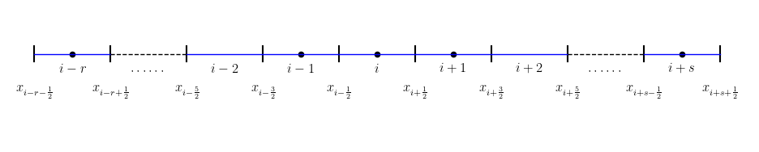

$r,s≥0$, with $r+s+1=k$:

$$
\begin{array}{l}
k=2\\
r+s=k-1=1\\
r=1,s=0\\
r=0,s=1\\
\end{array}
$$

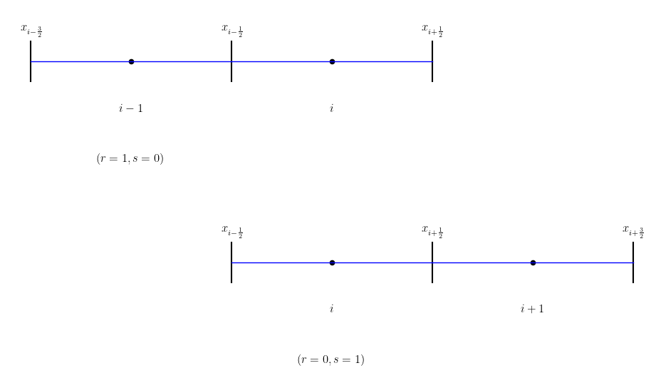

$$
\begin{array}{l}
k=3\\
r+s=k-1=2\\
r=2,s=0\\
r=1,s=1\\
r=0,s=2\\
\end{array}
$$

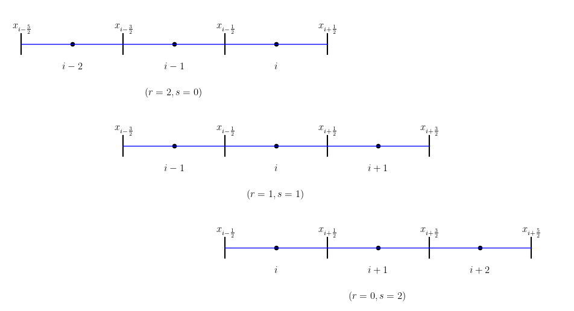

$$
\begin{array}{l}
k=4\\
r+s=k-1=3\\
r=3,s=0\\
r=2,s=1\\
r=1,s=2\\
r=0,s=3\\
\end{array}
$$

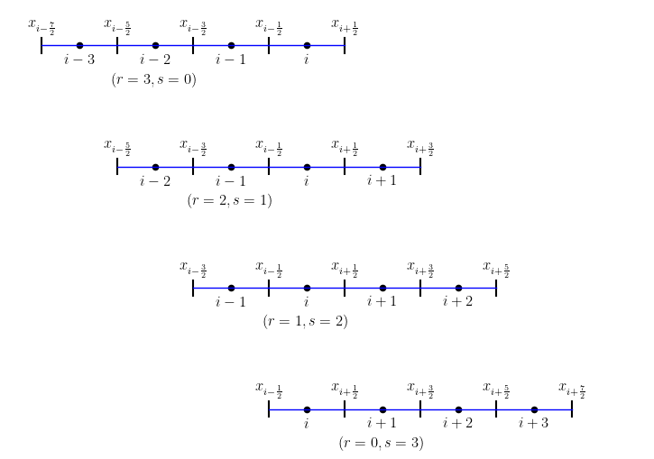

$$
v_{i+\frac{1}{2}}^{-} = \sum_{j=0}^{k-1} c_{rj} \bar{v}_{i-r+j}
$$


$$
\begin{array}{l}
k=2\\
\displaystyle v_{i+\frac{1}{2}}^{-} = \sum_{j=0}^{1} c_{rj} \bar{v}_{i-r+j} = 
\begin{cases} 
c_{10} \bar{v}_{i-1} + c_{11} \bar{v}_{i}, & \text{if } r = 1, \\
c_{00} \bar{v}_{i} + c_{01} \bar{v}_{i+1}, & \text{if } r = 0,
\end{cases}
\end{array}
$$

$$
v_{i+\frac{1}{2}}^{-} = \sum_{j=0}^{2} c_{rj} \bar{v}_{i-r+j} = c_{r0} \bar{v}_{i-r} + c_{r1} \bar{v}_{i-r+1} + c_{r2} \bar{v}_{i-r+2}
$$

$$
\begin{array}{l}
k=3\\
\displaystyle v_{i+\frac{1}{2}}^{-} = \sum_{j=0}^{2} c_{rj} \bar{v}_{i-r+j} = c_{r0} \bar{v}_{i-r} + c_{r1} \bar{v}_{i-r+1} + c_{r2} \bar{v}_{i-r+2}\\
\displaystyle v_{i+\frac{1}{2}}^{-} = \sum_{j=0}^{2} c_{2j} \bar{v}_{i-2+j} = c_{20} \bar{v}_{i-2} + c_{21} \bar{v}_{i-1} + c_{22} \bar{v}_{i}\\
\displaystyle v_{i+\frac{1}{2}}^{-} = \sum_{j=0}^{2} c_{1j} \bar{v}_{i-1+j} = c_{10} \bar{v}_{i-1} + c_{11} \bar{v}_{i} + c_{12} \bar{v}_{i+1}\\
\displaystyle v_{i+\frac{1}{2}}^{-} = \sum_{j=0}^{2} c_{0j} \bar{v}_{i-0+j} = c_{00} \bar{v}_{i} + c_{01} \bar{v}_{i+1} + c_{02} \bar{v}_{i+2}\\
\end{array}
$$

$$
\begin{array}{l}
k=4\\
\displaystyle v_{i+\frac{1}{2}}^{-} = \sum_{j=0}^{3} c_{rj} \bar{v}_{i-r+j} = \\
\begin{cases}
c_{30} \bar{v}_{i-3}&+&c_{31} \bar{v}_{i-2} &+& c_{32} \bar{v}_{i-1} &+& c_{33} \bar{v}_{i}&,& \text{if } r = 3, \\
c_{20} \bar{v}_{i-2}&+&c_{21} \bar{v}_{i-1} &+& c_{22} \bar{v}_{i} &+& c_{23} \bar{v}_{i+1}&,& \text{if } r = 2, \\
c_{10} \bar{v}_{i-1}&+&c_{11} \bar{v}_{i} &+& c_{12} \bar{v}_{i+1} &+& c_{13} \bar{v}_{i+2}&,& \text{if } r = 1, \\
c_{00} \bar{v}_{i} &+&c_{01} \bar{v}_{i+1} &+& c_{02} \bar{v}_{i+2} &+& c_{03} \bar{v}_{i+3}&,& \text{if } r = 0,
\end{cases}
\end{array}
$$

$$
v_{i-\frac{1}{2}}^{+} = \sum_{j=0}^{k-1} \tilde{c}_{rj} \overline{v}_{i-r+j}.
$$

```python
import numpy as np
import matplotlib.pyplot as plt
    
def plot_all_cell_center( xcc, yref ):
    plt.scatter(xcc, np.full_like(xcc, yref), s=20, facecolor='black', edgecolor='black', linewidth=1)
    return
    
def plot_cell_center( xcc, yref ):
    nx = xcc.size
    ii = nx // 2
    im = ii - 1
    ip = ii + 1
    xcc_new = []
    for i in range(0, nx):
        if i > 0 and i < im:
            continue
        if i > ip and i < nx-1:
            continue
        xcc_new.append( xcc[i] )
    plt.scatter(xcc_new, np.full_like(xcc_new, yref), s=20, facecolor='black', edgecolor='black', linewidth=1)
    return    

def plot_mesh( x, yref ):
    dx = x[1] - x[0]
    dy = 0.1 * dx
    for xm in x:
        plt.plot([xm, xm], [yref-dy, yref+dy], 'k-')  # 绘制垂直线
    #
    
    nxc = x.size - 1
    ii = nxc // 2
    im  = ii - 1
    im1 = ii - 2
    ip  = ii + 1
    ip1 = ii + 2
    
    for i in range(0, nxc):
        if i > 0 and i < im1:
            plt.plot([x[i], x[i+1]], [yref, yref], 'k--', linewidth=1)
        elif i > ip1 and i < nx-1:
            plt.plot([x[i], x[i+1]], [yref, yref], 'k--', linewidth=1)
        else :
            plt.plot([x[i], x[i+1]], [yref, yref], 'b-', linewidth=1)
    #plt.plot(x, np.full_like(x, yref), 'k--', linewidth=1)
    return
   
def plot_label(x, xcc, yref):
    dx = x[1] - x[0]
    dyb = 0.5 * dx
    dyt = dyb * 0.6
    yb = yref - dyb
    yt = yref + dyt
    ybc = yref - 0.5* dyb
    plt.text(x[0], yb, r'$x_{i-r-\frac{1}{2}}$', fontsize=12, ha='center')
    plt.text(x[1], yb, r'$x_{i-r+\frac{1}{2}}$', fontsize=12, ha='center')
    plt.text(x[2], yb, r'$x_{i-\frac{5}{2}}$', fontsize=12, ha='center')
    plt.text(x[3], yb, r'$x_{i-\frac{3}{2}}$', fontsize=12, ha='center')
    plt.text(x[4], yb, r'$x_{i-\frac{1}{2}}$', fontsize=12, ha='center')
    plt.text(x[5], yb, r'$x_{i+\frac{1}{2}}$', fontsize=12, ha='center')
    plt.text(x[6], yb, r'$x_{i+\frac{3}{2}}$', fontsize=12, ha='center')
    plt.text(x[7], yb, r'$x_{i+\frac{5}{2}}$', fontsize=12, ha='center')
    plt.text(x[8], yb, r'$x_{i+s-\frac{1}{2}}$', fontsize=12, ha='center')
    plt.text(x[9], yb, r'$x_{i+s+\frac{1}{2}}$', fontsize=12, ha='center')
    
    plt.text(xcc[0], ybc, r'$i-r$', fontsize=12, ha='center')
    plt.text(xcc[1], ybc, r'$\cdots\cdots$', fontsize=12, ha='center')
    plt.text(xcc[-2], ybc, r'$\cdots\cdots$', fontsize=12, ha='center')
    plt.text(xcc[-1], ybc, r'$i+s$', fontsize=12, ha='center')
    
    nx = xcc.size
    i = nx // 2
    print("i=",i)
    im  = i - 1
    im1 = i - 2
    ip  = i + 1
    ip1 = i + 2
    
    plt.text(xcc[im1], ybc, r'$i-2$', fontsize=12, ha='center')
    plt.text(xcc[im], ybc, r'$i-1$', fontsize=12, ha='center')
    plt.text(xcc[i], ybc, r'$i$', fontsize=12, ha='center')
    plt.text(xcc[ip], ybc, r'$i+1$', fontsize=12, ha='center')
    plt.text(xcc[ip1], ybc, r'$i+2$', fontsize=12, ha='center')
 
    return    

# 设置字体为 Times New Roman
plt.rc('text', usetex=True)
plt.rc('font', family='serif', serif=['Times New Roman'])

# 设置图形大小和样式
plt.figure(figsize=(12, 5))

nx = 9
L  = 1.0
x_l = 0.0
dx = L / nx

x   = np.zeros(nx+1, dtype=np.float64)
xcc = np.zeros(nx, dtype=np.float64)

for i in range(0, nx+1):
    x[i] = x_l + dx*(i)
    
for i in range(0, nx):
    xcc[i] = 0.5*(x[i]+x[i+1])
    
print("x=",x)
print("xcc=",xcc)

yref = 0.0

plot_cell_center( xcc, yref )
plot_mesh( x, yref )
plot_label(x, xcc, yref)
    
plt.axis('equal')
plt.axis('off')

plt.savefig('cfd.png', bbox_inches='tight', dpi=300)
plt.show()
```

```fortran
   do i=-ighost,nx+ighost
       x(i)=(i-1)*dx+dx/2-1.0
   enddo
```

## Python绘制CFD一维网格计算示意图
Left-side reconstrcution
```python
import matplotlib.pyplot as plt
import numpy as np
import matplotlib.patches as patches

# 设置字体为 Times New Roman
plt.rc('text', usetex=True)
plt.rc('font', family='serif', serif=['Times New Roman'])

# 设置图形大小和样式
plt.figure(figsize=(12, 3))

# 定义新的点坐标 (从 i=-6 到 i=6，基于 new_x_points)
new_x_points = np.array([-6, -5, -4, -2, -1, 0, 1, 2, 3, 4, 5, 6])
#new_x_points = np.array([-6, -5, -4, -2, -1, 0, 1, 2, 4, 5, 6])
y_points = np.zeros_like(new_x_points)  # 所有点在 y=0 线上

# 绘制除中间 5 个点和特定边缘点外的其他点 (内部红色，边缘黑色)
edge_points_red = np.concatenate([new_x_points[:2], new_x_points[10:]])
plt.scatter(edge_points_red, np.zeros_like(edge_points_red), s=100, facecolor='red', edgecolor='black', linewidth=1)

# 绘制左侧第三点 (i=-4) 和右侧第三点 (i=4) 为纯黑色点
special_black_points = np.array([-4, 4])
plt.scatter(special_black_points, np.zeros_like(special_black_points), s=100, facecolor='black', edgecolor='black', linewidth=1)

# 绘制中间 6 个点 (i=-2, -1, 0, 1, 2, 3)
middle_points = new_x_points[3:8]
plt.scatter(middle_points, np.zeros_like(middle_points), s=100, facecolor='black', edgecolor='black', linewidth=1)

# 绘制中间 6 个点的黑实线连接
plt.plot(middle_points, np.zeros_like(middle_points), 'k-', linewidth=1)

# 添加左起第三点和第四点之间的分段连线（-4到-2）
x_left = np.array([-4, -3.5, -2.5, -2])  # 按照1/4, 1/2, 1/4的比例分割
plt.plot([x_left[0], x_left[1]], [0, 0], 'k-', linewidth=1)  # 第一段实线
plt.plot([x_left[1], x_left[2]], [0, 0], 'k--', linewidth=1) # 第二段虚线
plt.plot([x_left[2], x_left[3]], [0, 0], 'k-', linewidth=1)  # 第三段实线

# 添加右起第三点和第四点之间的分段连线（2到4）
#x_right = np.array([3, 3.25, 3.75, 4])    # 按照1/4, 1/2, 1/4的比例分割
x_right = np.array([2, 2.5, 3.5, 4])    # 按照1/4, 1/2, 1/4的比例分割
plt.plot([x_right[0], x_right[1]], [0, 0], 'k-', linewidth=1)  # 第一段实线
plt.plot([x_right[1], x_right[2]], [0, 0], 'k--', linewidth=1) # 第二段虚线
plt.plot([x_right[2], x_right[3]], [0, 0], 'k-', linewidth=1)  # 第三段实线

xv = 0.5*(new_x_points[5]+new_x_points[6])
plt.plot([xv, xv], [-0.5, 0.5], 'k--')  # 绘制垂直线

# 添加圆角矩形背景
rectangle_color = (150/255, 150/255, 200/255)  # RGB颜色

x = -2.2
y = -0.1
#x = -1.2
#y = -0.1
width = 4.4
height = 0.2

rect = patches.FancyBboxPatch((x, y), width, height, 
                                       boxstyle="round,pad=0.1,rounding_size=0.1",
                                       edgecolor='none',
                                       facecolor=rectangle_color,
                                       zorder=0)

# 将矩形添加到坐标轴上
ax = plt.gca()
ax.add_patch(rect)
#ax.set_title('Right-side reconstruction')
ax.set_title('Left-side reconstruction')

# 添加标签和其他设置（保持不变）
plt.text(-6, -0.5, '$-2$', fontsize=12, ha='center')
plt.text(-5, -0.5, '$-1$', fontsize=12, ha='center')
plt.text(-4, -0.5, '$i=1$', fontsize=12, ha='center')
plt.text(-2, -0.5, '$i-2$', fontsize=12, ha='center')
plt.text(-1, -0.5, '$i-1$', fontsize=12, ha='center')
plt.text(0, -0.5, '$i$', fontsize=12, ha='center')
plt.text(1, -0.5, '$i+1$', fontsize=12, ha='center')
plt.text(2, -0.5, '$i+2$', fontsize=12, ha='center')
#plt.text(3, -0.5, '$i+3$', fontsize=12, ha='center')
plt.text(4, -0.5, '$i=N+1$', fontsize=12, ha='center')
plt.text(5, -0.5, '$N+2$', fontsize=12, ha='center')
plt.text(6, -0.5, '$N+3$', fontsize=12, ha='center')

#plt.text(xv+0.3, 0.5, r'$u_{i+\frac{1}{2}}^R$', fontsize=12, ha='center')
plt.text(xv-0.3, 0.5, r'$u_{i+\frac{1}{2}}^L$', fontsize=12, ha='center')
plt.text(-4, +0.3, '$x=0$', fontsize=12, ha='center')
plt.text(+4, +0.3, '$x=L$', fontsize=12, ha='center')

plt.axis('equal')
plt.axis('off')

plt.savefig('cfd.png', bbox_inches='tight', dpi=300)
plt.show()
```

## Left-side reconstrcution

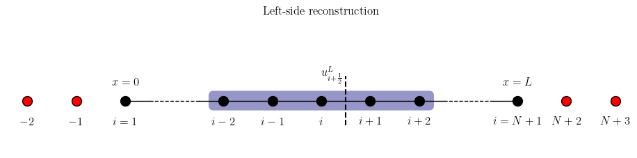

Right-side reconstrcution
```python
import matplotlib.pyplot as plt
import numpy as np
import matplotlib.patches as patches

# 设置字体为 Times New Roman
plt.rc('text', usetex=True)
plt.rc('font', family='serif', serif=['Times New Roman'])

# 设置图形大小和样式
plt.figure(figsize=(12, 3))

# 定义新的点坐标 (从 i=-6 到 i=6，基于 new_x_points)
new_x_points = np.array([-6, -5, -4, -2, -1, 0, 1, 2, 3, 4, 5, 6])
y_points = np.zeros_like(new_x_points)  # 所有点在 y=0 线上

# 绘制除中间 5 个点和特定边缘点外的其他点 (内部红色，边缘黑色)
edge_points_red = np.concatenate([new_x_points[:2], new_x_points[10:]])
plt.scatter(edge_points_red, np.zeros_like(edge_points_red), s=100, facecolor='red', edgecolor='black', linewidth=1)

# 绘制左侧第三点 (i=-4) 和右侧第三点 (i=4) 为纯黑色点
special_black_points = np.array([-4, 4])
plt.scatter(special_black_points, np.zeros_like(special_black_points), s=100, facecolor='black', edgecolor='black', linewidth=1)

# 绘制中间 6 个点 (i=-2, -1, 0, 1, 2, 3)
middle_points = new_x_points[3:9]
plt.scatter(middle_points, np.zeros_like(middle_points), s=100, facecolor='black', edgecolor='black', linewidth=1)

# 绘制中间 6 个点的黑实线连接
plt.plot(middle_points, np.zeros_like(middle_points), 'k-', linewidth=1)

# 添加左起第三点和第四点之间的分段连线（-4到-2）
x_left = np.array([-4, -3.5, -2.5, -2])  # 按照1/4, 1/2, 1/4的比例分割
plt.plot([x_left[0], x_left[1]], [0, 0], 'k-', linewidth=1)  # 第一段实线
plt.plot([x_left[1], x_left[2]], [0, 0], 'k--', linewidth=1) # 第二段虚线
plt.plot([x_left[2], x_left[3]], [0, 0], 'k-', linewidth=1)  # 第三段实线

# 添加右起第三点和第四点之间的分段连线（2到4）
x_right = np.array([3, 3.25, 3.75, 4])    # 按照1/4, 1/2, 1/4的比例分割
plt.plot([x_right[0], x_right[1]], [0, 0], 'k-', linewidth=1)  # 第一段实线
plt.plot([x_right[1], x_right[2]], [0, 0], 'k--', linewidth=1) # 第二段虚线
plt.plot([x_right[2], x_right[3]], [0, 0], 'k-', linewidth=1)  # 第三段实线

xv = 0.5*(new_x_points[5]+new_x_points[6])
plt.plot([xv, xv], [-0.5, 0.5], 'k--')  # 绘制垂直线

# 添加圆角矩形背景
rectangle_color = (150/255, 150/255, 200/255)  # RGB颜色
#rectangle_color = 'lightblue'

#x = -2.2
#y = -0.1
x = -1.2
y = -0.1
width = 4.4
height = 0.2

rect = patches.FancyBboxPatch((x, y), width, height, 
                                       boxstyle="round,pad=0.1,rounding_size=0.1",
                                       edgecolor='none',
                                       facecolor=rectangle_color,
                                       zorder=0)

# 将矩形添加到坐标轴上
ax = plt.gca()
ax.add_patch(rect)
ax.set_title('Right-side reconstruction')

# 添加标签和其他设置（保持不变）
plt.text(-6, -0.5, '$-2$', fontsize=12, ha='center')
plt.text(-5, -0.5, '$-1$', fontsize=12, ha='center')
plt.text(-4, -0.5, '$i=1$', fontsize=12, ha='center')
#plt.text(-2, -0.5, '$i-2$', fontsize=12, ha='center')
plt.text(-1, -0.5, '$i-1$', fontsize=12, ha='center')
plt.text(0, -0.5, '$i$', fontsize=12, ha='center')
plt.text(1, -0.5, '$i+1$', fontsize=12, ha='center')
plt.text(2, -0.5, '$i+2$', fontsize=12, ha='center')
plt.text(3, -0.5, '$i+3$', fontsize=12, ha='center')
plt.text(4, -0.5, '$i=N+1$', fontsize=12, ha='center')
plt.text(5, -0.5, '$N+2$', fontsize=12, ha='center')
plt.text(6, -0.5, '$N+3$', fontsize=12, ha='center')

plt.text(xv+0.3, 0.5, r'$u_{i+\frac{1}{2}}^R$', fontsize=12, ha='center')
plt.text(-4, +0.3, '$x=0$', fontsize=12, ha='center')
plt.text(+4, +0.3, '$x=L$', fontsize=12, ha='center')

plt.axis('equal')
plt.axis('off')

plt.savefig('cfd.png', bbox_inches='tight', dpi=300)
plt.show()
```

## Right-side reconstrcution

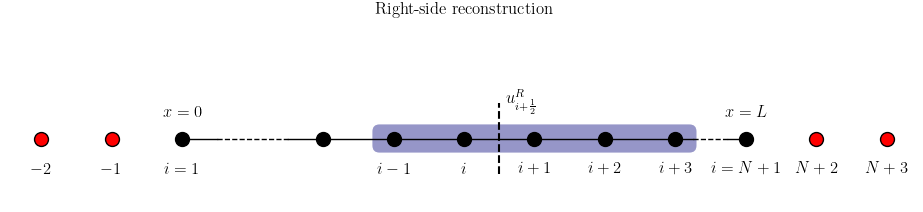

Left, Right-side reconstrcution
```python
import numpy as np
import matplotlib.pyplot as plt
import matplotlib.patches as patches

def plot_mixed_line( xst, xed, y0 ):
    ds = xed - xst
    ds1 = ds / 4
    x1 = xst + ds1
    x2 = xed - ds1
    x = np.array([xst, x1, x2, xed])  # 按照1/4, 1/2, 1/4的比例分割
    plt.plot([x[0], x[1]], [y0, y0], 'k-', linewidth=1)  # 第一段实线
    plt.plot([x[1], x[2]], [y0, y0], 'k--', linewidth=1) # 第二段虚线
    plt.plot([x[2], x[3]], [y0, y0], 'k-', linewidth=1)  # 第三段实线
    return
   
def plot_cfd_line( x_points, y0, lr ):
    # 绘制除中间 5 个点和特定边缘点外的其他点 (内部红色，边缘黑色)
    edge_points_red = np.concatenate([x_points[:2], x_points[10:]])
    plt.scatter(edge_points_red, np.full_like(edge_points_red, y0), s=100, facecolor='red', edgecolor='black', linewidth=1)
    
    # 绘制左侧第三点 (i=-4) 和右侧第三点 (i=4) 为纯黑色点
    special_black_points = np.array([-4, 4],dtype=np.float64)
    plt.scatter(special_black_points, np.full_like(special_black_points, y0), s=100, facecolor='black', edgecolor='black', linewidth=1)
    
    # 绘制中间 6 个点 (i=-2, -1, 0, 1, 2, 3)
    iend = 8
    if lr == 'R':
        iend = 9
    middle_points = x_points[3:iend]
    plt.scatter(middle_points, np.full_like(middle_points, y0), s=100, facecolor='black', edgecolor='black', linewidth=1)
    
    # 绘制中间 6 个点的黑实线连接
    plt.plot(middle_points, np.full_like(middle_points, y0), 'k-', linewidth=1)
    
    # 添加左起第三点和第四点之间的分段连线（-4到-2）
    xl_st = x_points[2]
    xl_ed = x_points[3]
    plot_mixed_line(xl_st,xl_ed, y0)
    
    # 添加右起第三点和第四点之间的分段连线（2到4）
    ii = -4
    if lr == 'L':
       ii = -5
    xr_st = x_points[ii]
    xr_ed = x_points[-3]    
    plot_mixed_line(xr_st,xr_ed, y0)
    
    return
    
def plot_rect(x, y, width, height, rectangle_color):
    rect = patches.FancyBboxPatch((x, y), width, height, 
                                        boxstyle="round,pad=0.1,rounding_size=0.1",
                                        edgecolor='none',
                                        facecolor=rectangle_color,
                                        zorder=0)
    
    # 将矩形添加到坐标轴上
    ax = plt.gca()
    ax.add_patch(rect)
    return
    
def plot_label(y0, xv, lr, txt_name):
    # 添加标签和其他设置（保持不变）
    plt.text(-6, y0-0.5, '$-2$', fontsize=12, ha='center')
    plt.text(-5, y0-0.5, '$-1$', fontsize=12, ha='center')
    plt.text(-4, y0-0.5, '$i=1$', fontsize=12, ha='center')
    if lr == 'L':
        plt.text(-2, y0-0.5, '$i-2$', fontsize=12, ha='center')
    plt.text(-1, y0-0.5, '$i-1$', fontsize=12, ha='center')
    plt.text(0, y0-0.5, '$i$', fontsize=12, ha='center')
    plt.text(1, y0-0.5, '$i+1$', fontsize=12, ha='center')
    plt.text(2, y0-0.5, '$i+2$', fontsize=12, ha='center')
    if lr == 'R':
        plt.text(3, y0-0.5, '$i+3$', fontsize=12, ha='center')
    
    plt.text(4, y0-0.5, '$i=N+1$', fontsize=12, ha='center')
    plt.text(5, y0-0.5, '$N+2$', fontsize=12, ha='center')
    plt.text(6, y0-0.5, '$N+3$', fontsize=12, ha='center')
    
    lrname = r'$u_{i+\frac{1}{2}}^' + lr + r'$'
    plt.text(xv, y0+0.5, lrname, fontsize=12, ha='center')
    plt.text(-4, y0+0.3, '$x=0$', fontsize=12, ha='center')
    plt.text(+4, y0+0.3, '$x=L$', fontsize=12, ha='center')
    
    plt.text(0, y0-1.5, txt_name, fontsize=12, ha='center')
    return

# 设置字体为 Times New Roman
plt.rc('text', usetex=True)
plt.rc('font', family='serif', serif=['Times New Roman'])

# 设置图形大小和样式
plt.figure(figsize=(12, 5))

# 定义新的点坐标 (从 i=-6 到 i=6，基于 x_points)
x_points = np.array([-6, -5, -4, -2, -1, 0, 1, 2, 3, 4, 5, 6],dtype=np.float64)

y0 = 0.5
plot_cfd_line( x_points, y0, 'L' )

xv = 0.5*(x_points[5]+x_points[6])
plt.plot([xv, xv], [y0-0.5, y0+0.5], 'k--')  # 绘制垂直线

# 添加圆角矩形背景
rectangle_color = (150/255, 150/255, 200/255)  # RGB颜色

width = 4.4
height = 0.2

plot_rect(-2.2,y0-0.1,width,height,rectangle_color)
plot_label(y0,xv-0.3,'L','(a) Left-side reconstruction')

y1 = -2.0
plot_cfd_line( x_points, y1, 'R' )
plt.plot([xv, xv], [y1-0.5, y1+0.5], 'k--')  # 绘制垂直线

plot_rect(-1.2,y1-0.1,width,height,rectangle_color)
plot_label(y1,xv+0.3,'R','(b) Right-side reconstruction')


plt.axis('equal')
plt.axis('off')

plt.savefig('cfd.png', bbox_inches='tight', dpi=300)
plt.show()
```

## Left-Right-side reconstrcution

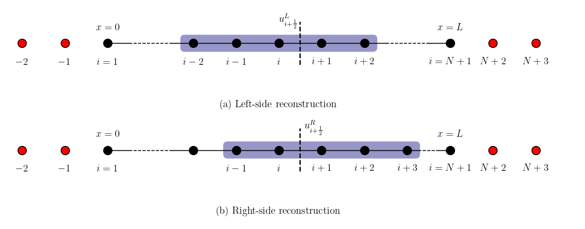

## Reconstruction and Approximation in 1D

```python
import numpy as np
import matplotlib.pyplot as plt
    
def plot_all_cell_center( xcc, yref ):
    plt.scatter(xcc, np.full_like(xcc, yref), s=20, facecolor='black', edgecolor='black', linewidth=1)
    return
    
def plot_cell_center( xcc, yref ):
    nx = xcc.size
    ii = nx // 2
    im = ii - 1
    ip = ii + 1
    xcc_new = []
    for i in range(0, nx):
        if i > 1 and i < im:
            continue
        if i > ip and i < nx-2:
            continue
        xcc_new.append( xcc[i] )
    plt.scatter(xcc_new, np.full_like(xcc_new, yref), s=20, facecolor='black', edgecolor='black', linewidth=1)
    return    

def plot_mesh( x, yref ):
    dx = x[1] - x[0]
    dy = 0.1 * dx
    for xm in x:
        plt.plot([xm, xm], [yref-dy, yref+dy], 'k-')  # 绘制垂直线
    #
    
    nxc = x.size - 1
    ii = nxc // 2
    im = ii - 1
    ip = ii + 1
    
    for i in range(0, nxc):
        if i > 1 and i < im:
            plt.plot([x[i], x[i+1]], [yref, yref], 'k--', linewidth=1)
        elif i > ip and i < nx-2:
            plt.plot([x[i], x[i+1]], [yref, yref], 'k--', linewidth=1)
        else :
            plt.plot([x[i], x[i+1]], [yref, yref], 'b-', linewidth=1)
    #plt.plot(x, np.full_like(x, yref), 'k--', linewidth=1)
    return
    
   
def plot_label(x, xcc, yref):
    x0 = x[0]
    dx = x[1] - x[0]
    dyb = 0.5 * dx
    dyt = dyb * 0.6
    yb = yref - dyb
    yt = yref + dyt
    ybc = yref - 0.5* dyb
    plt.text(x[0], yb, r'$x_{\frac{1}{2}}$', fontsize=12, ha='center')
    plt.text(x[1], yb, r'$x_{\frac{3}{2}}$', fontsize=12, ha='center')
    plt.text(x[-2], yb, r'$x_{N-\frac{1}{2}}$', fontsize=12, ha='center')
    plt.text(x[-1], yb, r'$x_{N+\frac{1}{2}}$', fontsize=12, ha='center')
    
    plt.text(x[0], yt, r'$x=0$', fontsize=12, ha='center')
    plt.text(x[-1], yt, r'$x=L$', fontsize=12, ha='center')
    
    plt.text(xcc[0], ybc, r'$i=1$', fontsize=12, ha='center')
    plt.text(xcc[1], ybc, r'$2$', fontsize=12, ha='center')
    plt.text(xcc[-2], ybc, r'$N-1$', fontsize=12, ha='center')
    plt.text(xcc[-1], ybc, r'$N$', fontsize=12, ha='center')
    
    nx = xcc.size
    i = nx // 2
    print("i=",i)
    im = i - 1
    ip = i + 1
    
    plt.text(xcc[im], ybc, r'$i-1$', fontsize=12, ha='center')
    plt.text(xcc[i], ybc, r'$i$', fontsize=12, ha='center')
    plt.text(xcc[ip], ybc, r'$i+1$', fontsize=12, ha='center')
 
    return    

# 设置字体为 Times New Roman
plt.rc('text', usetex=True)
plt.rc('font', family='serif', serif=['Times New Roman'])

# 设置图形大小和样式
plt.figure(figsize=(12, 5))

nx = 9
L  = 1.0
x_l = 0.0
dx = L / nx

x   = np.zeros(nx+1, dtype=np.float64)
xcc = np.zeros(nx, dtype=np.float64)

for i in range(0, nx+1):
    x[i] = x_l + dx*(i)
    
for i in range(0, nx):
    xcc[i] = 0.5*(x[i]+x[i+1])
    
print("x=",x)
print("xcc=",xcc)

yref = 0.0

plot_cell_center( xcc, yref )
plot_mesh( x, yref )
plot_label(x, xcc, yref)
    
plt.axis('equal')
plt.axis('off')

plt.savefig('cfd.png', bbox_inches='tight', dpi=300)
plt.show()
```

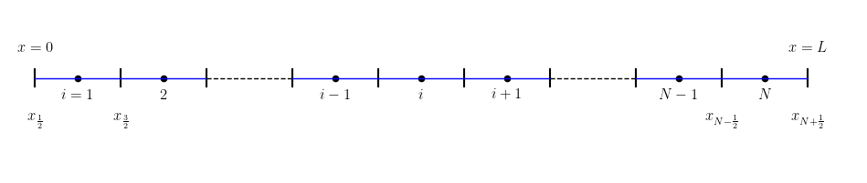

```python
import numpy as np
import matplotlib.pyplot as plt
    
def plot_all_cell_center( xcc, yref ):
    plt.scatter(xcc, np.full_like(xcc, yref), s=20, facecolor='black', edgecolor='black', linewidth=1)
    return
    
def plot_cell_center( xcc, yref ):
    nx = xcc.size
    ii = nx // 2
    im = ii - 1
    ip = ii + 1
    xcc_new = []
    for i in range(0, nx):
        if i > 1 and i < im:
            continue
        if i > ip and i < nx-2:
            continue
        xcc_new.append( xcc[i] )
    plt.scatter(xcc_new, np.full_like(xcc_new, yref), s=20, facecolor='black', edgecolor='black', linewidth=1)
    return
    
def plot_ghost_cell_center( xcc, yref ):
    plt.scatter(xcc, np.full_like(xcc, yref), s=20, facecolor='red', edgecolor='black', linewidth=1)
    return
    
def plot_ghost_mesh( x, yref ):
    dx = x[1] - x[0]
    dy = 0.1 * dx
    for xm in x:
        plt.plot([xm, xm], [yref-dy, yref+dy], 'k-')  # 绘制垂直线
    return

def plot_mesh( x, yref ):
    dx = x[1] - x[0]
    dy = 0.1 * dx
    for xm in x:
        plt.plot([xm, xm], [yref-dy, yref+dy], 'k-')  # 绘制垂直线
    #
    
    nxc = x.size - 1
    ii = nxc // 2
    im = ii - 1
    ip = ii + 1
    
    for i in range(0, nxc):
        if i > 1 and i < im:
            plt.plot([x[i], x[i+1]], [yref, yref], 'k--', linewidth=1)
        elif i > ip and i < nx-2:
            plt.plot([x[i], x[i+1]], [yref, yref], 'k--', linewidth=1)
        else :
            plt.plot([x[i], x[i+1]], [yref, yref], 'b-', linewidth=1)
    #plt.plot(x, np.full_like(x, yref), 'k--', linewidth=1)
    return
    
   
def plot_label(x, xcc, yref):
    x0 = x[0]
    dx = x[1] - x[0]
    dyb = 0.8 * dx
    dyt = dyb * 0.6
    yb = yref - dyb
    yt = yref + dyt
    ybc = yref - 0.5* dyb
    plt.text(x[0], yb, r'$x_{\frac{1}{2}}$', fontsize=12, ha='center')
    plt.text(x[1], yb, r'$x_{\frac{3}{2}}$', fontsize=12, ha='center')
    plt.text(x[-2], yb, r'$x_{N-\frac{1}{2}}$', fontsize=12, ha='center')
    plt.text(x[-1], yb, r'$x_{N+\frac{1}{2}}$', fontsize=12, ha='center')
    
    plt.text(x[0], yt, r'$x=0$', fontsize=12, ha='center')
    plt.text(x[-1], yt, r'$x=L$', fontsize=12, ha='center')
    
    plt.text(xcc[0], ybc, r'$i=1$', fontsize=12, ha='center')
    plt.text(xcc[1], ybc, r'$2$', fontsize=12, ha='center')
    plt.text(xcc[-2], ybc, r'$N-1$', fontsize=12, ha='center')
    plt.text(xcc[-1], ybc, r'$N$', fontsize=12, ha='center')
    
    nx = xcc.size
    i = nx // 2
    print("i=",i)
    im = i - 1
    ip = i + 1
    
    plt.text(xcc[im], ybc, r'$i-1$', fontsize=12, ha='center')
    plt.text(xcc[i], ybc, r'$i$', fontsize=12, ha='center')
    plt.text(xcc[ip], ybc, r'$i+1$', fontsize=12, ha='center')
    
    str = r'$a=x_{\frac{1}{2}}<x_{\frac{3}{2}}<\cdots<x_{N-\frac{1}{2}}<x_{N+\frac{1}{2}}=b$'
    str = 'Grid: ' + str
    
    nx = xcc.size
    ii = nx // 2    
    
    plt.text(x[ii], yb-dx, str, fontsize=12, ha='center')
 
    return
    
def plot_ghost_label_left(xg, xgcc, yref):
    dx = abs(xg[1] - xg[0])
    dyb = 0.8 * dx
    dyt = dyb * 0.6
    yb = yref - dyb
    yt = yref + dyt
    ybc = yref - 0.5* dyb
    plt.text(xg[1], yb, r'$x_{-\frac{1}{2}}$', fontsize=12, ha='center')
    plt.text(xg[2], yb, r'$x_{-\frac{3}{2}}$', fontsize=12, ha='center')
    
    plt.text(xgcc[0], ybc, r'$0$', fontsize=12, ha='center')
    plt.text(xgcc[1], ybc, r'$-1$', fontsize=12, ha='center')
 
    return

def plot_ghost_label_right(xg, xgcc, yref):
    dx = abs(xg[1] - xg[0])
    dyb = 0.8 * dx
    dyt = dyb * 0.6
    yb = yref - dyb
    yt = yref + dyt
    ybc = yref - 0.5* dyb
    plt.text(xg[1], yb, r'$x_{N+\frac{3}{2}}$', fontsize=12, ha='center')
    plt.text(xg[2], yb, r'$x_{N+\frac{5}{2}}$', fontsize=12, ha='center')
    
    plt.text(xgcc[0], ybc, r'$N+1$', fontsize=12, ha='center')
    plt.text(xgcc[1], ybc, r'$N+2$', fontsize=12, ha='center')    
 
    return

# 设置字体为 Times New Roman
plt.rc('text', usetex=True)
plt.rc('font', family='serif', serif=['Times New Roman'])

# 设置图形大小和样式
plt.figure(figsize=(12, 5))

nx = 9
L  = 1.0
x_l = 0.0
dx = L / nx

x   = np.zeros(nx+1, dtype=np.float64)
xcc = np.zeros(nx, dtype=np.float64)

nghost = 2
x_ghost_l   = np.zeros(nghost+1, dtype=np.float64)
xcc_ghost_l = np.zeros(nghost, dtype=np.float64)
x_ghost_r   = np.zeros(nghost+1, dtype=np.float64)
xcc_ghost_r = np.zeros(nghost, dtype=np.float64)

for i in range(0, nx+1):
    x[i] = x_l + dx*(i)
    
for i in range(0, nx):
    xcc[i] = 0.5*(x[i]+x[i+1])
    
x_ghost_l[0] = x[0]
for ighost in range(1, nghost+1):
    dx = x[0] - x[ighost]
    x_ghost_l[ighost] = x[0] + dx
    
x_ghost_r[0] = x[nx]
for ighost in range(1, nghost+1):
    dx = x[nx] - x[nx-ighost]
    x_ghost_r[ighost] = x[nx] + dx
    
for ighost in range(0, nghost):
    xcc_ghost_l[ighost] = 0.5*(x_ghost_l[ighost]+x_ghost_l[ighost+1])
    xcc_ghost_r[ighost] = 0.5*(x_ghost_r[ighost]+x_ghost_r[ighost+1])
    
print("x=",x)
print("xcc=",xcc)

print("x_ghost_l=",x_ghost_l)
print("xcc_ghost_l=",xcc_ghost_l)
print("x_ghost_r=",x_ghost_r)
print("xcc_ghost_r=",xcc_ghost_r)

yref = 0.0

plot_ghost_cell_center( xcc_ghost_l,yref )
plot_ghost_cell_center( xcc_ghost_r,yref )

plot_ghost_mesh( x_ghost_l, yref )
plot_ghost_mesh( x_ghost_r, yref )

plot_ghost_label_left(x_ghost_l, xcc_ghost_l, yref)
plot_ghost_label_right(x_ghost_r, xcc_ghost_r, yref)

plot_cell_center( xcc, yref )
plot_mesh( x, yref )
plot_label(x, xcc, yref)
    
plt.axis('equal')
plt.axis('off')

plt.savefig('cfd.png', bbox_inches='tight', dpi=300)
plt.show()
```

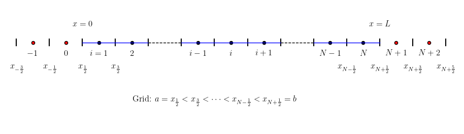

```python
import numpy as np
import matplotlib.pyplot as plt
    
def plot_all_cell_center( xcc, yref ):
    plt.scatter(xcc, np.full_like(xcc, yref), s=20, facecolor='black', edgecolor='black', linewidth=1)
    return
    
def plot_cell_center( xcc, yref ):
    nx = xcc.size
    ii = nx // 2
    im = ii - 1
    ip = ii + 1
    xcc_new = []
    for i in range(0, nx):
        if i > 1 and i < im:
            continue
        if i > ip and i < nx-2:
            continue
        xcc_new.append( xcc[i] )
    plt.scatter(xcc_new, np.full_like(xcc_new, yref), s=20, facecolor='black', edgecolor='black', linewidth=1)
    return
    
def plot_ghost_cell_center( xcc, yref ):
    plt.scatter(xcc, np.full_like(xcc, yref), s=20, facecolor='red', edgecolor='black', linewidth=1)
    return
    
def plot_ghost_mesh( x, yref ):
    dx = x[1] - x[0]
    dy = 0.1 * dx
    for xm in x:
        plt.plot([xm, xm], [yref-dy, yref+dy], 'k-')  # 绘制垂直线
    return

def plot_mesh( x, yref ):
    dx = x[1] - x[0]
    dy = 0.1 * dx
    for xm in x:
        plt.plot([xm, xm], [yref-dy, yref+dy], 'k-')  # 绘制垂直线
    #
    
    nxc = x.size - 1
    ii = nxc // 2
    im = ii - 1
    ip = ii + 1
    
    for i in range(0, nxc):
        if i > 1 and i < im:
            plt.plot([x[i], x[i+1]], [yref, yref], 'k--', linewidth=1)
        elif i > ip and i < nx-2:
            plt.plot([x[i], x[i+1]], [yref, yref], 'k--', linewidth=1)
        else :
            plt.plot([x[i], x[i+1]], [yref, yref], 'b-', linewidth=1)
    #plt.plot(x, np.full_like(x, yref), 'k--', linewidth=1)
    return
    
def addDollarString(str_in):    
    mystr = '$' + str_in + '$'
    return mystr
    
def removeDollarString(str_in):    
    mystr = str_in.strip("$")
    return mystr    
    
def genstrNp(strn, i):
    if i != 0:
        ai = abs(i)
        if i > 0:
           ss = '+'
        else:
           ss = '-'
        mystr = r'$' + strn + ss + f'{abs(i)}'+r'$'
        #mystr = strn + ss + f'{abs(i)}'
    else:
        if strn == '':
            mystr = r'$'+ '0' + r'$'
            #mystr = '0'
        else:
            mystr = r'$'+ strn + r'$'
            #mystr = strn
    return mystr
    
def genstrXNhalf(strn, i):
    if i != 0:
        ai = abs(i)
        if i > 0:
           ss = '+'
        else:
           ss = '-'
        mystr = r'$x_{' + strn + ss + r'\frac{' + f'{ai}' + r'}{2}}$'
        #mystr = r'x_{' + strn + ss + r'\frac{' + f'{ai}' + r'}{2}}'
    else:
        mystr = r'$x_{' + strn + ss + r'\frac{' + r'}{2}}$'
        #mystr = r'x_{' + strn + ss + r'\frac{' + r'}{2}}'
    return mystr    
   
def plot_label(x, xcc, yref, ishift):
    x0 = x[0]
    dx = x[1] - x[0]
    dyb = 0.8 * dx
    dyt = dyb * 0.6
    yb = yref - dyb
    yt = yref + dyt
    ybc = yref - 0.5* dyb
    
    str_list = []
    str_list.append('$a=')
    
    i1 = 2 * ( 1 + ishift ) - 1
    i2 = i1 + 2
    
    str1 = genstrXNhalf('', i1)
    str2 = genstrXNhalf('', i2)
    str_list.append(removeDollarString(str1))
    str_list.append('<')
    str_list.append(removeDollarString(str2))
    str_list.append('<')
    str_list.append(r'\cdots')
    str_list.append('<')
    
    plt.text(x[0], yb, str1, fontsize=12, ha='center')
    plt.text(x[1], yb, str2, fontsize=12, ha='center')
    
    i1 = 2 * ( 1 + ishift ) - 1
    i2 = i1 - 2
    
    str1 = genstrXNhalf('N', i1)
    str2 = genstrXNhalf('N', i2)
    
    str_list.append(removeDollarString(str2))
    str_list.append('<')
    str_list.append(removeDollarString(str1))
    str_list.append('=b$')    
    
    plt.text(x[-1], yb, str1, fontsize=12, ha='center')
    plt.text(x[-2], yb, str2, fontsize=12, ha='center')
    
    plt.text(x[0], yt, r'$x=a$', fontsize=12, ha='center')
    plt.text(x[-1], yt, r'$x=b$', fontsize=12, ha='center')
    
    i1 = 1 + ishift
    i2 = i1 + 1
    
    str1 = genstrNp('',i1)
    str2 = genstrNp('',i2)
    
    plt.text(xcc[0], ybc, str1, fontsize=12, ha='center')
    plt.text(xcc[1], ybc, str2, fontsize=12, ha='center')
    
    i1 = ishift
    i2 = i1 - 1
    
    str1 = genstrNp('N',i1)
    str2 = genstrNp('N',i2)
    
    plt.text(xcc[-1], ybc, str1, fontsize=12, ha='center')
    plt.text(xcc[-2], ybc, str2, fontsize=12, ha='center')    
    
    nx = xcc.size
    i = nx // 2
    print("i=",i)
    im = i - 1
    ip = i + 1
    
    s1 = genstrNp('i',-1)
    s2 = genstrNp('i',0)
    s3 = genstrNp('i',+1)
    
    plt.text(xcc[im], ybc, s1, fontsize=12, ha='center')
    plt.text(xcc[i], ybc, s2, fontsize=12, ha='center')
    plt.text(xcc[ip], ybc, s3, fontsize=12, ha='center')
    
    sss = ''
    for item in str_list:
        sss += item
        
    print(f'{sss=}')
  
    str = 'Grid: ' + sss
    
    nx = xcc.size
    ii = nx // 2
    
    plt.text(x[ii], yb-dx, str, fontsize=12, ha='center')
 
    return
    
def plot_ghost_label_left(xg, xgcc, yref, ishift):
    dx = abs(xg[1] - xg[0])
    dyb = 0.8 * dx
    dyt = dyb * 0.6
    yb = yref - dyb
    yt = yref + dyt
    ybc = yref - 0.5* dyb
    
    i1 = -1 + 2 * ishift
    i2 = i1 - 2
    
    str1 = genstrXNhalf('', i1)
    str2 = genstrXNhalf('', i2)
    
    plt.text(xg[1], yb, str1, fontsize=12, ha='center')
    plt.text(xg[2], yb, str2, fontsize=12, ha='center')
    
    i1 = 0+ishift
    i2 = i1-1
    
    str1 = genstrNp('',i1)
    str2 = genstrNp('',i2)    
    
    plt.text(xgcc[0], ybc, str1, fontsize=12, ha='center')
    plt.text(xgcc[1], ybc, str2, fontsize=12, ha='center')
 
    return

   
def plot_ghost_label_right(xg, xgcc, yref, ishift):
    dx = abs(xg[1] - xg[0])
    dyb = 0.8 * dx
    dyt = dyb * 0.6
    yb = yref - dyb
    yt = yref + dyt
    ybc = yref - 0.5* dyb
    
    i1 = 2*(1+ishift)+1
    i2 = i1 + 2
    
    str1 = genstrXNhalf('N', i1)
    str2 = genstrXNhalf('N', i2)
    
    plt.text(xg[1], yb, str1, fontsize=12, ha='center')
    plt.text(xg[2], yb, str2, fontsize=12, ha='center')
    
    i1 = 1+ishift
    i2 = i1+1
    str1 = genstrNp('N',i1)
    str2 = genstrNp('N',i2)
    
    plt.text(xgcc[0], ybc, str1, fontsize=12, ha='center')
    plt.text(xgcc[1], ybc, str2, fontsize=12, ha='center')    
 
    return

# 设置字体为 Times New Roman
plt.rc('text', usetex=True)
plt.rc('font', family='serif', serif=['Times New Roman'])

# 设置图形大小和样式
plt.figure(figsize=(12, 5))

nx = 9
L  = 1.0
x_l = 0.0
dx = L / nx

x   = np.zeros(nx+1, dtype=np.float64)
xcc = np.zeros(nx, dtype=np.float64)

nghost = 2
x_ghost_l   = np.zeros(nghost+1, dtype=np.float64)
xcc_ghost_l = np.zeros(nghost, dtype=np.float64)
x_ghost_r   = np.zeros(nghost+1, dtype=np.float64)
xcc_ghost_r = np.zeros(nghost, dtype=np.float64)

for i in range(0, nx+1):
    x[i] = x_l + dx*(i)
    
for i in range(0, nx):
    xcc[i] = 0.5*(x[i]+x[i+1])
    
x_ghost_l[0] = x[0]
for ighost in range(1, nghost+1):
    dx = x[0] - x[ighost]
    x_ghost_l[ighost] = x[0] + dx
    
x_ghost_r[0] = x[nx]
for ighost in range(1, nghost+1):
    dx = x[nx] - x[nx-ighost]
    x_ghost_r[ighost] = x[nx] + dx
    
for ighost in range(0, nghost):
    xcc_ghost_l[ighost] = 0.5*(x_ghost_l[ighost]+x_ghost_l[ighost+1])
    xcc_ghost_r[ighost] = 0.5*(x_ghost_r[ighost]+x_ghost_r[ighost+1])
    
print("x=",x)
print("xcc=",xcc)

print("x_ghost_l=",x_ghost_l)
print("xcc_ghost_l=",xcc_ghost_l)
print("x_ghost_r=",x_ghost_r)
print("xcc_ghost_r=",xcc_ghost_r)

yref = 0.0

plot_ghost_cell_center( xcc_ghost_l,yref )
plot_ghost_cell_center( xcc_ghost_r,yref )

plot_ghost_mesh( x_ghost_l, yref )
plot_ghost_mesh( x_ghost_r, yref )

ishift = -1
plot_ghost_label_left(x_ghost_l, xcc_ghost_l, yref, ishift)
plot_ghost_label_right(x_ghost_r, xcc_ghost_r, yref, ishift)

plot_cell_center( xcc, yref )
plot_mesh( x, yref )
plot_label(x, xcc, yref, ishift)
    
plt.axis('equal')
plt.axis('off')

plt.savefig('cfd.png', bbox_inches='tight', dpi=300)
plt.show()
```

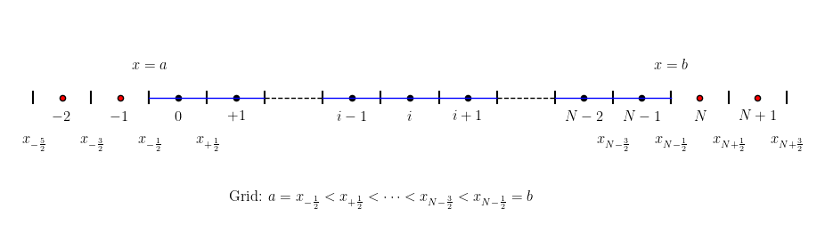
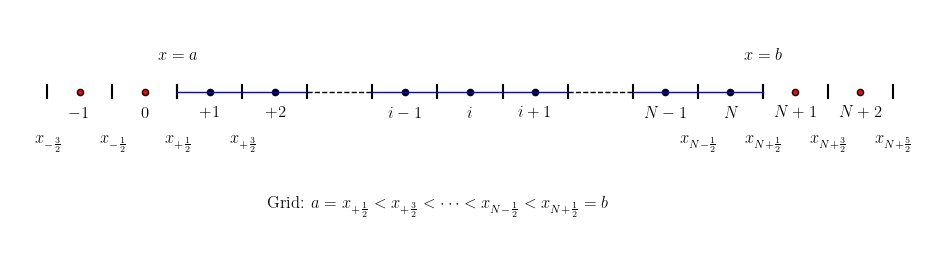
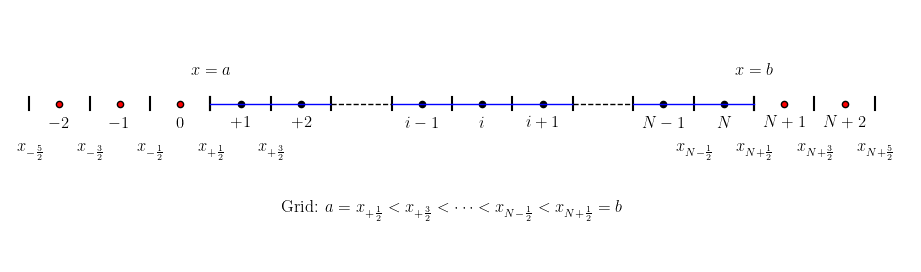
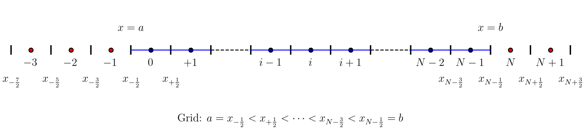
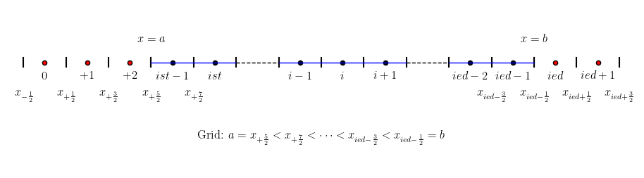
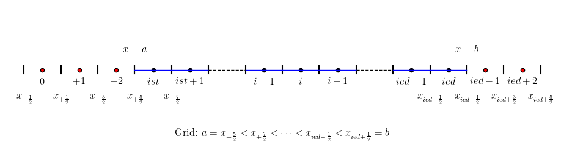
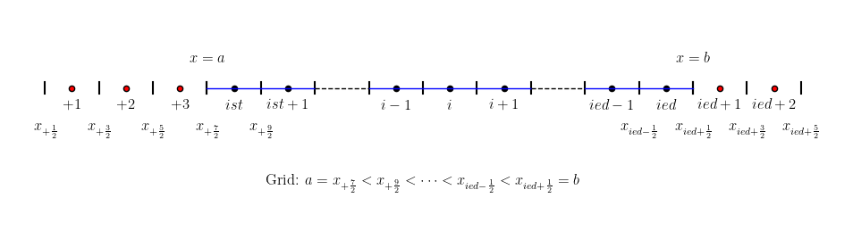


```fortran
integer, parameter :: nx = 10
integer, parameter :: ighost = 2
real(8) :: u(-ighost:nx+ighost)
real(8) :: u(-2:10+2)

| -2 | -1 | 0 | 1 | 2 | 3 4 5 6 7 8 9 | 10 | 11 | 12 |
   1    2   3   4   5                   13   14   15
               ist=4                   ied=13
		   
ist = 1 + ighost + 1 = 4
ied = nx + ighost + 1 = nx + 3 = 13
0->3
nx->nx+3
do j=0,nx->do j=3,nx+3->do j=ist-1,ied
x(-ighost:nx+ighost)
ncell = nx = 10
ni = nx + 1 = 11
nghost = 2*ighost+1=5
ntotalcell = ncell + nghost=10+5=15
real(8) :: u(1:ntotalcell)
ishift=ighost+1=3
ist = 4 = 1+ishift
ied = 13= 10+ishift

!chose the stencil by ENO method
do j = -ighost, nx + ighost
    dd(0,j)=u(j)
enddo
do i=1,iorder-1
    do j=-ighost,nx+ighost-1
        dd(i,j)=dd(i-1,j+1)-dd(i-1,j)
    enddo
enddo
->

real(8) :: dd(0:ighost-1, -ighost:nx+ighost)
->
real(8) :: dd(0:ighost-1, 1:ntotalcell)
do j = 1, nx + ighost + ighost + 1
    dd(0,j)=u(j)
enddo

do i=1,iorder-1
    do j=1,ntotalcell-1
        dd(i,j)=dd(i-1,j+1)-dd(i-1,j)
    enddo
enddo
-----------------------------------------

integer :: il(0:nx),ir(0:nx)

do j = 0, nx 
    il(j) = j
    ir(j) = j + 1
    do i=1,iorder-1  
        if( abs(dd(i,il(j)-1)) <= abs(dd(i,il(j))) ) then
            il(j)=il(j)-1 
        endif
        if( abs(dd(i,ir(j)-1)) <= abs(dd(i,ir(j))) ) then
            ir(j)=ir(j)-1 
        endif
    enddo
enddo
->
| -2 | -1 | 0 | 1 | 2 | 3 4 5 6 7 8 9 | 10 | 11 | 12 |
   1    2   3   4   5                   13   14   15
               ist=4                   ied=13
		   
ist = 1 + ighost + 1 = 4
ied = nx + ighost + 1 = nx + 3 = 13
              
integer :: il(ist-1:ied),ir(ist-1:ied)
integer :: il(3:13),ir(3:13)

do j = ist-1, ied 
    il(j) = j
    ir(j) = j + 1
    do i=1,iorder-1  
        if( abs(dd(i,il(j)-1)) <= abs(dd(i,il(j))) ) then
            il(j)=il(j)-1 
        endif
        if( abs(dd(i,ir(j)-1)) <= abs(dd(i,ir(j))) ) then
            ir(j)=ir(j)-1 
        endif
    enddo
enddo
------------------------------------
subroutine boundary( u, nx, ighost )
    implicit none
    integer :: nx, ighost
    real(8) :: u(-ighost:nx+ighost)
    integer :: i
	
	!nx = 10
	!ighost=2
	!u(0)=u(nx)
	!u(-1)=u(nx-1)
	!u(-2)=u(nx-2)
	!u(ist-1)=u(ied)
	!u(ist-2)=u(ied-1)
	!u(ist-3)=u(ied-2)
         
    do i = 0, - ighost, - 1
        u( i ) = u( i + nx )
    enddo
         
    do i = nx + 1, nx + ighost
        u( i ) = u( i - nx )
    enddo
	
| -2 | -1 | 0 | 1 | 2 | 3 4 5 6 7 8 9 | 10 | 11 | 12 |
   1    2   3   4   5                   13   14   15
               ist=4                   ied=13	
	
	!u(nx+1)=u(1)
	!u(nx+2)=u(2)
	
	!u(ied+1)=u(4)=u(ist)
	!u(ied+2)=u(5)=u(ist+1)
	
end subroutine boundary
------------------------------------
1    2    3   4   5   6              13   14   15   16
| -2 | -1 | 0 | 1 | 2 | 3 4 5 6 7 8 9 | 10 | 11 | 12 |
   1    2   3   4   5                   13   14   15
               ist=4                   ied=13
			   
-2   -1   0   1	  2   3	              9    10   11   12
| -2 | -1 | 0 | 1 | 2 | 3 4 5 6 7 8 9 | 10 | 11 | 12 |

def boundary(u):
    #ighost=2,-ighost=-2
    #ishift = ighost + 1=3
    #ist = 1 + ishift
    #ied = nx + ishift    
    #i=-2,-1,0
    #ishift+i=3-2,3-1,3+0=1,2,3
    #ied + i=ied-2,ied-1,ied+0
    #ist=ishift
    #ied=nx-1+ishift
    for i in range(-ighost, 1):
        u[ishift + i] = u[ied + i]
    #i=1,2
    #ied+i=ied+1,ied+2
    #ishift+i=3+1,3+2=4,5
    for i in range(1, ighost + 1):
        u[ied + i] = u[ishift + i]
		
def boundary(u):
    #ighost=2,-ighost=-2
    #ishift = ighost + 1=3
    #ist = 1 + ishift
    #ied = nx + ishift    
    #i=-2,-1,0
    #ishift+i=3-2,3-1,3+0=1,2,3
    #ied + i=ied-2,ied-1,ied+0
    #ist=ishift
    #ied=nx-1+ishift
    #ist-1=2
    for i in range(-ighost, 1):
        u[ist - 1 + i] = u[ied + i]
    #i=1,2
    #ied+i=ied+1,ied+2
    #ist-1=2
    #ist-1+i=3,4
    for i in range(1, ighost + 1):
        u[ied + i] = u[ist - 1 + i]		
			   
```