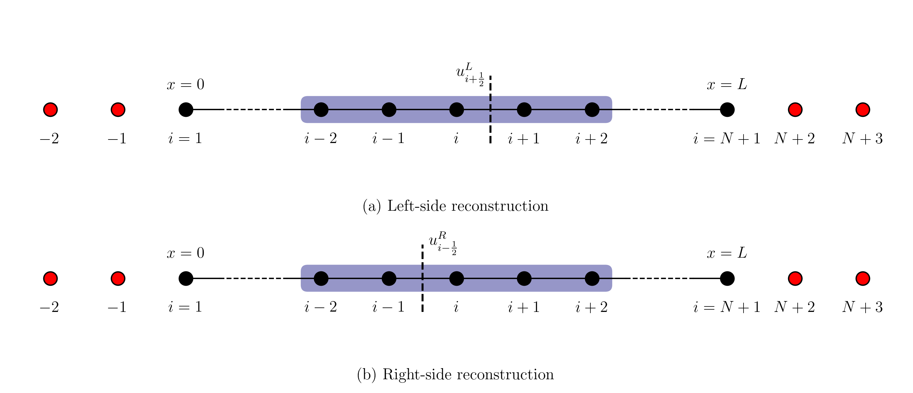
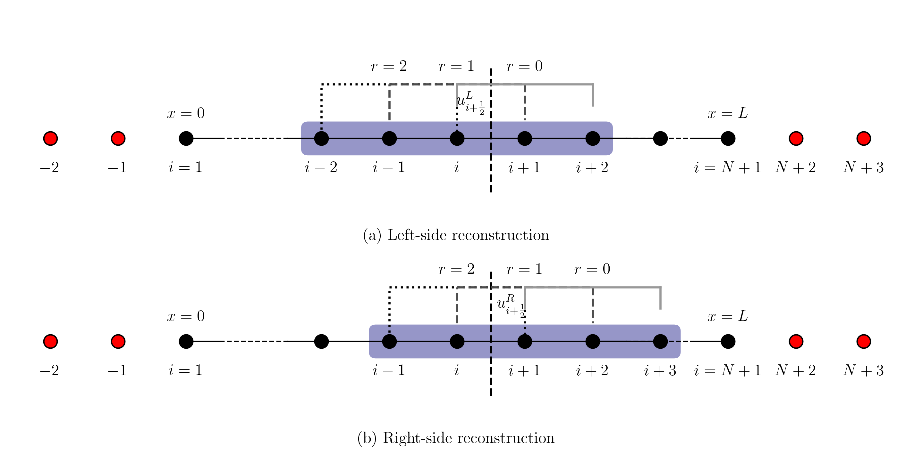

# WENO

## WENO Link

- [OneFLOW-WENO schemes](https://eric2003.github.io/OneFLOW/cfd/scheme/weno.html).
- [Efficient Finite Difference WENO Scheme for Hyperbolic Systems with Non-Conservative Products and Stiff Source Terms](https://www.youtube.com/watch?v=D87ctxheEr0).
- [Prof. Chi-Wang Shu: Mathematics in Scientific Computing](https://www.youtube.com/watch?v=0FdOVvCJJEk).
- [High-Order CFD Solvers on Three-Dimensional Unstructured Meshes: Parallel Implementation of RKDG Method with WENO Limiter and Momentum Sources](https://www.mdpi.com/2226-4310/9/7/372).


## Compact Weighted ENO

- Compact Reconstruction Schemes with Weighted ENO Limiting for Hyperbolic Conservation Laws

## Codes

- [WENO (Weighted Essentially Non-Oscillatory) schemes](https://github.com/wme7/WENO).
- [WENO52D_fortran](https://github.com/aranyadan/WENO52D_fortran).


## PyWENO

PyWENO contains two modules to help authors generate WENO codes

- [PyWENO](https://pyweno.readthedocs.io/en/latest/index.html).

## Visualization

- [Python科学计算绘图链接整理](https://zhuanlan.zhihu.com/p/26046456263).

```
D:\github\OneFLOW\example\figure\1d\03s> python .\testprj.py
```

$$
f^{+}(u)=\cfrac{1}{2}(f(u)+\alpha{u}), \quad f^{-}(u)=\cfrac{1}{2}(f(u)-\alpha{u})
$$

$$
\begin{align}
u^{L}_{i+1/2} & = w^{L}_{0}(\cfrac{1}{3}u_{i-2}-\cfrac{7}{6}u_{i-1}+\cfrac{11}{6}u_{i})\\
           &+w^{L}_{1}(-\cfrac{1}{6}u_{i-1}+\cfrac{5}{6}u_{i}+\cfrac{1}{3}u_{i+1})\\
           &+w^{L}_{2}(\cfrac{1}{3}u_{i}+\cfrac{5}{6}u_{i+1}-\cfrac{1}{6}u_{i+2})\\
u^{R}_{i-1/2}& = w^{R}_{0}(-\cfrac{1}{6}u_{i-2}+\cfrac{5}{6}u_{i-1}+\cfrac{1}{3}u_{i})\\
           & + w^{R}_{1}(\cfrac{1}{3}u_{i-1}+\cfrac{5}{6}u_{i}-\cfrac{1}{6}u_{i+1})\\
           & + w^{R}_{2}(\cfrac{11}{6}u_{i}-\cfrac{7}{6}u_{i+1}+\cfrac{1}{3}u_{i+2})
\end{align}
$$

$$
\begin{align}
u^{L}_{i+1/2} & = w^{L}_{0}(\cfrac{1}{3}u_{i-2}-\cfrac{7}{6}u_{i-1}+\cfrac{11}{6}u_{i})\\
           &+w^{L}_{1}(-\cfrac{1}{6}u_{i-1}+\cfrac{5}{6}u_{i}+\cfrac{1}{3}u_{i+1})\\
           &+w^{L}_{2}(\cfrac{1}{3}u_{i}+\cfrac{5}{6}u_{i+1}-\cfrac{1}{6}u_{i+2})\\
u^{R}_{i+1/2}& = w^{R}_{0}(-\cfrac{1}{6}u_{i-1}+\cfrac{5}{6}u_{i}+\cfrac{1}{3}u_{i+1})\\
           & + w^{R}_{1}(\cfrac{1}{3}u_{i}+\cfrac{5}{6}u_{i+1}-\cfrac{1}{6}u_{i+2})\\
           & + w^{R}_{2}(\cfrac{11}{6}u_{i+1}-\cfrac{7}{6}u_{i+2}+\cfrac{1}{3}u_{i+3})
\end{align}
$$


```
 r | j=0  j=1  j=2
-1 | 11/6 -7/6  1/3
 0 |  1/3  5/6 -1/6
 1 | -1/6  5/6  1/3
 2 |  1/3 -7/6 11/6
```

there are constants $c_{rj}$ such that the reconstructed value at the cell boundary ${x}_{i+\frac{1}{2}}$

$$
{v}_{i+\frac{1}{2}}=\sum_{j=0}^{k-1}c_{rj}\bar{v}_{i-r+j}
$$


We summarize this as follows: given the $k$ cell averages

$$
\bar{v}_{i-r},\bar{v}_{i-r+1}\dots,\bar{v}_{i-r+k-1}
$$

there are constants $c_{rj}$ such that the reconstructed value at the cell boundary $x_{i+1/2}$

$$
v_{i+1/2}=c_{r0}\bar{v}_{i-r}+c_{r1}\bar{v}_{i-r+1}+\dots+c_{r,k-1}\bar{v}_{i-r+k-1}\\
$$

$$
v_{i+1/2}=\sum_{j=0}^{k-1}c_{rj}\bar{v}_{i-r+j}\\
$$

对于$k=3$，有

$$
v_{i+1/2}=c_{r0}\bar{v}_{i-r}+c_{r1}\bar{v}_{i-r+1}+c_{r,k-1}\bar{v}_{i-r+2}\\
$$

具体为

$$
\begin{array}{l}
v_{i+1/2}^{-1}=&c_{-1,0}&\bar{v}_{i+1}&+&c_{-1,1}&\bar{v}_{i+2}&+&c_{-1,2}&\bar{v}_{i+3}\\
v_{i+1/2}^{0}=&c_{0,0}&\bar{v}_{i}&+&c_{0,1}&\bar{v}_{i+1}&+&c_{0,2}&\bar{v}_{i+2}\\
v_{i+1/2}^{1}=&c_{1,0}&\bar{v}_{i-1}&+&c_{1,1}&\bar{v}_{i}&+&c_{1,2}&\bar{v}_{i+1}\\
v_{i+1/2}^{2}=&c_{2,0}&\bar{v}_{i-2}&+&c_{2,1}&\bar{v}_{i-1}&+&c_{2,2}&\bar{v}_{i}\\
\end{array}
$$

这应该对应下面的系数，实际上是从右到左的模板顺序

```
 r | j=0  j=1  j=2
-1 | 11/6 -7/6  1/3 (i+1,i+2,i+3)
 0 |  1/3  5/6 -1/6 (i  ,i+1,i+2)
 1 | -1/6  5/6  1/3 (i-1,i  ,i+1)
 2 |  1/3 -7/6 11/6 (i-2,i-1,i  )
```

如果按照习惯，从左到右计算，有

```
 r | j=0  j=1  j=2
 2 |  1/3 -7/6 11/6 (i-2,i-1,i  )
 1 | -1/6  5/6  1/3 (i-1,i  ,i+1)
 0 |  1/3  5/6 -1/6 (i  ,i+1,i+2)
-1 | 11/6 -7/6  1/3 (i+1,i+2,i+3)
```

Given the location $I_i$ and the order of accuracy $k$, we first choose a “stencil”, based on $r$ cells to the
left, $s$ cells to the right, and $I_i$ itself if $r, s ≥ 0$, with $r + s +1= k$:

$$
S(i)\equiv\{I_{i-r},\dots,I_{i+s}\}
$$

$$
v_{i+1/2} = c_{20}\bar{v}_{i-2} + c_{21}\bar{v}_{i-1} + c_{22}\bar{v}_{i} + c_{23}\bar{v}_{i+1}
$$

$$
v_{i+1/2}^{(2)} = c_{2,0}\,\bar{v}_{i-2} + c_{2,1}\,\bar{v}_{i-1} + c_{2,2}\,\bar{v}_{i} + c_{2,3}\,\bar{v}_{i+1}
$$


$$
v_{i+1/2}^{(0)} = \frac{1}{3}\,\bar{v}_{i} + \frac{5}{6}\,\bar{v}_{i+1} - \frac{1}{6}\,\bar{v}_{i+2}
$$

$$
\begin{alignat}{3}
  v_{i+1/2}^{(2)} &= \phantom{+} \frac{1}{3}\bar{v}_{i-2} && - \frac{7}{6}\bar{v}_{i-1} && + \frac{11}{6}\bar{v}_{i} \\
  v_{i+1/2}^{(1)} &= - \frac{1}{6}\bar{v}_{i-1} && + \frac{5}{6}\bar{v}_{i} && + \frac{1}{3}\bar{v}_{i+1} \\
  v_{i+1/2}^{(0)} &= \phantom{+} \frac{1}{3}\bar{v}_{i} && + \frac{5}{6}\bar{v}_{i+1} && - \frac{1}{6}\bar{v}_{i+2} \\
  v_{i+1/2}^{(-1)} &= \phantom{+} \frac{11}{6}\bar{v}_{i+1} && - \frac{7}{6}\bar{v}_{i+2} && + \frac{1}{3}\bar{v}_{i+3}
\end{alignat}
$$


我们仔细考察有：

$$
\begin{alignat}{3}
  v_{i+1/2}^{L(i-2,i-1,i)} &= \phantom{+} \frac{1}{3}\bar{v}_{i-2} && - \frac{7}{6}\bar{v}_{i-1} && + \frac{11}{6}\bar{v}_{i} \\
  v_{i+1/2}^{L(i-1,i,i+1)} &= - \frac{1}{6}\bar{v}_{i-1} && + \frac{5}{6}\bar{v}_{i} && + \frac{1}{3}\bar{v}_{i+1} \\
  v_{i+1/2}^{L(i,i+1,i+2)} &= \phantom{+} \frac{1}{3}\bar{v}_{i} && + \frac{5}{6}\bar{v}_{i+1} && - \frac{1}{6}\bar{v}_{i+2} \\
\end{alignat}
$$

$$
\begin{alignat}{3}
  v_{i+1/2}^{R(i-1,i,i+1)} &= - \frac{1}{6}\bar{v}_{i-1} && + \frac{5}{6}\bar{v}_{i} && + \frac{1}{3}\bar{v}_{i+1} \\
  v_{i+1/2}^{R(i,i+1,i+2)} &= \phantom{+} \frac{1}{3}\bar{v}_{i} && + \frac{5}{6}\bar{v}_{i+1} && - \frac{1}{6}\bar{v}_{i+2} \\
  v_{i+1/2}^{R(i+1,i+2,i+3)} &= \phantom{+} \frac{11}{6}\bar{v}_{i+1} && - \frac{7}{6}\bar{v}_{i+2} && + \frac{1}{3}\bar{v}_{i+3}
\end{alignat}
$$

$$
\begin{alignat}{3}
  v_{i+1/2}^{L(i-1,i,i+1)} &= v_{i+1/2}^{R(i-1,i,i+1)} \\
  v_{i+1/2}^{L(i,i+1,i+2)} &= v_{i+1/2}^{R(i,i+1,i+2)} \\
\end{alignat}
$$

Given the location $I_{i}$ and the order of accuracy $k$, we first choose a “stencil”, based on $r$ cells to the
left, $s$ cells to the right, and $I_{i}$ itself if $r, s ≥ 0$, with $r + s +1= k$:

$$
S(i)\equiv \{I_{i-r},\cdots,I_{i+s}\}
$$

There is a unique polynomial of degree at most $k−1 = r+s$, denoted by $p(x)$ (we will drop the subscript
i when it does not cause confusion), whose cell average in each of the cells in $S(i)$ agrees with that of $v(x)$:

$$
\cfrac{1}{\Delta x_{j}}\int_{x_{j-\frac{1}{2}}}^{x_{j+\frac{1}{2}}}p(\xi)d\xi=\bar{v}_{j},\quad 
j=i-r,\cdots,i+s
$$

$$
{v}^{-}_{i+\frac{1}{2}}=\sum_{j=0}^{k-1}c_{rj}\bar{v}_{i-r+j},\quad
{v}^{+}_{i-\frac{1}{2}}=\sum_{j=0}^{k-1}\tilde c_{rj}\bar{v}_{i-r+j}
$$



$$
\begin{alignat}{3}
  v_{i+1/2}^{L,r=2} &= \phantom{+} \frac{1}{3}\bar{v}_{i-2} && - \frac{7}{6}\bar{v}_{i-1} && + \frac{11}{6}\bar{v}_{i} \\
  v_{i+1/2}^{L,r=1} &= - \frac{1}{6}\bar{v}_{i-1} && + \frac{5}{6}\bar{v}_{i} && + \frac{1}{3}\bar{v}_{i+1} \\
  v_{i+1/2}^{L,r=0} &= \phantom{+} \frac{1}{3}\bar{v}_{i} && + \frac{5}{6}\bar{v}_{i+1} && - \frac{1}{6}\bar{v}_{i+2} \\
\end{alignat}
$$

$$
\tilde{c}_{rj}=c_{r-1,j}
$$

$$
\begin{array}{l}
{v}^{+}_{i-\frac{1}{2}}&=&\sum_{j=0}^{k-1}\tilde c_{rj}\bar{v}_{i-r+j}
=\sum_{j=0}^{2}\tilde c_{rj}\bar{v}_{i-r+j}\\
&=&\tilde c_{r,0}\bar{v}_{i-r}+\tilde c_{r,1}\bar{v}_{i-r+1}+\tilde c_{r,2}\bar{v}_{i-r+2}\\
&=&c_{r-1,0}\bar{v}_{i-r}+c_{r-1,1}\bar{v}_{i-r+1}+c_{r-1,2}\bar{v}_{i-r+2}\\
\end{array}
$$

crj(k=3)
```
 r | j=0  j=1  j=2
 2 |  1/3 -7/6 11/6 (i-2,i-1,i  )
 1 | -1/6  5/6  1/3 (i-1,i  ,i+1)
 0 |  1/3  5/6 -1/6 (i  ,i+1,i+2)
-1 | 11/6 -7/6  1/3 (i+1,i+2,i+3)
```

i-1/2

$$
\begin{alignat}{3}
  v_{i-1/2}^{R,r=2} &= - \frac{1}{6}\bar{v}_{i-2} && + \frac{5}{6}\bar{v}_{i-1} && +  \frac{1}{3}\bar{v}_{i} \\
  v_{i-1/2}^{R,r=1} &= \phantom{+} \frac{1}{3}\bar{v}_{i-1} && + \frac{5}{6}\bar{v}_{i} && - \frac{1}{6}\bar{v}_{i+1} \\
  v_{i-1/2}^{R,r=0} &= \phantom{+} \frac{11}{6}\bar{v}_{i} && - \frac{7}{6}\bar{v}_{i+1} && + \frac{1}{3}\bar{v}_{i+2} \\
\end{alignat}
$$

i+1/2

$$
\begin{alignat}{3}
  v_{i+1/2}^{R,r=2} &= - \frac{1}{6}\bar{v}_{i-1} && + \frac{5}{6}\bar{v}_{i} && +  \frac{1}{3}\bar{v}_{i+1} \\
  v_{i+1/2}^{R,r=1} &= \phantom{+} \frac{1}{3}\bar{v}_{i} && + \frac{5}{6}\bar{v}_{i+1} && - \frac{1}{6}\bar{v}_{i+2} \\
  v_{i+1/2}^{R,r=0} &= \phantom{+} \frac{11}{6}\bar{v}_{i+1} && - \frac{7}{6}\bar{v}_{i+2} && + \frac{1}{3}\bar{v}_{i+3} \\
\end{alignat}
$$

合在一起，有：


ui+1/2,L

$$
\begin{alignat}{3}
  v_{i+1/2}^{L,r=2} &= \phantom{+} \frac{1}{3}\bar{v}_{i-2} && - \frac{7}{6}\bar{v}_{i-1} && + \frac{11}{6}\bar{v}_{i} \\
  v_{i+1/2}^{L,r=1} &= - \frac{1}{6}\bar{v}_{i-1} && + \frac{5}{6}\bar{v}_{i} && + \frac{1}{3}\bar{v}_{i+1} \\
  v_{i+1/2}^{L,r=0} &= \phantom{+} \frac{1}{3}\bar{v}_{i} && + \frac{5}{6}\bar{v}_{i+1} && - \frac{1}{6}\bar{v}_{i+2} \\
\end{alignat}
$$

ui+1/2,R

$$
\begin{alignat}{3}
  v_{i+1/2}^{R,r=2} &= - \frac{1}{6}\bar{v}_{i-1} && + \frac{5}{6}\bar{v}_{i} && +  \frac{1}{3}\bar{v}_{i+1} \\
  v_{i+1/2}^{R,r=1} &= \phantom{+} \frac{1}{3}\bar{v}_{i} && + \frac{5}{6}\bar{v}_{i+1} && - \frac{1}{6}\bar{v}_{i+2} \\
  v_{i+1/2}^{R,r=0} &= \phantom{+} \frac{11}{6}\bar{v}_{i+1} && - \frac{7}{6}\bar{v}_{i+2} && + \frac{1}{3}\bar{v}_{i+3} \\
\end{alignat}
$$

在不引起混淆的情况下，从左至右计数(0,1,2),有：

ui+1/2,L

$$
\begin{alignat}{3}
  v_{i+1/2,L}^{(0)} &= \phantom{+} \frac{1}{3}\bar{v}_{i-2} && - \frac{7}{6}\bar{v}_{i-1} && + \frac{11}{6}\bar{v}_{i} \\
  v_{i+1/2,L}^{(1)} &= - \frac{1}{6}\bar{v}_{i-1} && + \frac{5}{6}\bar{v}_{i} && + \frac{1}{3}\bar{v}_{i+1} \\
  v_{i+1/2,L}^{(2)} &= \phantom{+} \frac{1}{3}\bar{v}_{i} && + \frac{5}{6}\bar{v}_{i+1} && - \frac{1}{6}\bar{v}_{i+2} \\
\end{alignat}
$$

ui+1/2,R

$$
\begin{alignat}{3}
  v_{i+1/2,R}^{(0)} &= - \frac{1}{6}\bar{v}_{i-1} && + \frac{5}{6}\bar{v}_{i} && +  \frac{1}{3}\bar{v}_{i+1} \\
  v_{i+1/2,R}^{(1)} &= \phantom{+} \frac{1}{3}\bar{v}_{i} && + \frac{5}{6}\bar{v}_{i+1} && - \frac{1}{6}\bar{v}_{i+2} \\
  v_{i+1/2,R}^{(2)} &= \phantom{+} \frac{11}{6}\bar{v}_{i+1} && - \frac{7}{6}\bar{v}_{i+2} && + \frac{1}{3}\bar{v}_{i+3} \\
\end{alignat}
$$


从另一个角度看：

Left side

$$
  \{V_{1},V_{2},V_{3},V_{4},V_{5}\} 
  = \{\bar{v}_{i-2},\bar{v}_{i-1},\bar{v}_{i},\bar{v}_{i+1},\bar{v}_{i+2}\}\\
$$

$$
\begin{alignat}{3}
  v_{i+1/2,L}^{(0)} &= \phantom{+} \frac{1}{3}V_{1} && - \frac{7}{6}V_{2} && + \frac{11}{6}V_{3} \\
  v_{i+1/2,L}^{(1)} &= - \frac{1}{6}V_{2} && + \frac{5}{6}V_{3} && + \frac{1}{3}V_{4} \\
  v_{i+1/2,L}^{(2)} &= \phantom{+} \frac{1}{3}V_{3} && + \frac{5}{6}V_{4}&& - \frac{1}{6}V_{5} \\
\end{alignat}
$$

Right side

$$
  \{W_{1},W_{2},W_{3},W_{4},W_{5}\} 
  = \{\bar{v}_{i-1},\bar{v}_{i},\bar{v}_{i+1},\bar{v}_{i+2},\bar{v}_{i+3}\}\\
$$

$$
\begin{alignat}{3}
  v_{i+1/2,R}^{(0)} &= - \frac{1}{6}W_{1} && + \frac{5}{6}W_{2} && +  \frac{1}{3}W_{3} \\
  v_{i+1/2,R}^{(1)} &= \phantom{+} \frac{1}{3}W_{2} && + \frac{5}{6}W_{3} && - \frac{1}{6}W_{4} \\
  v_{i+1/2,R}^{(2)} &= \phantom{+} \frac{11}{6}W_{3} && - \frac{7}{6}W_{4} && + \frac{1}{3}W_{5} \\
\end{alignat}
$$

已知：

ui+1/2,R

$$
\begin{alignat}{3}
  v_{i+1/2,R}^{(0)} &= - \frac{1}{6}\bar{v}_{i-1} && + \frac{5}{6}\bar{v}_{i} && +  \frac{1}{3}\bar{v}_{i+1} \\
  v_{i+1/2,R}^{(1)} &= \phantom{+} \frac{1}{3}\bar{v}_{i} && + \frac{5}{6}\bar{v}_{i+1} && - \frac{1}{6}\bar{v}_{i+2} \\
  v_{i+1/2,R}^{(2)} &= \phantom{+} \frac{11}{6}\bar{v}_{i+1} && - \frac{7}{6}\bar{v}_{i+2} && + \frac{1}{3}\bar{v}_{i+3} \\
\end{alignat}
$$

对其进行重新排列：

$$
\begin{alignat}{3}
  v_{i+1/2,R}^{(2)} &= \phantom{+} \frac{11}{6}\bar{v}_{i+1} && - \frac{7}{6}\bar{v}_{i+2} && + \frac{1}{3}\bar{v}_{i+3} \\
  v_{i+1/2,R}^{(1)} &= \phantom{+} \frac{1}{3}\bar{v}_{i} && + \frac{5}{6}\bar{v}_{i+1} && - \frac{1}{6}\bar{v}_{i+2} \\
  v_{i+1/2,R}^{(0)} &= - \frac{1}{6}\bar{v}_{i-1} && + \frac{5}{6}\bar{v}_{i} && +  \frac{1}{3}\bar{v}_{i+1} \\
\end{alignat}
$$

$$
\begin{alignat}{3}
  v_{i+1/2,R}^{(2)} &= \phantom{+}\frac{1}{3}\bar{v}_{i+3} &&- \frac{7}{6}\bar{v}_{i+2} &&+ \frac{11}{6}\bar{v}_{i+1} \\
  v_{i+1/2,R}^{(1)} &=  - \frac{1}{6}\bar{v}_{i+2}&&+ \frac{5}{6}\bar{v}_{i+1}&&+\frac{1}{3}\bar{v}_{i}  \\
  v_{i+1/2,R}^{(0)} &= \phantom{+}\frac{1}{3}\bar{v}_{i+1}&&+ \frac{5}{6}\bar{v}_{i}&&- \frac{1}{6}\bar{v}_{i-1}   \\
\end{alignat}
$$

对比

ui+1/2,L

$$
\begin{alignat}{3}
  v_{i+1/2,L}^{(0)} &= \phantom{+} \frac{1}{3}\bar{v}_{i-2} && - \frac{7}{6}\bar{v}_{i-1} && + \frac{11}{6}\bar{v}_{i} \\
  v_{i+1/2,L}^{(1)} &= - \frac{1}{6}\bar{v}_{i-1} && + \frac{5}{6}\bar{v}_{i} && + \frac{1}{3}\bar{v}_{i+1} \\
  v_{i+1/2,L}^{(2)} &= \phantom{+} \frac{1}{3}\bar{v}_{i} && + \frac{5}{6}\bar{v}_{i+1} && - \frac{1}{6}\bar{v}_{i+2} \\
\end{alignat}
$$

我们发现这两个的插值系数完全一致，也就是说具备对称性，这和我们的理解是一致的。
也就是说，如果对于ui+1/2,R，从右向左计数，和ui+1/2,L从左向右计数的物理规律完全一致。


$$
  \{U_{1},U_{2},U_{3},U_{4},U_{5}\} 
  = \{\bar{v}_{i+3},\bar{v}_{i+2},\bar{v}_{i+1},\bar{v}_{i},\bar{v}_{i-1},\bar{v}_{i-2}\}\\
$$

$$
\begin{alignat}{3}
  v_{i+1/2,R}^{(2)} &= \phantom{+}\frac{1}{3}U_{1} &&- \frac{7}{6}U_{2} &&+ \frac{11}{6}U_{3} \\
  v_{i+1/2,R}^{(1)} &=  - \frac{1}{6}U_{2}&&+ \frac{5}{6}U_{3}&&+\frac{1}{3}U_{4}  \\
  v_{i+1/2,R}^{(0)} &= \phantom{+}\frac{1}{3}U_{3}&&+ \frac{5}{6}U_{4}&&- \frac{1}{6}U_{5}   \\
\end{alignat}
$$

$$
\begin{alignat}{3}
  v_{i+1/2,R}^{(0')} &= \phantom{+}\frac{1}{3}U_{1} &&- \frac{7}{6}U_{2} &&+ \frac{11}{6}U_{3} \\
  v_{i+1/2,R}^{(1')} &=  - \frac{1}{6}U_{2}&&+ \frac{5}{6}U_{3}&&+\frac{1}{3}U_{4}  \\
  v_{i+1/2,R}^{(2')} &= \phantom{+}\frac{1}{3}U_{3}&&+ \frac{5}{6}U_{4}&&- \frac{1}{6}U_{5}   \\
\end{alignat}
$$

对比

Left side

$$
  \{V_{1},V_{2},V_{3},V_{4},V_{5}\} 
  = \{\bar{v}_{i-2},\bar{v}_{i-1},\bar{v}_{i},\bar{v}_{i+1},\bar{v}_{i+2}\}\\
$$

$$
\begin{alignat}{3}
  v_{i+1/2,L}^{(0)} &= \phantom{+} \frac{1}{3}V_{1} && - \frac{7}{6}V_{2} && + \frac{11}{6}V_{3} \\
  v_{i+1/2,L}^{(1)} &= - \frac{1}{6}V_{2} && + \frac{5}{6}V_{3} && + \frac{1}{3}V_{4} \\
  v_{i+1/2,L}^{(2)} &= \phantom{+} \frac{1}{3}V_{3} && + \frac{5}{6}V_{4}&& - \frac{1}{6}V_{5} \\
\end{alignat}
$$

ui+1/2,L,R

$$
\begin{array}{l}
\displaystyle{v}^{r}_{i+\frac{1}{2},L}=\sum_{j=0}^{k-1}c_{rj}\bar{v}_{i-r+j},\quad r=0,\dots,k-1\\
\displaystyle{v}^{r}_{i+\frac{1}{2},R}=\sum_{j=0}^{k-1}\tilde c_{rj}\bar{v}_{i+1-r+j},\quad r=0,\dots,k-1\\
\end{array}
$$



WENO reconstruction would take a convex combination of all \( v_{i+\frac{1}{2},L}^{(r)} \) as a new approximation to the cell boundary value \( v(x_{i+\frac{1}{2}}) \):

\[
\quad v_{i+\frac{1}{2},L} = \sum_{r=0}^{k-1} \omega_r v_{i+\frac{1}{2},L}^{(r)},\quad r=0,\dots,k-1
\]

Apparently, the key to the success of WENO would be the choice of the weights \( \omega_r \). We require

\[
 \quad \omega_r \geq 0, \quad \sum_{r=0}^{k-1} \omega_r = 1
\]

for stability and consistency.

If the function \( v(x) \) is smooth in all of the candidate stencils, there are constants \( d_r \) such that

\[
 \quad v_{i+\frac{1}{2}} = \sum_{r=0}^{k-1} d_r v_{i+\frac{1}{2}}^{(r)} = v(x_{i+\frac{1}{2}}) + O(\Delta x^{2k-1}).
\]

For example, \( d_r \) for \( 1 \leq k \leq 3 \) are given by

\[
\begin{align*}
d_0 &= 1, \quad k = 1; \\
d_0 &= \frac{2}{3}, \, d_1 = \frac{1}{3}, \quad k = 2; \\
d_0 &= \frac{3}{10}, \, d_1 = \frac{3}{5}, \, d_2 = \frac{1}{10}, \quad k = 3.
\end{align*}
\]

We can see that \( d_r \) is always positive and, due to consistency,

\[
 \quad \sum_{r=0}^{k-1} d_r = 1.
\]


For \( k = 2 \):

\[
\quad
\begin{align*}
\beta_0 &= (\overline{v}_{i+1} - \overline{v}_i)^2, \\
\beta_1 &= (\overline{v}_i - \overline{v}_{i-1})^2.
\end{align*}
\]

For \( k = 3 \):

\[
\quad
\begin{align*}
\beta_0 &= \frac{13}{12}(\overline{v}_i - 2\overline{v}_{i+1} + \overline{v}_{i+2})^2 + \frac{1}{4}(3\overline{v}_i - 4\overline{v}_{i+1} + \overline{v}_{i+2})^2, \\
\beta_1 &= \frac{13}{12}(\overline{v}_{i-1} - 2\overline{v}_i + \overline{v}_{i+1})^2 + \frac{1}{4}(\overline{v}_{i-1} - \overline{v}_{i+1})^2, \\
\beta_2 &= \frac{13}{12}(\overline{v}_{i-2} - 2\overline{v}_{i-1} + \overline{v}_i)^2 + \frac{1}{4}(\overline{v}_{i-2} - 4\overline{v}_{i-1} + 3\overline{v}_i)^2.
\end{align*}
\]


\[
\begin{align*}
\alpha_r &= \frac{d_r}{(\epsilon + \beta_r)^2}, \quad r = 0, \dots, k-1 \\
\omega_r &= \frac{\alpha_r}{\displaystyle\sum_{s=0}^{k-1} \alpha_s}, \quad r = 0, \dots, k-1 \\
\end{align*}
\]

\[
\begin{align*}
\beta_0^R &= \frac{13}{12}(\overline{v}_{i+1} - 2\overline{v}_{i+2} + \overline{v}_{i+3})^2 + \frac{1}{4}(3\overline{v}_{i+1} - 4\overline{v}_{i+2} + \overline{v}_{i+3})^2, \\
\beta_1^R &= \frac{13}{12}(\overline{v}_i - 2\overline{v}_{i+1} + \overline{v}_{i+2})^2 + \frac{1}{4}(\overline{v}_i - \overline{v}_{i+2})^2, \\
\beta_2^R &= \frac{13}{12}(\overline{v}_{i-1} - 2\overline{v}_i + \overline{v}_{i+1})^2 + \frac{1}{4}(\overline{v}_{i-1} - 4\overline{v}_i + 3\overline{v}_{i+1})^2.
\end{align*}
\]


Left side

$$
  \{V_{1},V_{2},V_{3},V_{4},V_{5}\} 
  = \{\bar{v}_{i-2},\bar{v}_{i-1},\bar{v}_{i},\bar{v}_{i+1},\bar{v}_{i+2}\}\\
$$

\[
\begin{align*}
\beta_0 &= \frac{13}{12}(V_{3} - 2V_{4} + V_{5})^2 + \frac{1}{4}(3V_{3} - 4V_{4} + V_{5})^2, \\
\beta_1 &= \frac{13}{12}(V_{2} - 2V_{3} + V_{4})^2 + \frac{1}{4}(V_{2} - V_{4})^2, \\
\beta_2 &= \frac{13}{12}(V_{1} - 2V_{2} + V_{3})^2 + \frac{1}{4}(V_{1} - 4V_{2} + 3V_{3})^2
\end{align*}
\]


Right side

$$
  \{W_{1},W_{2},W_{3},W_{4},W_{5}\} 
  = \{\bar{v}_{i-1},\bar{v}_{i},\bar{v}_{i+1},\bar{v}_{i+2},\bar{v}_{i+3}\}\\
$$

\[
\begin{align*}
\beta_0^R &= \frac{13}{12}(W_{3} - 2W_{4} + W_{5})^2 + \frac{1}{4}(3W_{3} - 4W_{4} + W_{5})^2, \\
\beta_1^R &= \frac{13}{12}(W_{2} - 2W_{3} + W_{4})^2 + \frac{1}{4}(W_{2} - W_{4})^2, \\
\beta_2^R &= \frac{13}{12}(W_{1} - 2W_{2} + W_{3})^2 + \frac{1}{4}(W_{1} - 4W_{2} + 3W_{3})^2.
\end{align*}
\]